# 车载HDR CMOS技术白皮书：Sony Sub-Pixel / Stacked Pixel 与 OMNIVISION TheiaCel™ 技术路线深度解析

> 面向ADAS/ADS前视感知系统的单帧HDR CMOS演进

| 项目 | 信息 |
|------|------|
| 版本 | v1.0.0 |
| 日期 | 2026-06-12 |
| 适用对象 | 产业研究员 / CMOS研发工程师 / 自动驾驶感知架构师 |

---

## 摘要（Executive Summary）

自动驾驶从L2向L4演进的进程中，前视摄像头面临的动态范围需求从60 dB攀升至140 dB以上。LED交通信号灯、隧道出入口逆光、夜间对向车远光灯等极端场景，使传统多帧HDR的Motion Artifact成为致命缺陷。单帧HDR（Single-Exposure HDR）技术由此成为车载CMOS的决胜战场。

本白皮书深度解析两大单帧HDR技术路线：Sony的Sub-Pixel + LOFIC架构（以ISX031、IMX728、ISX038为代表）与OMNIVISION的TheiaCel™ = DCG + LOFIC架构（以OX03C10、OX05D10、OX08D10为代表）。两大路线均以LOFIC（Lateral Overflow Integration Capacitor，横向溢出积分电容）为核心扩展动态范围上限，但在像素架构、读出链路、LFM（LED Flicker Mitigation）实现方式上存在本质差异。Sony采用大小PD（Photodiode）子像素分离方案，豪威采用DCG双转换增益 + LOFIC溢出电容联合方案。

本白皮书从系统层（ADAS/ADS感知需求、Tier1应用、竞争格局）与像素层（Photodiode、FD、Conversion Gain、LOFIC、LFM等晶体管级机理）双视角展开，包含30+ Mermaid架构图、12+ 技术原理图、14+技术对比表、8个产品案例与50+条带URL参考文献，为产业研究员与CMOS研发工程师提供可操作的技术参考。

---

## 缩略语与术语表

| 缩略语 | 全称 | 中文释义 |
|--------|------|----------|
| ADS | Autonomous Driving System | 自动驾驶系统 |
| ADAS | Advanced Driver-Assistance System | 高级驾驶辅助系统 |
| BSI | Back-Side Illumination | 背照式 |
| CG | Conversion Gain | 转换增益 |
| CIS | CMOS Image Sensor | CMOS图像传感器 |
| DCG | Dual Conversion Gain | 双转换增益 |
| DR | Dynamic Range | 动态范围 |
| DOL | Digital Overlap | 数字重叠多帧HDR |
| DTI | Deep Trench Isolation | 深槽隔离 |
| EMVA | European Machine Vision Association | 欧洲机器视觉协会 |
| FC | Floating Capacitor | 浮置电容 |
| FD | Floating Diffusion | 浮置扩散 |
| FWC | Full Well Capacity | 满阱容量 |
| HALE | HDR and LFM Engine | HDR与LFM联合引擎 |
| HCG | High Conversion Gain | 高转换增益 |
| HDR | High Dynamic Range | 高动态范围 |
| IIC | Intra-pixel Integration Capacitor | 像素内积分电容 |
| ISP | Image Signal Processor | 图像信号处理器 |
| LCG | Low Conversion Gain | 低转换增益 |
| LFM | LED Flicker Mitigation | LED闪烁抑制 |
| LOFIC | Lateral Overflow Integration Capacitor | 横向溢出积分电容 |
| PD | Photodiode | 光电二极管 |
| RG | Reset Gate | 复位栅 |
| SF | Source Follower | 源极跟随器 |
| SNR | Signal-to-Noise Ratio | 信噪比 |
| SoC | System-on-Chip | 片上系统 |
| TG | Transfer Gate | 传输栅 |

---

# 第一章 自动驾驶感知推动HDR CMOS革命

## 1.1 ADAS→ADS感知架构演进

自动驾驶感知架构正经历从分布式到域集中式的根本性变革。L2级ADAS通常搭载1~3颗前视摄像头，L3级增至5~8颗覆盖前/侧/后视，L4级Robotaxi则需10+颗摄像头实现360°无死角感知。

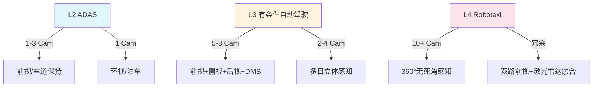
```mermaid
graph TD
    A[L2 ADAS] -->|1-3 Cam| B[前视/车道保持]
    A -->|1 Cam| C[环视/泊车]
    D[L3 有条件自动驾驶] -->|5-8 Cam| E[前视+侧视+后视+DMS]
    D -->|2-4 Cam| F[多目立体感知]
    G[L4 Robotaxi] -->|10+ Cam| H[360°无死角感知]
    G -->|冗余| I[双路前视+激光雷达融合]
    style A fill:#e1f5fe
    style D fill:#fff3e0
    style G fill:#fce4ec
```

感知架构演进直接推动单车型CMOS搭载量从2~4颗增长至8~15颗。据GMInsights数据，2025年全球图像传感器市场规模达256亿美元，Sony以63.6%份额居首，OMNIVISION位居第三[1]。

## 1.2 前视摄像头性能需求

前视摄像头是ADAS/ADS的核心传感器，承担目标检测、车道识别、信号灯识别等关键任务。其性能需求可归纳为五个维度：

| 维度 | 需求 | 量化指标 |
|------|------|----------|
| 动态范围 | 同时捕获暗区细节与亮区信号 | ≥120 dB（L3+需140 dB） |
| LED闪烁抑制 | 真实还原LED信号灯状态 | LFM覆盖率≥95% |
| 低照度性能 | 夜间/雨天/逆光清晰成像 | SNR≥1@0.1 lux |
| 分辨率 | 远距目标有效像素≥8 px | 2~8 MP |
| 帧率 | 低延迟感知 | ≥30 fps（L3+需60 fps） |

### 1.2.1 感知管线对CMOS的定量约束

自动驾驶感知管线（Perception Pipeline）的端到端延迟预算通常为100~150 ms，其中摄像头模块分配30~50 ms。这意味着CMOS的曝光+读出+传输总时间必须控制在33 ms以内（30 fps）或16.7 ms以内（60 fps）。在L3+系统中，前视摄像头通常要求60 fps以保证足够的感知余量。

从目标检测角度，远距目标（如150 m处的车辆）在前视图像中的成像大小取决于像素尺寸与焦距。以2.1 μm像素、35 mm焦距镜头为例，150 m处0.5 m宽目标仅占约4个像素。当分辨率从2 MP提升至8 MP时，同距离目标的像素数增加约4倍，显著提升检测置信度。这也是8 MP前视（IMX728/ISX038/OX08D10）成为L3+标配的核心驱动力。

### 1.2.2 摄像头模块架构

车载摄像头模块由镜头组（Lens）、CMOS传感器、ISP（可选内置）和串行器（Serializer）四部分组成。传统架构中，CMOS输出RAW数据经MIPI CSI-2传输至外置ISP处理，再由Serializer（如GMSL2/A-PHY）转换为高速串行信号通过同轴电缆传输至域控制器。新型架构（如ISX038）将ISP集成于CMOS内部，直接输出YUV至信息娱乐系统，同时保留RAW输出至ADAS SoC，消除了对外置ISP的需求。

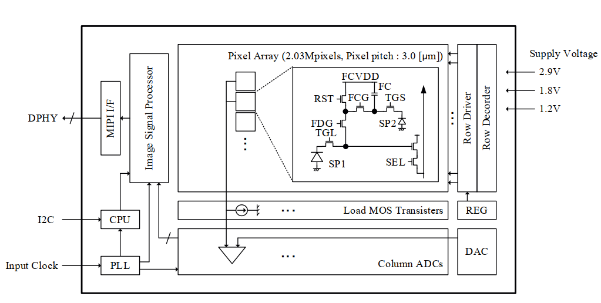
*图1-2：车载摄像头模块系统架构图。由镜头组、CMOS传感器、ISP（可选内置）和串行器（Serializer）组成，通过同轴电缆以GMSL2/A-PHY高速串行信号连接至域控制器。*

**系统架构演进趋势：** 随着A-PHY标准的普及（MIPI联盟2020年发布），新一代CMOS传感器（如Sony IMX828）开始内置A-PHY SerDes，直接输出16Gbps高速串行信号，省去外置Serializer芯片，降低BOM成本和PCB面积。OMNIVISION的OX08D10同样支持A-PHY接口，这是车载摄像头从分布式ECU架构向域集中架构演进的关键技术。

| 架构类型 | 代表产品 | 优势 | 劣势 |
|----------|----------|------|------|
| RAW输出+外置ISP | IMX728, OX08D10 | ISP灵活可升级 | 需额外芯片，BOM成本高 |
| SoC内置ISP+YUV | ISX031, ISX038 | 简化系统，降低BOM | ISP固定，升级受限 |
| RAW+YUV双输出 | ISX038 | 一颗CMOS服务双用途 | 功耗略增 |
| 内置Serializer | IMX828 (A-PHY) | 省去外置Serializer | 接口锁定 |

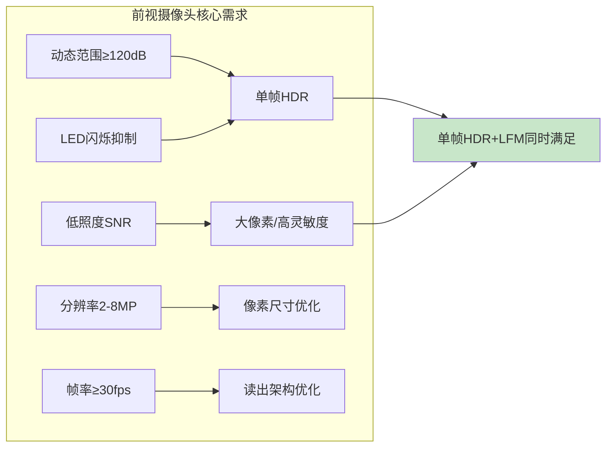
```mermaid
graph LR
    subgraph 前视摄像头核心需求
        A1[动态范围≥120dB] --> B[单帧HDR]
        A2[LED闪烁抑制] --> B
        A3[低照度SNR] --> C[大像素/高灵敏度]
        A4[分辨率2-8MP] --> D[像素尺寸优化]
        A5[帧率≥30fps] --> E[读出架构优化]
    end
    B --> F[单帧HDR+LFM同时满足]
    C --> F
    style F fill:#c8e6c9
```

## 1.3 极端场景定义

车载CMOS面临的极端光照场景远超消费类应用，主要包括四类：

### 1.3.1 隧道出入口

隧道内外照度差可达6个数量级（100,000 lux vs 0.1 lux），等效120 dB以上动态范围需求。隧道入口场景的特殊性在于照度变化发生在一个极短的过渡段内（通常10~30 m），车辆以80 km/h通过仅需0.45~1.35 s。在这段时间内，CMOS必须同时捕获隧道内极暗区域（0.1~1 lux）和隧道外极亮区域（50,000~100,000 lux），且不能产生运动伪影。对于DOL多帧HDR，三次曝光间的时间差在高速通过时产生明显的鬼影叠加，而单帧HDR天然无此问题。

隧道出口场景同样具有挑战性：车辆从暗环境突然进入强光环境，CMOS需要在白屏饱和之前快速调整。LOFIC技术的溢出电容在此场景中发挥关键作用——即使PD满阱，溢出电荷仍可被LOFIC电容捕获，避免亮区信号完全丢失。

### 1.3.2 LED信号灯闪烁

全球LED交通信号灯渗透率超过60%。LED以90~200 Hz PWM调制工作，若CMOS曝光时间过短则无法完整捕获LED亮周期，在图像中表现为闪烁或不可见。

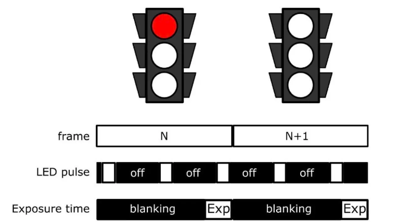
*图1-1：LED交通信号灯PWM调制示意。LED以快速PWM方式工作（90~200Hz），人眼无法察觉但CMOS传感器可清晰捕获其闪烁特性。*

LED信号灯的PWM频率因地区而异：北美典型为90 Hz，欧洲为100 Hz，日本为120 Hz，中国为50~200 Hz。占空比通常为5~25%，意味着LED在单个周期内仅亮5%~25%的时间。对于30 fps帧率的CMOS，每帧曝光时间最长约33 ms。以90 Hz PWM、10%占空比为例，LED亮周期仅1.1 ms。如果CMOS曝光时间短于LED周期（如DOL短曝光0.5 ms），则LED可能恰好处于灭周期，图像中信号灯表现为不可见——这被称为"phantom LED"问题，在自动驾驶中可能导致闯红灯事故。

LFM（LED Flicker Mitigation）要求CMOS曝光时间至少覆盖一个完整PWM周期，或通过像素内硬件机制确保LED信号的可见性。Sony的Small PD快速饱和和OMNIVISION的Split-Pixel长曝光是两种不同的LFM实现策略，将在第三、四章详细分析。

### 1.3.3 夜间对向车远光灯

对向车远光灯照度可达100,000 cd/m²，而同帧路面仅0.01 cd/m²，动态范围需求达100 dB。这一场景的难点在于：远光灯直射光进入镜头后产生强烈的lens flare和ghost，不仅使远光灯区域饱和，还可能污染邻近像素。LOFIC技术的溢出电荷存储机制可以在PD满阱后继续捕获电荷，但lens flare是光学层面的问题，无法通过像素架构完全解决，需要配合镜头镀膜和ISP去眩光算法。

夜间场景的另一个关键指标是SNR10——即信噪比等于10时的照度值。SNR10越低，表示传感器在更低照度下仍可提供可用图像。Sony Sub-Pixel的Large PD因面积大，在暗区具有更高的量子效率-面积乘积，SNR10表现优异；TheiaCel的HCG模式通过极低读出噪声（~1 e⁻）实现低SNR10值。

### 1.3.4 逆光行人检测

朝向阳光行驶时，行人处于阴影区，照度仅10 lux，而天空可达100,000 lux。这一场景要求CMOS同时在行人区域（10 lux）和天空区域（100,000 lux）提供可用信号，等价于80 dB动态范围需求。更重要的是，行人检测算法需要行人轮廓的边缘信息，如果HDR合成在行人区域引入噪声或伪影，将直接影响检测率。

Euro NCAP 2025协议已将逆光行人检测纳入评分项，要求前视摄像头在逆光条件下（照度比>1000:1）对成人/儿童行人的检测率≥90%。这直接推动了OEM对单帧HDR+LFM传感器的需求升级。

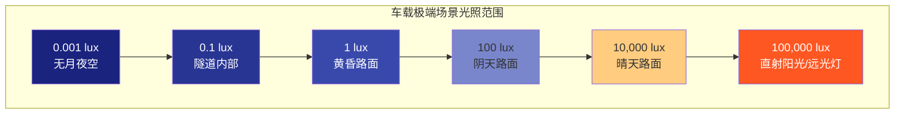
```mermaid
graph TB
    subgraph 车载极端场景光照范围
        A[0.001 lux<br/>无月夜空] --> B[0.1 lux<br/>隧道内部]
        B --> C[1 lux<br/>黄昏路面]
        C --> D[100 lux<br/>阴天路面]
        D --> E[10,000 lux<br/>晴天路面]
        E --> F[100,000 lux<br/>直射阳光/远光灯]
    end
    style A fill:#1a237e,color:#fff
    style B fill:#283593,color:#fff
    style C fill:#3949ab,color:#fff
    style D fill:#7986cb
    style E fill:#ffcc80
    style F fill:#ff5722,color:#fff
```

## 1.4 HDR成为主战场

### 1.4.1 多帧HDR的固有限制

传统DOL（Digital Overlap）多帧HDR通过短、中、长三次曝光合成扩展动态范围，但三次曝光之间存在时间差，导致运动物体产生Ghosting（运动伪影）。在80 km/h车速下，帧间30 ms延迟对应0.67 m位移，足以使目标检测失效。

### 1.4.2 单帧HDR的技术突破

单帧HDR在**同一曝光周期**内完成高动态范围捕获，彻底消除Motion Artifact，是车载CMOS的必由之路。LOFIC技术是单帧HDR的关键使能器：当光电二极管满阱后，溢出电荷流入横向电容，将有效满阱容量提升5~10倍，从而在同一曝光内覆盖从暗到亮的完整范围。

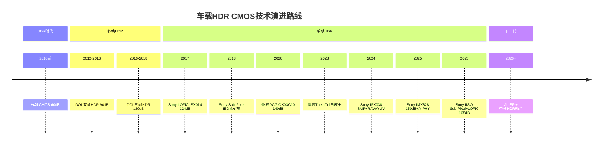
```mermaid
timeline
    title 车载HDR CMOS技术演进路线
    section SDR时代
        2010前 : 标准CMOS 60dB
    section 多帧HDR
        2012-2016 : DOL双帧HDR 90dB
        2016-2018 : DOL三帧HDR 120dB
    section 单帧HDR
        2017 : Sony LOFIC ISX014 124dB
        2018 : Sony Sub-Pixel IEDM发布
        2020 : 豪威DCG OX03C10 140dB
        2023 : 豪威TheiaCel白皮书
        2024 : Sony ISX038 8MP+RAW/YUV
        2025 : Sony IMX828 150dB+A-PHY
        2025 : Sony IISW Sub-Pixel+LOFIC 105dB
    section 下一代
        2026+ : AI ISP + 单帧HDR融合
```

---

# 第二章 HDR CMOS技术演进

## 2.1 SDR时代

标准CMOS图像传感器的动态范围由满阱容量（FWC）与读出噪声决定：

$$DR = 20 \log_{10}\left(\frac{N_{sat}}{N_{read}}\right) \text{ (dB)}$$

典型2.1 μm像素的FWC约10,000 e⁻，读出噪声约2 e⁻，DR≈74 dB，远不能满足车载需求。

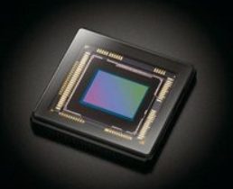
*图2-1：CMOS图像传感器基本结构与光电转换原理*

CMOS图像传感器是一种半导体芯片，其表面有几十万到几百万个光电二极管，光电二极管受到光照就会产生电荷，将光线转换成电信号。其功能类似于人的眼睛，因此sensor性能的好坏将直接影响到camera的性能。

**CMOS传感器基本工作原理：** CMOS sensor通常由行驱动器、列驱动器、时序控制逻辑、像敏单元阵列、AD转换器、数据总线输出接口、控制接口等几部分组成。这几部分功能通常都被集成在同一块硅片上。其工作过程一般可分为四个阶段：

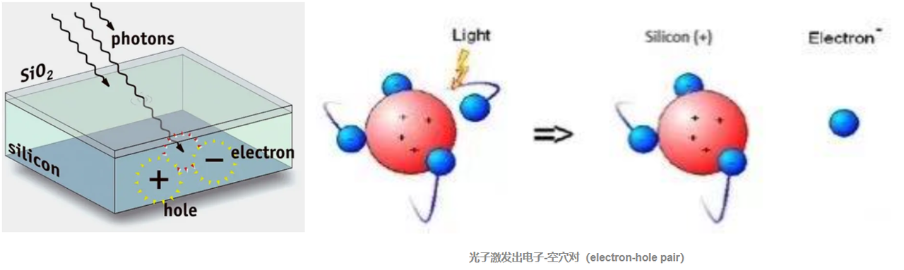
*图2-1b：光子-电子转换原理示意图。入射光子被硅吸收后激发电子-空穴对，光生电子在PN结电场作用下被收集至势阱中，完成光电转换的第一步。*

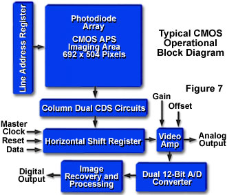
*图2-1c：CMOS图像传感器整体芯片架构。集成像敏单元阵列、行/列驱动器、时序控制逻辑、ADC和数据总线输出接口于同一硅片，实现光电信号的全片上处理。*

**量子效率（QE）与光谱响应：** 并非所有入射光子都能产生可收集的电子。量子效率定义为产生电子数与入射光子数之比，受硅吸收系数、PN结深度和表面反射率影响。硅对可见光的吸收系数随波长变化：蓝光（450nm）吸收深度约1μm，绿光（550nm）约3μm，红光（650nm）约10μm。BSI工艺通过将PD置于硅表面附近，优化了短波长光的收集效率，QE可从FSI的~50%提升至BSI的~80%以上。
2. **光电转换（Integration）**：光子进入硅衬底，激发出电子-空穴对，电子被势阱收集
3. **电荷积分（Accumulation）**：在曝光时间内，光生电荷不断积累于势阱中
4. **读出（Readout）**：通过行/列选择逻辑，将电荷转换为电压信号并经ADC数字化输出

图像传感器的设计基础是将模拟信号光信息转换为电信号的元件。在Bayer阵列中，每个像素都拥有色彩滤波器，只允许RGB（三原色）中一种颜色的光通过。光能进入后产生的电荷被放大为电信号，生成各种颜色的值。之后，ISP根据每个像素临近像素的颜色值通过插值（去马赛克）确定最终颜色，构成彩色图像。

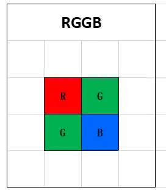
*图2-1a：Bayer RGGB色彩滤波阵列布局。每个像素仅允许红、绿或蓝一种颜色光通过，ISP通过去马赛克插值重建全彩色图像。绿色像素数量是红/蓝的两倍，因为人眼对绿色光最敏感。*

**Bayer阵列与去马赛克：** RGGB排列中，50%像素为绿色，25%为红色，25%为蓝色。ISP的去马赛克算法（Demosaicing）通过邻近像素的已知颜色值插值出缺失的颜色。先进的去马赛克算法（如方向性插值、自适应权重）可将插值误差降至最低。值得注意的是，去马赛克会引入约1.4倍的噪声放大系数（因为每个输出像素依赖于多个输入像素的加权平均），这意味着CMOS传感器的原始SNR在ISP输出后会有所下降。

## 2.2 多帧HDR（DOL）

DOL通过在同一帧周期内连续进行短/中/长曝光，然后在ISP中合成，将DR扩展至120 dB。但其固有问题包括：

| 问题 | 原因 | 影响 |
|------|------|------|
| Motion Artifact | 曝光间物体位移 | 运动物体鬼影 |
| LED Flicker | 短曝光无法捕获LED完整周期 | 信号灯闪烁/消失 |
| 功耗增加 | 多次读出 | 功耗×3 |
| 数据量增大 | 多帧存储与合成 | 带宽/存储压力 |

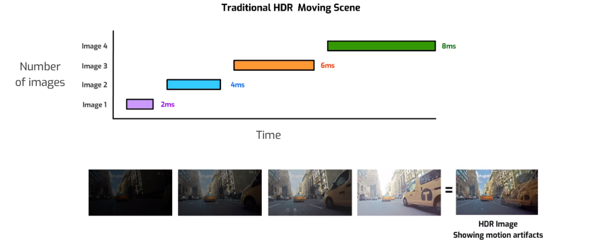
*图2-2：DOL（Digital Overlap）多帧HDR技术原理示意图。通过短、中、长三次曝光合成扩展动态范围，但曝光间存在时间差导致运动伪影。*

**DOL技术的时序特征：** DOL HDR在同一帧周期内连续进行三次曝光（长曝光33ms、中曝光4ms、短曝光0.5ms），三次曝光间存在固定的时间差。以30fps为例，一帧周期为33.3ms，三次曝光几乎填满整个帧周期。Sony的DOL技术支持两种输出模式：

- **单码流交替输出**：在同一数据流中交替输出长曝光和短曝光数据，通过行号标识区分
- **双码流并行输出**：使用两个独立的MIPI通道分别输出长曝光和短曝光数据，降低ISP处理复杂度

DOL技术的根本局限在于：**三次曝光不在同一时刻完成**。在80km/h车速下，帧间30ms延迟对应0.67m位移，足以使目标在图像中发生明显位移，产生运动伪影（Motion Artifact）。此外，短曝光（0.5ms）可能恰好落在LED灭周期内，导致信号灯不可见——这是DOL在车载场景中致命的安全隐患。

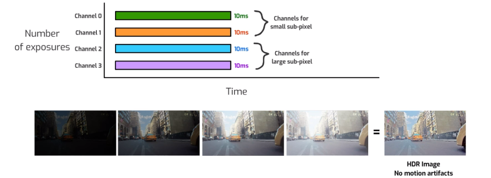
*图2-2a：DOL多帧HDR合成过程示意图。短、中、长三帧曝光在ISP中按亮度权重融合，但帧间时间差导致运动物体在不同曝光位置出现Ghosting伪影。图中显示了一个运动中的汽车在三帧中的不同位置，合成后出现"透明"残影。*

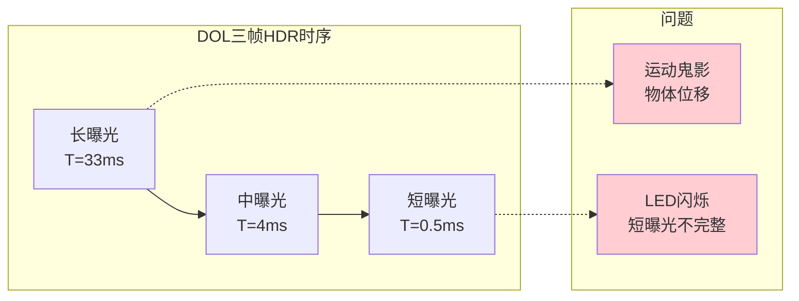
```mermaid
graph LR
    subgraph DOL三帧HDR时序
        A[长曝光<br/>T=33ms] --> B[中曝光<br/>T=4ms]
        B --> C[短曝光<br/>T=0.5ms]
    end
    subgraph 问题
        D[运动鬼影<br/>物体位移]
        E[LED闪烁<br/>短曝光不完整]
    end
    A -.-> D
    C -.-> E
    style D fill:#ffcdd2
    style E fill:#ffcdd2
```

## 2.3 单帧LOFIC原理

LOFIC（Lateral Overflow Integration Capacitor）是单帧HDR的核心使能技术。其工作原理如下：

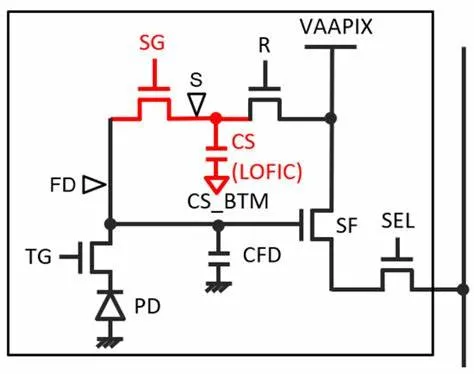
*图2-3：LOFIC（Lateral Overflow Integration Capacitor）像素结构示意图。当PD达到饱和阱容的一半（Skim level）时，溢出电荷被转移到CS电容中存储，实现单帧HDR。*

**LOFIC技术原理详解：**

LOFIC技术的核心思想是在每个像素中配置一个较大的横向电容（CS），用于收集因饱和而溢出的电荷。曝光时只要PD达到饱和阱容的一半（Skim level）就会触发相关电路动作，把电荷转移到CS电容上。读出时，首先读取PD信号，随即再读取PD和CS电容的总信号。英文"skim"常用语描述在水上撇油脂的动作，所以LOFIC又称为"Skimming pixel"。

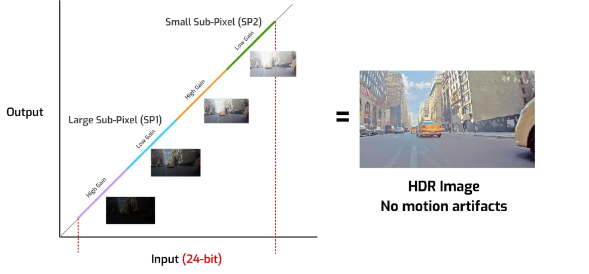
*图2-3a：标准线性响应与HDR非线性响应曲线对比。SDR传感器在暗区受读出噪声限制（最低可检测信号~2e⁻）、在亮区因满阱而饱和（~10ke⁻）；LOFIC技术通过溢出电荷存储将亮区响应线性延伸至120 ke⁻以上，动态范围从74dB扩展至105dB。*

LOFIC的主要挑战是如何在有限的像素面积内高效地制造大电容CS。2017年的报道是用6μm像素实现了37.5万电子的最大阱容，2019年的报道是用2.8μm像素实现了12万电子的最大阱容。Sony和OMNIVISION的最新产品通过MIM/MOM/MOS等多种电容结构，在2.1μm像素中实现了80~120 ke⁻的存储容量。

1. **光电积分阶段**：光子在Photodiode中产生电子-空穴对，电子积聚于PD势阱
2. **溢出阶段**：当PD满阱后，溢出电子经Transfer Gate流向横向电容（LOFIC Capacitor）
3. **读出阶段**：分别读出PD信号（HCG高增益，暗区）和LOFIC信号（LCG低增益，亮区）
4. **合成阶段**：HCG和LCG信号在模拟/数字域合成，形成完整HDR图像

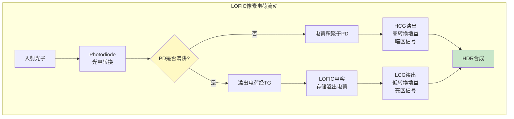
```mermaid
graph TD
    subgraph LOFIC像素电荷流动
        A[入射光子] --> B[Photodiode<br/>光电转换]
        B --> C{PD是否满阱?}
        C -->|否| D[电荷积聚于PD]
        C -->|是| E[溢出电荷经TG]
        E --> F[LOFIC电容<br/>存储溢出电荷]
        D --> G[HCG读出<br/>高转换增益<br/>暗区信号]
        F --> H[LCG读出<br/>低转换增益<br/>亮区信号]
        G --> I[HDR合成]
        H --> I
    end
    style C fill:#fff9c4
    style I fill:#c8e6c9
```

LOFIC的核心价值在于：**同一曝光、同一光电二极管**产生高低两路信号，不存在时间差，天然无Motion Artifact。

### 2.3.1 LOFIC关键参数

| 参数 | 定义 | 典型值（2.1 μm像素） |
|------|------|----------------------|
| HCG（高转换增益） | FD电容小，每电子电压变化大 | 160 μV/e⁻ |
| LCG（低转换增益） | FD + LOFIC电容，每电子电压变化小 | 10 μV/e⁻ |
| 有效FWC（LCG） | PD + LOFIC总容量 | 120 ke⁻ |
| 读出噪声（HCG） | 高增益下的RMS噪声 | 0.68 e⁻ |
| 动态范围 | 20log(FWC_LCG/Noise_HCG) | 103~105 dB |

### 2.3.2 LOFIC电容结构与物理

LOFIC电容的物理实现是单帧HDR性能的关键。在2.1 μm像素面积约束下，LOFIC电容需要提供80~100 ke⁻的电荷存储容量，同时不显著占用像素面积。

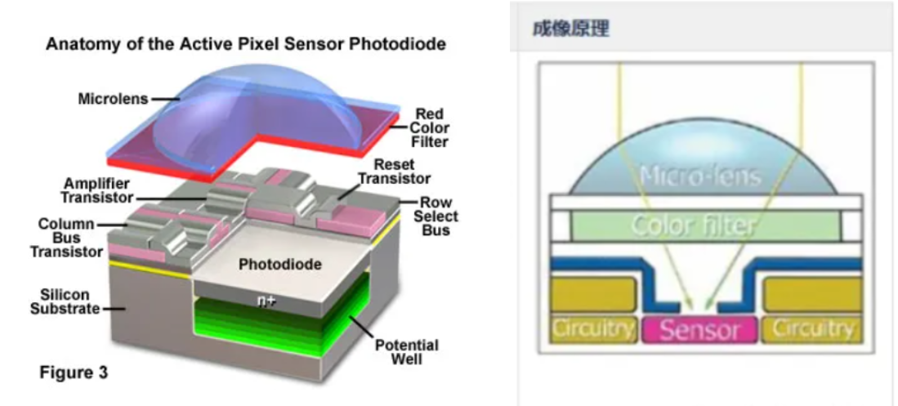
*图2-4：CMOS像素微观截面结构示意图，展示了硅感光区、势阱、电路、滤光膜和微透镜的层次结构。*

**像素截面结构的物理层次（从下到上）：**

1. **硅衬底（Silicon Substrate）**：P型硅基底，是光电转换的发生地。光子进入硅层后激发出电子-空穴对，电子被N+区域（光电二极管）收集。

2. **势阱（Potential Well）**：由PN结反偏电压形成的电场区域，用于捕获和存储光生电子。势阱的深度和宽度决定了像素的满阱容量（FWC）。

3. **传输栅（Transfer Gate, TG）**：控制电荷从PD向FD转移的开关。TG的开启电压和时序精度直接影响电荷转移效率和图像残影（Image Lag）。

4. **浮置扩散（Floating Diffusion, FD）**：电荷-电压转换节点。FD的电容大小决定了转换增益（CG），是HCG/LCG模式切换的关键。

5. **金属布线层（Metal Layers）**：用于连接像素内各晶体管和控制信号。在传统FSI工艺中，这些金属层会遮挡入射光；BSI工艺中则位于像素背面，不再影响感光。

6. **色彩滤波阵列（Color Filter Array, CFA）**：Bayer RGGB图案，每个像素仅透过红、绿、蓝中的一种颜色。滤镜的光谱透过率直接影响量子效率（QE）。

7. **微透镜（Micro Lens）**：将入射光会聚到感光区，提高填充因子。先进的微透镜设计（如双微透镜、无间隙微透镜）可将光能利用率提升至90%以上。

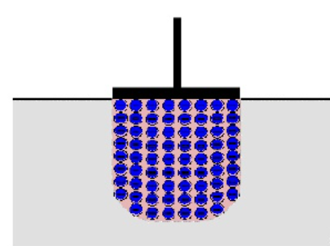
*图2-4a：光电二极管势阱原理示意图。反向偏置电压在PN结处形成电势阱，光生电子被捕获并积聚于阱中，势阱深度决定最大电荷存储容量（FWC）。当势阱填满时，额外电荷将溢出至LOFIC电容。*

**势阱工程与FWC优化：** 势阱的物理本质是PN结耗尽区。通过调节N型掺杂浓度和P型衬底偏压，可以控制势阱深度（典型值0.5~2V电势差）。更深的势阱能存储更多电荷，但需要更高的工作电压，可能增加功耗和暗电流。现代CIS采用渐变掺杂（Graded Doping）技术，在硅表面附近形成浅势阱（快速收集短波长光），在深处形成深势阱（存储大量电荷），实现FWC与灵敏度的平衡。

**MIM（Metal-Insulator-Metal）电容**：利用像素层金属布线层之间的绝缘介质形成平板电容。MIM电容的优势在于工艺兼容性好，可直接在标准CIS工艺流程中制造。单位面积电容密度约1~2 fF/μm²，对于80 ke⁻电荷存储需求，需要约200~400 μm²的电容面积，在2.1 μm像素（4.41 μm²面积）中无法容纳。因此，MIM电容通常设置在像素层的上层金属层中，利用3D堆叠空间。

**MOM（Metal-Oxide-Metal）电容**：利用金属层间的叉指结构（interdigital）和边缘电容增加单位面积电容密度。MOM电容密度可达3~5 fF/μm²，比MIM更高。Sony在IISW 2025论文中使用的EC（Extra Capacitor）即为MOM结构[2]。

**MOS电容**：利用晶体管栅极的MOS结构作为电容，即FC（Floating Capacitor）。MOS电容的优势是可以设置在像素层下部，不占用光电二极管面积。其电容密度取决于栅氧厚度和面积，典型值5~10 fF/μm²。

| 电容类型 | 结构 | 电容密度 | 典型用途 |
|----------|------|----------|----------|
| MIM | 金属-绝缘体-金属 | 1~2 fF/μm² | OMNIVISION LOFIC |
| MOM | 金属-氧化物-金属叉指 | 3~5 fF/μm² | Sony EC |
| MOS | 栅极MOS结构 | 5~10 fF/μm² | Sony FC |

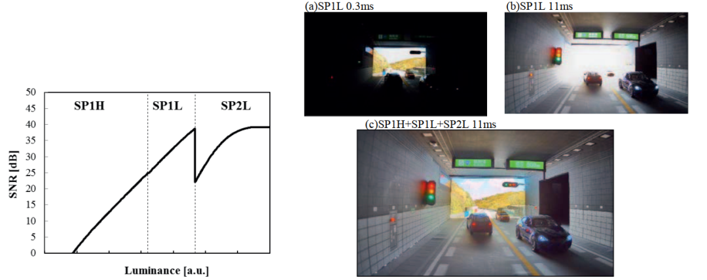
*图2-4b：像素光电转换过程TCAD仿真示意图。模拟显示光子在硅衬底中的吸收深度分布与电子-空穴对的产生/收集效率，为PD面积与势阱深度优化提供理论依据。*

### 2.3.3 LOFIC读出时序详解

LOFIC像素的读出时序是理解单帧HDR机制的关键。以4T像素 + LOFIC为例，一次完整的曝光-读出周期如下：

1. **复位阶段（Reset）**：RG导通，FD复位至VDD电平。若为DCG像素，DCG关断（HCG模式），FD电容为小电容（C_FD）。
2. **曝光阶段（Integration）**：光子在PD中产生电子，电荷积聚于PD势阱。当PD电荷超过PD满阱容量（FWC_PD）时，溢出电子经溢出通路流入LOFIC电容（C_LOFIC）。
3. **HCG读出（First Sample）**：TG导通，PD中未溢出的电荷转移至FD。DCG关断，FD小电容，高增益读出。此信号对应暗区（HCG信号）。
4. **LCG读出（Second Sample）**：DCG导通，FD电容增大（C_FD + C_DCG），等效增益降低。TG再次导通或LOFIC电荷转移至FD，低增益读出。此信号对应亮区（LCG信号）。
5. **HDR合成**：HCG和LCG信号在模拟域（CDS）或数字域合成，根据信号幅度自动选择增益路径。

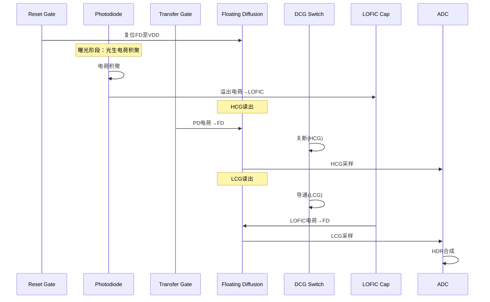
```mermaid
sequenceDiagram
    participant RG as Reset Gate
    participant PD as Photodiode
    participant TG as Transfer Gate
    participant FD as Floating Diffusion
    participant DCG as DCG Switch
    participant LOFIC as LOFIC Cap
    participant ADC as ADC

    RG->>FD: 复位FD至VDD
    Note over PD: 曝光阶段：光生电荷积聚
    PD->>PD: 电荷积聚
    PD->>LOFIC: 溢出电荷→LOFIC
    Note over FD: HCG读出
    TG->>FD: PD电荷→FD
    DCG->>DCG: 关断(HCG)
    FD->>ADC: HCG采样
    Note over FD: LCG读出
    DCG->>DCG: 导通(LCG)
    LOFIC->>FD: LOFIC电荷→FD
    FD->>ADC: LCG采样
    ADC->>ADC: HDR合成
```

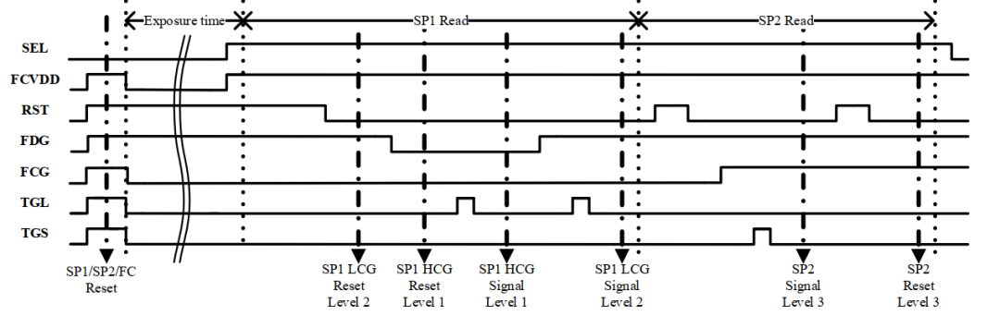
*图2-3b：LOFIC像素读出时序图。展示复位栅（RG）、传输栅（TG）、双转换增益开关（DCG）和行选择（SEL）的控制信号时序，以及HCG与LCG两次采样的精确时刻关系。注意DCG状态切换在HCG采样后、LCG采样前完成，确保两路信号基于不同的FD电容。*

**时序设计的关键约束：**
1. **TG导通时间**：必须足够长（通常1~5μs）以确保PD电荷100%转移至FD，避免图像残影
2. **DCG切换瞬态**：DCG开关切换时会产生电荷注入（Charge Injection）和时钟馈通（Clock Feedthrough），需要通过虚拟开关或补偿电路消除
3. **采样保持时间**：ADC采样必须在FD电压稳定后进行，考虑SF建立时间（Settling Time）和RC常数
4. **行间延迟**：每行读出的控制信号需要精确同步， Rolling Shutter模式下每行间延迟固定（约几微秒）

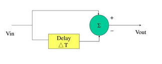
*图2-3c：相关双采样（CDS）原理示意图。通过采样复位电平（Vreset）与信号电平（Vsignal）的差值（ΔV = Vsignal - Vreset），有效消除kTC噪声和复位噪声，是实现亚电子级读出噪声的关键技术。*

**CDS的噪声消除机制：** 在理想情况下，FD复位后的电压Vreset包含kTC噪声（√(kT/C)）和复位管引入的噪声。曝光后电荷转移至FD，电压变为Vsignal，同样包含这些噪声分量。由于两次采样间隔极短（微秒级），kTC噪声和复位噪声可视为相同。通过差分运算ΔV = Vsignal - Vreset，这些相关噪声被抵消，仅保留信号电压和随机热噪声。先进的CDS电路采用列并行架构（Column-parallel CDS），每列配备独立的采样保持电路和差分放大器，实现高速低噪声读出。

LOFIC像素的动态范围理论上由最低照度端的读出噪声和最高照度端的满阱容量决定：

$$DR_{theoretical} = 20 \log_{10}\left(\frac{FWC_{total}}{\sigma_{read,HCG}}\right)$$

其中 $FWC_{total} = FWC_{PD} + FWC_{LOFIC}$。

然而，实际可达到的DR受限于以下因素：

1. **HCG/LCG增益比**：HCG和LCG信号在合成点需要精确匹配，增益比过大导致合成缝隙
2. **LOFIC电容的kTC噪声**：LOFIC电荷读出时引入额外的kTC噪声，降低LCG端SNR
3. **暗电流**：高温下PD暗电流可达数千e⁻/s，显著降低有效FWC
4. **非线性**：LOFIC电容在极端高照度下可能出现非线性响应
5. **合成算法精度**：数字域合成需要精确的增益比校准和offset补偿

实际测量的DR通常比理论值低5~15 dB。例如，理论FWC_total/σ_read = 120,000/0.68 ≈ 105 dB，但考虑kTC噪声、暗电流和非线性后，实测DR约95~100 dB（EMVA 1288标准测量）。

## 2.4 Sony Sub-Pixel HDR

Sony的Sub-Pixel（子像素）HDR在LOFIC基础上引入了大小PD分离架构。每个2.1 μm像素包含一个Large PD和一个小PD：

- **Large PD**：捕获低照度信号，提供高灵敏度
- **Small PD**：快速饱和，用于捕获高照度信号
- **FC（Floating Capacitor）**：MOS电容，作为像素内积分电容
- **EC（Extra Capacitor）**：MOM电容，扩展满阱容量

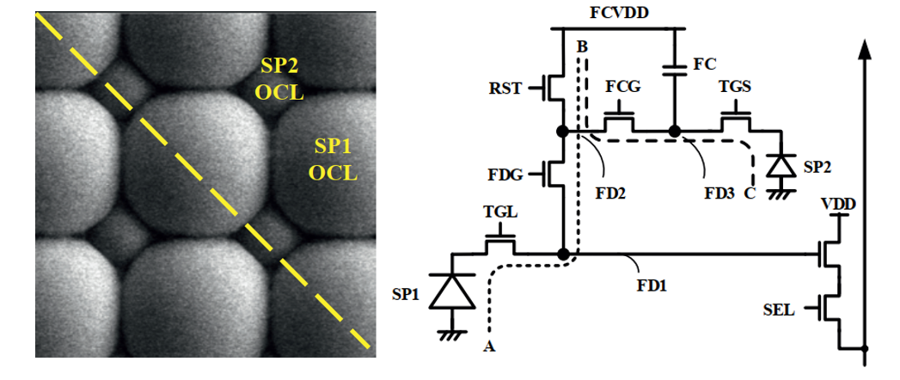
*图2-5：Sony IMX390 Sub-Pixel像素架构俯视图与电路示意图。一个像素具有大片上微透镜（OCL）给小PD使用，SP2的OCL位于SP1的OCL间隙部分，使SP1与SP2的灵敏度比等于10:1。*

**IMX390像素设计的关键创新：**

1. **双微透镜（Dual OCL）设计**：SP2（Small PD）的微透镜位于SP1（Large PD）微透镜的间隙部分，这种紧凑布局使得在有限的像素面积内同时容纳两个光电二极管成为可能。SP1与SP2的灵敏度比为10:1，这是通过面积比和OCL聚光效率共同实现的。

2. **深沟隔离（DTI）技术**：在硅底处采用深槽隔离方式，有效防止从SP1到SP2的电荷泄漏。如果没有DTI，SP1中积累的大量电荷可能通过硅衬底扩散到SP2，破坏两个PD的独立性，导致HDR信号交叉污染。

3. **FC+EC双电容架构**：FC（Floating Capacitor，MOS电容）连接于FD节点，用于存储从两个PD转移来的电荷；EC（Extra Capacitor，MOM电容）进一步扩展满阱容量。FC提供快速、低噪声的电荷存储，EC提供大容量的溢出电荷存储，两者协同实现105dB动态范围。

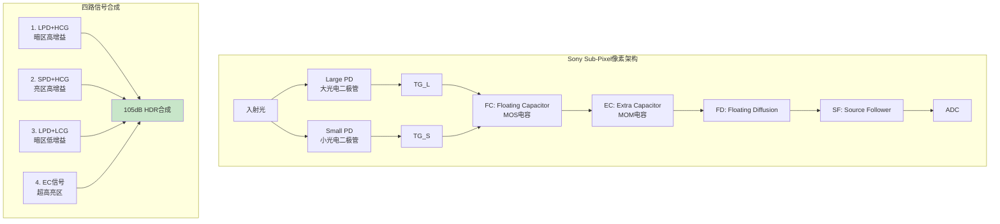
```mermaid
graph TD
    subgraph Sony Sub-Pixel像素架构
        A[入射光] --> B[Large PD<br/>大光电二极管]
        A --> C[Small PD<br/>小光电二极管]
        B --> D[TG_L]
        C --> E[TG_S]
        D --> F[FC: Floating Capacitor<br/>MOS电容]
        E --> F
        F --> G[EC: Extra Capacitor<br/>MOM电容]
        G --> H[FD: Floating Diffusion]
        H --> I[SF: Source Follower]
        I --> J[ADC]
    end
    subgraph 四路信号合成
        K[1. LPD+HCG<br/>暗区高增益]
        L[2. SPD+HCG<br/>亮区高增益]
        M[3. LPD+LCG<br/>暗区低增益]
        N[4. EC信号<br/>超高亮区]
        K & L & M & N --> O[105dB HDR合成]
    end
    style O fill:#c8e6c9
```

据Sony在IISW 2025发表的论文[2]，2.1 μm Sub-Pixel + LOFIC架构可实现105 dB单帧HDR同时具备LFM能力，四路信号合成确保从暗到亮的连续覆盖。

## 2.5 Sony Stacked Pixel架构

Sony的Stacked Pixel（堆叠像素）架构将像素层（Pixel Chip）和电路层（Logic Chip）分别制造在两片晶圆上，通过Cu-Cu混合键合连接：

- **上层像素芯片**：仅包含PD、TG、FD等光敏与电荷存储元件
- **下层逻辑芯片**：包含SF、ADC、列并行读出电路、ISP等

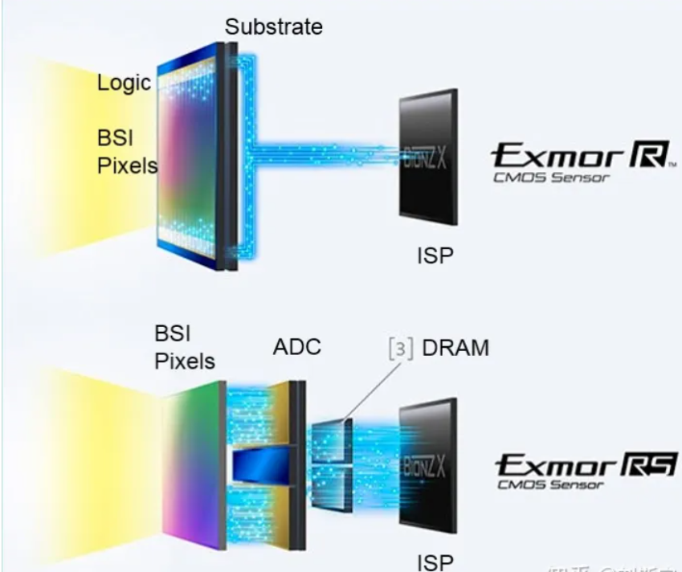
*图2-6：Sony Exmor RS BSI堆栈式CMOS传感器工艺结构。上层硅片全部用于制造像素感光区，下层硅片用于sensor控制所需的模拟、数字逻辑，通过Cu-Cu混合键合连接，感光区占sensor靶面尺寸的比例接近100%。*

**堆叠工艺的技术演进：**

Sony的Exmor RS系列代表了CMOS传感器工艺的巅峰。传统FSI（Front Side Illumination）工艺中，光线需要穿越多层金属电路才能到达感光PN结，造成光能损耗和CRA（Chief Ray Angle）限制。BSI（Back Side Illumination）工艺将wafer打磨至超薄，让光线从背面入射，消除了金属层的遮挡。

堆叠式工艺在此基础上更进一步：
1. **像素层面积最大化**：将读出电路（SF、ADC等）移至下层逻辑芯片，像素层仅保留感光元件，PD占空比从传统60%提升至近100%
2. **电路层独立优化**：逻辑芯片可使用更先进的制程（28nm/22nm），实现更复杂的ISP和AI处理功能
3. **Cu-Cu混合键合**：通过铜-铜直接键合连接上下层，替代传统TSV（硅通孔），降低寄生电容和电阻，提升信号完整性
4. **ISP集成**：如ISX038内置双ISP，直接输出YUV至信息娱乐系统，同时保留RAW输出至ADAS SoC

据Sony数据，IMX828的Cu-Cu键合点数量达5040万个，确保了8MP像素阵列的高速并行读出。

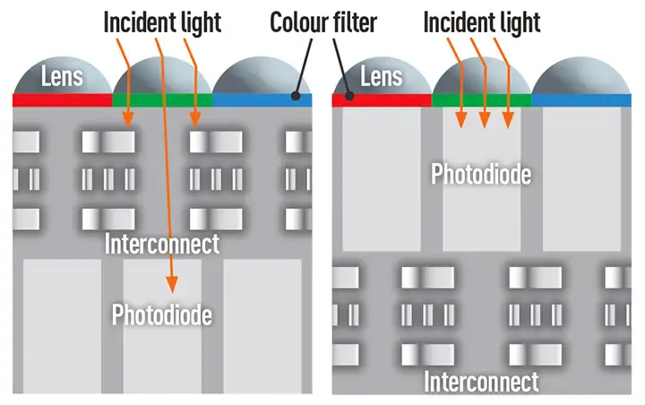
*图2-6a：FSI前照式与BSI背照式CMOS像素结构对比。FSI中光线需穿越多层金属布线（Metal 1-4），造成光损耗和CRA限制；BSI将wafer打磨至3~5μm，光线从背面直接入射至PD，消除金属遮挡，量子效率从~50%提升至~80%以上。*

**BSI工艺的关键制造步骤：**
1. **正面制造**：在传统硅片上完成所有晶体管和金属布线
2. **临时键合**：将硅片键合至载体晶圆（Carrier Wafer）
3. **背面研磨**：将硅片从背面打磨至3~5μm厚度（接近PD结深）
4. **背面工艺**：添加抗反射涂层（ARC）、背面通孔（Backside Via）和背面金属
5. **解键合**：移除载体晶圆，完成BSI晶圆

BSI的难点在于超薄硅片的机械强度和背面表面缺陷控制。Sony通过优化研磨工艺和背面钝化处理，将暗电流控制在与FSI相当的水平。BSI与Stacked工艺的结合（如Exmor RS）代表了CIS制造的最高水平。

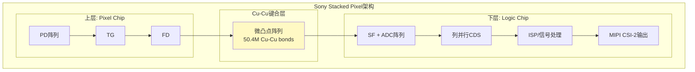
```mermaid
graph TD
    subgraph Sony Stacked Pixel架构
        subgraph 上层: Pixel Chip
            A1[PD阵列] --> A2[TG]
            A2 --> A3[FD]
        end
        subgraph Cu-Cu键合层
            B1[微凸点阵列<br/>50.4M Cu-Cu bonds]
        end
        subgraph 下层: Logic Chip
            C1[SF + ADC阵列] --> C2[列并行CDS]
            C2 --> C3[ISP/信号处理]
            C3 --> C4[MIPI CSI-2输出]
        end
        A3 --> B1
        B1 --> C1
    end
    style B1 fill:#fff9c4
```

Stacked架构的优势：
1. **像素层面积最大化**：移除晶体管后PD占空比显著提升
2. **电路层可独立优化**：更先进的逻辑工艺（如28nm/22nm）
3. **Cu-Cu键合降低寄生**：信号路径短，噪声更低
4. **ISP集成**：如ISX038内置双ISP实现RAW+YUV同时输出

## 2.6 TheiaCel技术

OMNIVISION的TheiaCel™ = DCG + LOFIC联合架构，是另一条单帧HDR技术路线：

- **DCG（Dual Conversion Gain）**：同一PD电荷以高/低两种增益读出，扩展DR至暗区
- **LOFIC**：溢出电荷存储于横向电容，扩展DR至亮区
- **三段HDR**：HCG暗区 + LCG中间区 + LOFIC亮区，覆盖完整光照范围

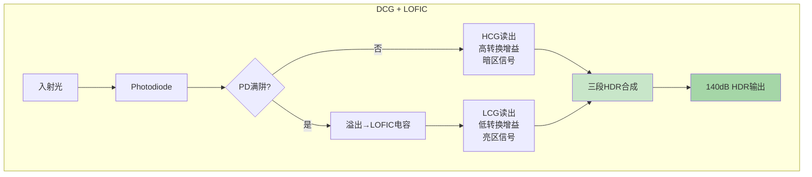
```mermaid
graph TD
    subgraph TheiaCel [DCG + LOFIC]
        A[入射光] --> B[Photodiode]
        B --> C{PD满阱?}
        C -->|否| D[HCG读出<br/>高转换增益<br/>暗区信号]
        C -->|是| E[溢出→LOFIC电容]
        E --> F[LCG读出<br/>低转换增益<br/>亮区信号]
        D --> G[三段HDR合成]
        F --> G
        G --> H[140dB HDR输出]
    end
    style G fill:#c8e6c9
    style H fill:#a5d6a7
```

## 2.7 下一代HDR展望

| 世代 | 时间 | 技术 | DR目标 | 特征 |
|------|------|------|--------|------|
| 第1代 | 2010-2016 | DOL多帧 | 90-120 dB | 有Motion Artifact |
| 第2代 | 2017-2022 | 单帧LOFIC/DCG | 120-140 dB | 无Motion Artifact |
| 第3代 | 2023-2026 | Sub-Pixel+LOFIC / TheiaCel | 140-150 dB | HDR+LFM同时 |
| 第4代 | 2027+ | AI ISP + 单帧HDR | 150+ dB | 算法-工艺协同 |

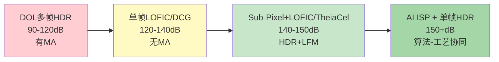
```mermaid
graph LR
    A[DOL多帧HDR<br/>90-120dB<br/>有MA] --> B[单帧LOFIC/DCG<br/>120-140dB<br/>无MA]
    B --> C[Sub-Pixel+LOFIC/TheiaCel<br/>140-150dB<br/>HDR+LFM]
    C --> D[AI ISP + 单帧HDR<br/>150+dB<br/>算法-工艺协同]
    style A fill:#ffcdd2
    style B fill:#fff9c4
    style C fill:#c8e6c9
    style D fill:#a5d6a7
```

---

# 第三章 Sony Sub-Pixel HDR深度解析

## 3.1 Sub-Pixel像素架构

Sony的Sub-Pixel架构是在传统4T像素基础上的革命性改进。核心创新在于将单一PD拆分为一大一小两个子PD，配合LOFIC电容实现单帧HDR + LFM。

### 3.1.1 大小PD分离原理

Sony的Sub-Pixel架构是在传统4T像素基础上的革命性改进。核心创新在于将单一PD拆分为一大一小两个子PD，配合LOFIC电容实现单帧HDR + LFM。

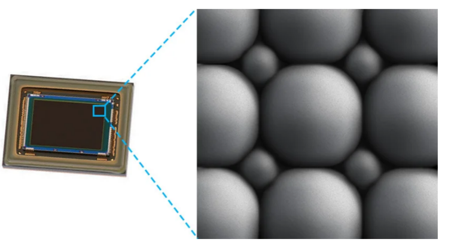
*图3-1a：Sony Sub-Pixel像素物理布局示意图。一个2.1μm物理像素被划分为Large PD（~60%面积，低照度）和Small PD（~20%面积，高照度/LFM）两个独立感光区，通过DTI深沟隔离防止电荷串扰。图中显示了双微透镜（Dual OCL）布局和TG_L/TG_S传输栅位置。*

**PPD（Pinned Photodiode）结构基础：** 现代CIS普遍采用PPD结构，在传统N+/P-Sub结上方增加一层P+钉扎层（Pinning Layer）。这层薄P+区与N+区形成完全耗尽的PN结，将硅-二氧化硅界面（Si-SiO₂ interface）处的缺陷态与光生电子隔离，从而将暗电流降低1~2个数量级（从数百e⁻/s降至数e⁻/s）。PPD的另一关键优势是完整的电荷转移：由于N+区被P+层完全包围，曝光结束时所有电子可被TG电压完全扫出，实现100%转移效率，消除图像残影（Image Lag）。

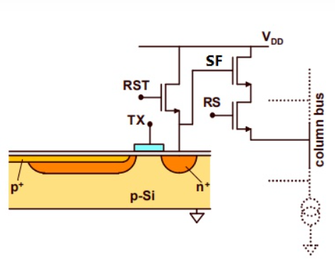
*图3-1b：Pinned Photodiode（PPD）截面结构示意图。P+钉扎层有效抑制界面态产生的暗电流，同时确保曝光结束时电荷能100%转移至FD，消除图像残影（Image Lag）。*

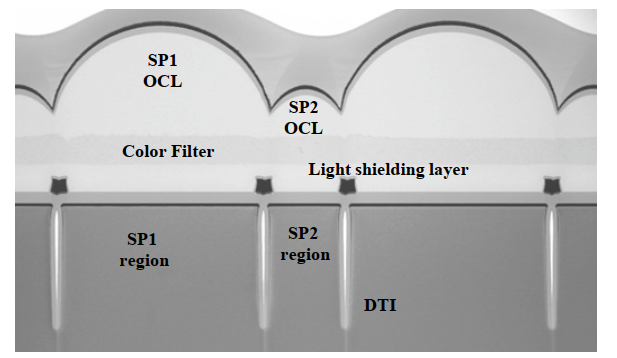
*图3-1：Sony Sub-Pixel像素截面示意图。显示了微透镜、色彩滤波CFA、Large PD、Small PD、传输栅TG_L/TG_S、FC+EC电容和读出电路的层次结构。深沟在硅底处采用隔离方式防止从SP1到SP2的电荷泄漏。*

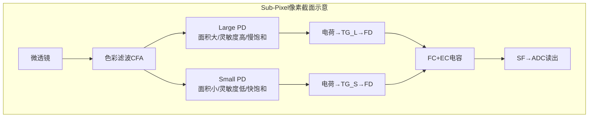
```mermaid
graph TD
    subgraph Sub-Pixel像素截面示意
        A[微透镜] --> B[色彩滤波CFA]
        B --> C[Large PD<br/>面积大/灵敏度高/慢饱和]
        B --> D[Small PD<br/>面积小/灵敏度低/快饱和]
        C --> E[电荷→TG_L→FD]
        D --> F[电荷→TG_S→FD]
        E --> G[FC+EC电容]
        F --> G
        G --> H[SF→ADC读出]
    end
```

**Large PD（大光电二极管）**：占像素面积60~70%，承担低照度信号捕获。其FWC较大（约30 ke⁻），灵敏度（量子效率×面积）高，可捕获0.1 lux级别的暗区信号。由于面积大，Large PD的暗电流也相对较大，但Sony通过DTI（Deep Trench Isolation）深沟隔离技术有效降低了PD间的电荷串扰和暗电流泄漏。

**Small PD（小光电二极管）**：占像素面积20~30%，快速饱和（FWC约5 ke⁻），用于高照度信号捕获。其快速饱和特性天然支持LFM：短积分时间内即可完成对LED完整亮周期的捕获。Small PD的灵敏度约为Large PD的1/10（Sony IMX390设计比），这种设计使得Small PD能在极短时间内（约12.5μs）达到半满阱，确保LED信号的可见性。

**四路信号合成的物理基础：** Sub-Pixel架构的核心创新在于通过大小PD分离，在同一曝光周期内产生四路不同特性的信号。这与DCG技术（仅改变FD电容）有本质区别——Sub-Pixel是从光电转换源头就分离了信号路径，因此能同时优化暗区灵敏度和亮区/LFM性能。

### 3.1.2 电荷读出与四路信号合成

Sony Sub-Pixel的四路信号读出时序如下：

| 信号 | 源 | 增益 | 覆盖照度范围 | 用途 |
|------|-----|------|------------|------|
| LPD_HCG | Large PD | 高 | 0.01~10 lux | 极暗区 |
| SPD_HCG | Small PD | 高 | 10~1,000 lux | 中间区 |
| LPD_LCG | Large PD + LOFIC | 低 | 1,000~10,000 lux | 亮区 |
| EC | Extra Capacitor | 低 | 10,000~100,000 lux | 超亮区 |

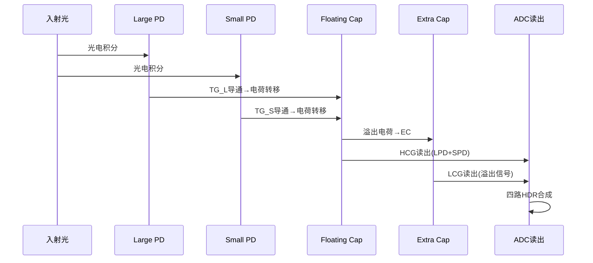
```mermaid
sequenceDiagram
    participant Light as 入射光
    participant LPD as Large PD
    participant SPD as Small PD
    participant FC as Floating Cap
    participant EC as Extra Cap
    participant ADC as ADC读出

    Light->>LPD: 光电积分
    Light->>SPD: 光电积分
    LPD->>FC: TG_L导通→电荷转移
    SPD->>FC: TG_S导通→电荷转移
    FC->>EC: 溢出电荷→EC
    FC->>ADC: HCG读出(LPD+SPD)
    EC->>ADC: LCG读出(溢出信号)
    ADC->>ADC: 四路HDR合成
```

## 3.2 LED Flicker Mitigation实现

LFM的核心挑战：LED以PWM方式工作（典型占空比5~25%，频率90~200 Hz），当CMOS曝光时间短于LED亮周期时，图像中出现闪烁条纹。

Sony Sub-Pixel的LFM策略：

1. **Small PD快速读出**：Small PD在LED亮周期内即可饱和，确保LED信号可见
2. **长曝光与短曝光结合**：四路信号覆盖不同曝光等效时间
3. **曝光时间控制**：使曝光时间为LED周期的整数倍，消除频闪

### 3.2.1 Small PD LFM机理详解

Small PD的LFM能力源于其快速饱和特性。假设Small PD的FWC为5 ke⁻，量子效率为40%，在LED信号灯典型照度（10,000 lux，经光学系统衰减至像素面约1×10⁶ photons/s）下，Small PD仅需约12.5 μs即可达到半满阱。这意味着在33 ms的标准曝光时间内，Small PD已经多次饱和——无论LED的PWM占空比如何（5%~25%），Small PD都能在LED亮周期内积累足够电荷使信号超过噪声阈值，从而保证LED在图像中始终可见。

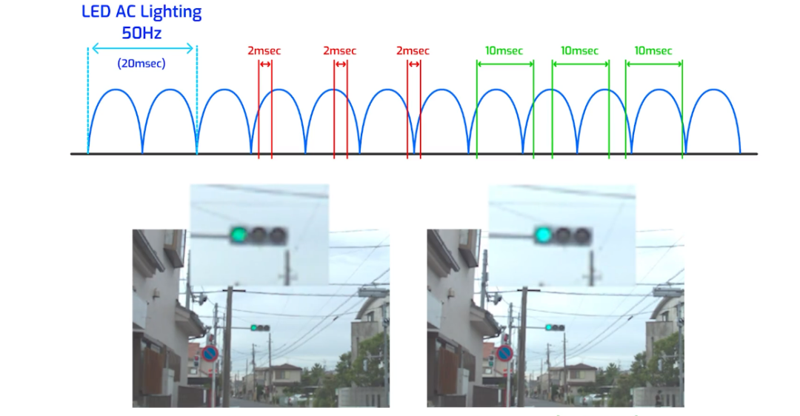
*图3-2：Sony Sub-Pixel LFM（LED Flicker Mitigation）实现原理。由于HDR合成后单帧动态范围可达120dB以上，曝光控制在10ms即可采集到整个LED能量周期（100Hz），从根本上消除LED闪烁问题。*

相比之下，DOL短曝光（0.5 ms）可能恰好落在LED灭周期内，导致"phantom LED"现象。Sub-Pixel方案通过Small PD的快速饱和从根本上消除了这一问题。

### 3.2.2 Sony LFM与TheiaCel LFM的本质差异

两种LFM机制在实现路径上存在本质差异：

| 维度 | Sony Small PD LFM | OMNIVISION Split-Pixel LFM |
|------|-------------------|---------------------------|
| LFM信号源 | Small PD（面积小、快速饱和） | Split-Pixel（独立光电转换区域） |
| 物理机制 | PD面积缩小→FWC低→快速饱和 | 独立PD长曝光覆盖LED完整周期 |
| 对HDR信号的影响 | Small PD也贡献HDR中间区信号 | Split-Pixel仅用于LFM，不影响HDR |
| 捕获次数 | 四路信号内含LFM信息 | 4次独立Split-Pixel捕获 |
| 温度稳定性 | Small PD暗电流受温度影响 | Split-Pixel长曝光在高温下噪声增大 |

Sony方案的优势在于LFM信号与HDR信号来自同一光电转换路径，不需要额外的Split-Pixel面积；劣势是Small PD同时承担HDR中间区和LFM两种功能，在极端高对比度场景中可能出现折衷。OMNIVISION方案的优势在于LFM独立优化，不影响HDR信号质量；劣势是需要额外的Split-Pixel面积，降低主PD的占空比。

## 3.3 典型产品

### 3.3.1 IMX390 — 首代车载Sub-Pixel HDR

Sony IMX390是首款量产的车载Sub-Pixel HDR CMOS，标志着Sony正式进入车载前视感知市场。

| 参数 | IMX390 |
|------|--------|
| 光学格式 | 1/2.7" |
| 像素数 | 2.42 MP (1920×1260) |
| 像素尺寸 | 3.0 μm |
| HDR | 120 dB |
| LFM | 支持 |
| 帧率 | 30 fps |
| 输出 | RAW |
| 接口 | MIPI CSI-2 |
| 功能安全 | ASIL-B |

### 3.3.2 ISX031 — Sub-Pixel + ISP SoC

ISX031是Sony第二代车载SoC传感器，集成ISP与Sub-Pixel HDR。

| 参数 | ISX031 |
|------|--------|
| 光学格式 | 1/2.42" |
| 像素数 | 2.95 MP (1920×1536) |
| 像素尺寸 | 3.0 μm |
| HDR | 120 dB |
| LFM | 内置 |
| 帧率 | 30~60 fps |
| 输出 | YUV422 (UYVY) |
| ISP | 内置 |
| 接口 | GMSL2 (MAX9295) |
| 工作温度 | -40°C ~ +85°C |

ISX031的Sub-Pixel HDR技术使运动物体图像更加锐利，与传统方法相比显著减少运动伪影[3]。

### 3.3.3 IMX728 — 8MP Split-Pixel HDR + LFM

| 参数 | IMX728 |
|------|--------|
| 光学格式 | 1/1.7" |
| 像素数 | 8.39 MP (3857×2177) |
| 像素尺寸 | 2.1 μm |
| HDR | 120 dB |
| LFM | 支持 |
| 帧率 | 30 fps |
| 输出 | RAW |
| 接口 | MIPI CSI-2 |
| 功能安全 | ASIL-B(D) |

IMX728采用Exmor RS Split-Pixel架构，2.1 μm像素尺寸实现了高分辨率与单帧HDR的平衡。TechInsights的DEF分析确认其采用了堆叠BSI结构[4]。

### 3.3.4 ISX038 — 业界首款RAW+YUV双输出

| 参数 | ISX038 |
|------|--------|
| 光学格式 | 1/1.72" |
| 像素数 | 8.39 MP (3857×2177) |
| 像素尺寸 | 2.1 μm |
| HDR+LFM | 106 dB |
| HDR优先 | 130 dB |
| 帧率 | 30 fps (RAW&YUV双输出) |
| 输出 | RAW + YUV (同时) |
| ISP | 双ISP (RAW专用 + YUV专用) |
| 接口 | MIPI CSI-2 (双端口) |
| 兼容性 | Mobileye EyeQ6 |
| 功能安全 | ASIL-B(D) |

ISX038的核心突破：**业界首款可同时处理和输出RAW与YUV图像的车载CMOS**[5]。这一特性使单颗摄像头同时服务于ADAS感知（RAW）和车载信息娱乐（YUV），显著简化系统架构。

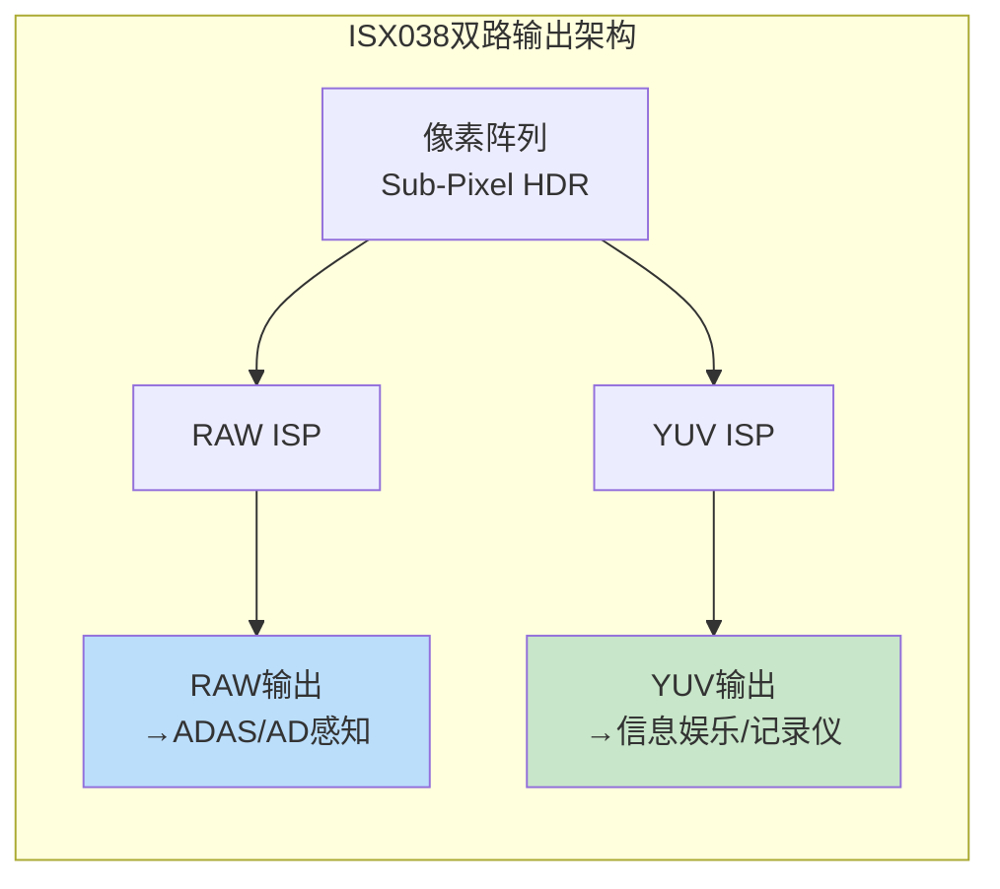
```mermaid
graph LR
    subgraph ISX038双路输出架构
        A[像素阵列<br/>Sub-Pixel HDR] --> B[RAW ISP]
        A --> C[YUV ISP]
        B --> D[RAW输出<br/>→ADAS/AD感知]
        C --> E[YUV输出<br/>→信息娱乐/记录仪]
    end
    style D fill:#bbdefb
    style E fill:#c8e6c9
```

### 3.3.5 IMX828 — 首款内置MIPI A-PHY + 150dB HDR

| 参数 | IMX828 |
|------|--------|
| 光学格式 | 1/1.7" |
| 像素数 | 8.34 MP (3848×2168) |
| 像素尺寸 | 2.1 μm |
| HDR+LFM | 120 dB |
| HDR优先 | 150 dB |
| 饱和照度 | 47 kcd/m²（业界最高） |
| 帧率 | 45 fps |
| 接口 | MIPI D-PHY + I2C 或 MIPI A-PHY |
| 功能安全 | ASIL-B(D), AEC-Q100 Grade 2 |
| 网络安全 | ISO/SAE 21434 |
| 停车监控 | 内置（功耗<100 mW） |

IMX828是业界首款内置MIPI A-PHY接口的车载CMOS[6]，消除了外部Serializer芯片，实现更紧凑的摄像头模块设计和更低功耗。其150 dB动态范围和47 kcd/m²饱和照度确保了红色LED信号灯在日光条件下的正确颜色还原。

### 3.3.6 IISW 2025: 2.1μm Sub-Pixel + LOFIC

Sony在IISW 2025发表的论文[2]披露了最新2.1 μm Sub-Pixel + LOFIC架构细节：
- Large PD + Small PD + FC（MOS电容）+ EC（MOM电容）
- 四路信号单曝光合成，实现105 dB HDR + LFM + Motion Artifact Free

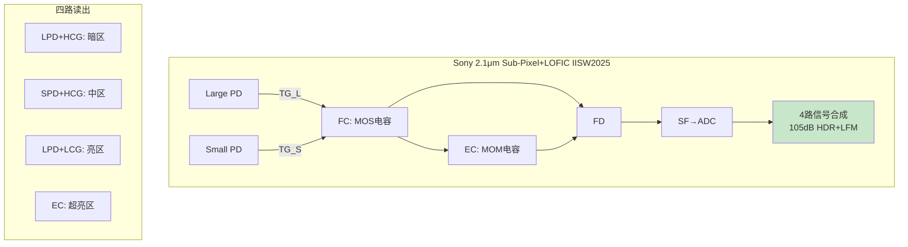
```mermaid
graph TD
    subgraph Sony 2.1μm Sub-Pixel+LOFIC IISW2025
        A[Large PD] -->|TG_L| B[FC: MOS电容]
        C[Small PD] -->|TG_S| B
        B --> D[EC: MOM电容]
        B --> E[FD]
        D --> E
        E --> F[SF→ADC]
        F --> G[4路信号合成<br/>105dB HDR+LFM]
    end
    subgraph 四路读出
        H1[LPD+HCG: 暗区]
        H2[SPD+HCG: 中区]
        H3[LPD+LCG: 亮区]
        H4[EC: 超亮区]
    end
    style G fill:#c8e6c9
```

## 3.4 Sony车载CMOS产品演进表

| 产品 | 年份 | 像素尺寸 | 分辨率 | HDR | LFM | HDR+LFM DR | 关键创新 |
|------|------|----------|--------|-----|-----|------------|----------|
| IMX390 | 2018 | 3.0 μm | 2.4 MP | 120 dB | ✓ | - | 首代Sub-Pixel |
| ISX031 | 2020 | 3.0 μm | 2.9 MP | 120 dB | ✓ | - | SoC+ISP集成 |
| IMX728 | 2022 | 2.1 μm | 8.4 MP | 120 dB | ✓ | - | Split-Pixel 8MP |
| ISX038 | 2024 | 2.1 μm | 8.4 MP | 130 dB | ✓ | 106 dB | RAW+YUV双输出 |
| IMX828 | 2025 | 2.1 μm | 8.3 MP | 150 dB | ✓ | 120 dB | 内置A-PHY+150dB |

---

# 第四章 OMNIVISION TheiaCel™深度解析

## 4.1 TheiaCel架构原理

TheiaCel™是OMNIVISION于2023年正式发布的单帧HDR技术品牌[7]，其核心为DCG + LOFIC联合架构。

### 4.1.1 DCG（Dual Conversion Gain）技术

DCG像素在传统4T像素的复位栅（RG）与VDD之间增加了一个DCG晶体管，通过控制DCG晶体管的导通/关断来改变浮置扩散（FD）的等效电容：

- **HCG模式**：DCG关断，FD电容小（仅FD结电容），Conversion Gain高（典型160 μV/e⁻），读出噪声低（~1 e⁻）
- **LCG模式**：DCG导通，FD电容增大（FD + DCG晶体管电容），Conversion Gain低（典型10 μV/e⁻），满阱容量大（~120 ke⁻）

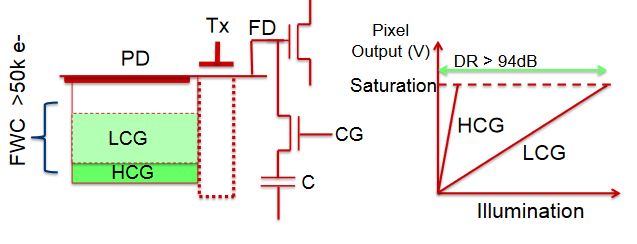
*图4-1：DCG（Dual Conversion Gain）像素电路结构示意图。通过CG信号控制增益，HCG模式捕捉暗部信息，LCG模式捕捉亮部信息，实现单次曝光双增益读出。*

**DCG与Sub-Pixel的本质差异：** DCG技术通过电路层面的增益切换实现HDR，而Sub-Pixel技术通过物理层面的PD分离实现HDR。DCG的优势在于像素结构相对简单（单PD+DCG开关），PD占空比高（约85%），暗区量子效率不受面积分割影响；劣势是仅能提供两路信号（HCG/LCG），HDR合成过渡区的SNR可能不如四路信号的Sub-Pixel平滑。Sub-Pixel的优势在于四路信号提供更精细的DR覆盖和天然的LFM能力；劣势是像素结构复杂（2PD+FC+EC），工艺难度和成本更高。

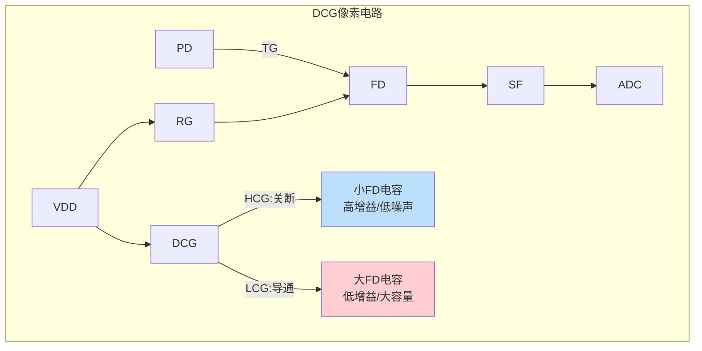
```mermaid
graph TD
    subgraph DCG像素电路
        A[PD] -->|TG| B[FD]
        B --> C[SF]
        C --> D[ADC]
        E[RG] --> B
        F[DCG] -->|HCG:关断| G[小FD电容<br/>高增益/低噪声]
        F -->|LCG:导通| H[大FD电容<br/>低增益/大容量]
        I[VDD] --> E
        I --> F
    end
    style G fill:#bbdefb
    style H fill:#ffcdd2
```

**DCG读出时序**：

1. 曝光结束后，TG导通，PD电荷转移至FD
2. **第一次采样（HCG）**：DCG关断，FD小电容，高增益读出——捕获低照度信号
3. **第二次采样（LCG）**：DCG导通，FD大电容，低增益读出——捕获高照度信号
4. HCG和LCG信号在数字域合成

### 4.1.1.1 DCG晶体管级工作原理

DCG技术的核心是一个与RG并联的MOS开关管。当DCG管关断时，FD节点仅看到其自身的pn结电容（C_j）、栅漏重叠电容（C_gd）和布线寄生电容（C_par）：

$$C_{FD,HCG} = C_j + C_{gd} + C_{par} \approx 1 \text{ fF}$$

当DCG管导通时，FD节点通过DCG管连接至VDD轨，等效电容增加DCG管引入的额外电容：

$$C_{FD,LCG} = C_{FD,HCG} + C_{DCG} + C_{CDS} \approx 16 \text{ fF}$$

Conversion Gain（CG）为每电子在FD上产生的电压变化：

$$CG = \frac{q}{C_{FD}}$$

其中q为电子电荷（1.6×10⁻¹⁹ C）。因此：

- HCG：CG = 1.6×10⁻¹⁹ / 1×10⁻¹⁵ = 160 μV/e⁻
- LCG：CG = 1.6×10⁻¹⁹ / 16×10⁻¹⁵ = 10 μV/e⁻

增益比为16:1，对应24 dB的DR扩展。这意味着仅DCG本身即可从暗区扩展约24 dB动态范围。

读出噪声与增益的关系：HCG模式下，SF的输入参考噪声被高增益放大后在ADC端表现为更少的等效电子数。典型SF噪声约30 μV_rms，在HCG模式下等效为30/160 = 0.19 e⁻，加上kTC噪声（√(kT/C) = √(1.38×10⁻²³×300/1×10⁻¹⁵) ≈ 64 μV ≈ 0.4 e⁻），总HCG读出噪声约0.5~1 e⁻。LCG模式下，同一SF噪声等效为30/10 = 3 e⁻，但亮区信号本身远大于噪声，SNR仍可接受。

### 4.1.1.2 DCG HCG/LCG合成算法

DCG的两路信号合成是保证HDR质量的关键环节。合成算法需要在HCG和LCG信号的交叉点实现平滑过渡，避免合成伪影。

理想的合成策略如下：

1. **低照度区（0~N₁ e⁻）**：仅使用HCG信号，因为LCG信号的信噪比不足
2. **过渡区（N₁~N₂ e⁻）**：HCG和LCG加权融合，权重随信号幅度变化
3. **高照度区（N₂~FWC e⁻）**：仅使用LCG信号，因为HCG已饱和

过渡区的权重函数通常采用线性或sigmoid插值。OMNIVISION的HALE（HDR and LFM Engine）算法在过渡区采用自适应权重，根据像素级信噪比动态调整HCG/LCG融合比例[8]。

| 参数 | HCG路径 | LCG路径 |
|------|---------|---------|
| CG | 160 μV/e⁻ | 10 μV/e⁻ |
| 读出噪声 | ~1 e⁻ | ~3 e⁻ |
| FWC | ~6 ke⁻ | ~120 ke⁻ |
| SNR@1 e⁻信号 | 1 (0 dB) | 0.33 (-9.5 dB) |
| SNR@饱和 | 77.5 (37.8 dB) | 40 (32 dB) |
| DR贡献 | 暗区（低噪声） | 亮区（大容量） |

### 4.1.2 LOFIC技术

LOFIC（Lateral Overflow Integration Capacitor）在DCG基础上进一步扩展亮区动态范围：

- 当PD产生的电荷超过LCG模式的满阱容量时，溢出电荷流入像素内的LOFIC大电容
- LOFIC电容通常采用MIM（Metal-Insulator-Metal）或MOM（Metal-Oxide-Metal）结构，可提供额外80~100 ke⁻存储容量
- LOFIC读出为LCG模式，与PD的LCG读出共享读出链路

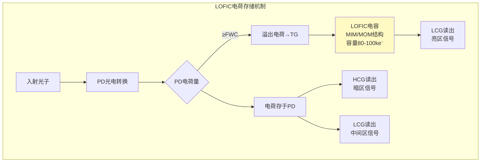
```mermaid
graph TD
    subgraph LOFIC电荷存储机制
        A[入射光子] --> B[PD光电转换]
        B --> C{PD电荷量}
        C -->|<FWC| D[电荷存于PD]
        C -->|≥FWC| E[溢出电荷→TG]
        E --> F[LOFIC电容<br/>MIM/MOM结构<br/>容量80-100ke⁻]
        D --> G[HCG读出<br/>暗区信号]
        D --> H[LCG读出<br/>中间区信号]
        F --> I[LCG读出<br/>亮区信号]
    end
    style F fill:#fff9c4
```

### 4.1.3 TheiaCel三段HDR机制

TheiaCel将DCG和LOFIC组合为三段HDR：

| 段 | 信号源 | 增益模式 | 覆盖范围 | 对应场景 |
|----|--------|----------|----------|----------|
| 暗段 | PD | HCG | 0.01~1 lux | 夜间/隧道 |
| 中段 | PD | LCG | 1~1,000 lux | 阴天/室内 |
| 亮段 | LOFIC | LCG | 1,000~100,000 lux | 直射阳光/远光灯 |

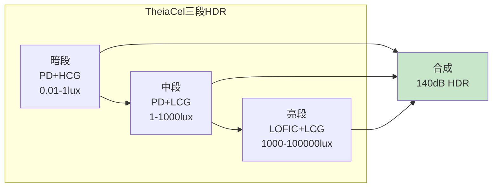
```mermaid
graph LR
    subgraph TheiaCel三段HDR
        A[暗段<br/>PD+HCG<br/>0.01-1lux] --> B[中段<br/>PD+LCG<br/>1-1000lux]
        B --> C[亮段<br/>LOFIC+LCG<br/>1000-100000lux]
    end
    A --> D[合成<br/>140dB HDR]
    B --> D
    C --> D
    style D fill:#c8e6c9
```

## 4.2 LFM实现机制

TheiaCel的LFM通过Split-Pixel方式实现：像素内包含主PD（用于HDR成像）和Split-Pixel（用于LFM）。Split-Pixel在长曝光下捕获LED完整周期，与主PD的HDR信号合成后消除闪烁。

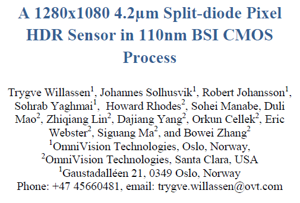
*图4-2：Split-Diode像素结构示意图。将像素的光敏区（PhotoDiode, PD）分割成SPD和LPD两个部分，分别负责短曝光和长曝光。SPD主要用于捕捉强光信号，面积小敏感度低；LPD主要用于捕捉弱光信号，面积大敏感度高。*

**Split-Diode与Sub-Pixel的技术对比：** 虽然两者都采用了PD分割的思路，但实现方式有本质差异。Sony的Sub-Pixel中，大小PD都参与HDR成像（四路信号合成），Small PD同时承担LFM功能；而TheiaCel的Split-Diode中，主PD负责HDR成像，Split-Pixel独立负责LFM（通过长曝光捕获LED完整周期），两者信号在HALE算法中联合合成。

**TheiaCel LFM的物理机制：** Split-Pixel通过独立的长曝光（通常33ms，覆盖一个完整帧周期）确保捕获LED的完整PWM周期。由于Split-Pixel的曝光时间与主PD的HDR曝光时间独立，即使HDR采用短曝光，Split-Pixel仍能保证LFM性能。这种分离设计的优势是LFM不影响HDR信号质量；劣势是需要额外的像素面积用于Split-Pixel，降低了主PD的占空比（约85%→75%）。

OX03C10采用4次捕获的Split-Pixel LFM技术，在整个车载温度范围内提供最佳LFM性能[8]。

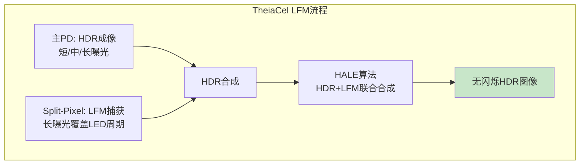
```mermaid
graph TD
    subgraph TheiaCel LFM流程
        A[主PD: HDR成像<br/>短/中/长曝光] --> C[HDR合成]
        B[Split-Pixel: LFM捕获<br/>长曝光覆盖LED周期] --> C
        C --> D[HALE算法<br/>HDR+LFM联合合成]
        D --> E[无闪烁HDR图像]
    end
    style E fill:#c8e6c9
```

## 4.3 典型产品

### 4.3.1 OX03C10 — 2.5MP 140dB HDR + LFM

| 参数 | OX03C10 |
|------|---------|
| 光学格式 | 1/2.6" |
| 像素数 | 2.5 MP (1920×1280) |
| 像素尺寸 | 3.0 μm |
| HDR | 140 dB |
| LFM | 4次捕获Split-Pixel |
| 帧率 | 60 fps |
| 技术 | DCG™ + Split-Pixel LFM |
| 封装 | a-CSP™ / a-BGA™ |
| 功能安全 | ASIL-C |
| 功耗 | 业界最低（2.5MP LFM传感器中） |
| 接口 | MIPI CSI-2 (4-lane) + DVP (12-bit) |

OX03C10是业界首款将140 dB HDR与最佳LFM性能结合的车载Viewing传感器[8]。其HALE（HDR and LFM Engine）组合算法实现了HDR与LFM的同时最优化。

### 4.3.2 OX05D10 — 5MP TheiaCel

| 参数 | OX05D10 |
|------|---------|
| 光学格式 | - |
| 像素数 | 5 MP |
| 像素尺寸 | - |
| HDR | 140 dB |
| LFM | 支持 |
| 技术 | TheiaCel™ (DCG + LOFIC) |
| 应用 | 前视/周视 |

### 4.3.3 OX08D10 — 8MP TheiaCel旗舰

| 参数 | OX08D10 |
|------|---------|
| 光学格式 | 1/1.73" |
| 像素数 | 8 MP (3840×2160) |
| 像素尺寸 | 2.1 μm |
| HDR | TheiaCel™ (DCG + LOFIC) |
| LFM | 支持 |
| 技术 | TheiaCel™ |
| LFM动态范围 | 较前代提升3.3倍 |
| 总动态范围 | 较前代提升近3倍 |
| 封装 | a-CSP™ (面积最小) |

OX08D10是OMNIVISION首款集成TheiaCel™技术的8MP车载传感器[9]，LOFIC与DCG的组合使其LFM动态范围较非LOFIC前代提升3.3倍，总动态范围提升近3倍。

### 4.3.4 OX08D20 — 次代8MP + Mobileye协作

| 参数 | OX08D20 |
|------|---------|
| 像素数 | 8 MP |
| 帧率 | 60 fps |
| 创新 | Mobileye协作捕获方案，减少近距运动模糊 |
| 网络安全 | MIPI CSE 2.0 |
| 封装 | a-CSP™（比同级小50%） |
| 量产时间 | Q4 2026 |

OX08D20在OX08D10基础上引入了与Mobileye协作开发的创新捕获方案，显著减少近距离物体运动模糊，并升级至60 fps支持双用途摄像头[10]。

**OX08D20技术深度解析：**

OX08D20代表了OMNIVISION TheiaCel技术的最新演进，其核心改进包括：

1. **Mobileye协作捕获方案**：通过与Mobileye EyeQ6H芯片的深度协同优化，OX08D20实现了传感器与ISP的联合调优。传感器输出专为目标检测网络优化的RAW格式（而非传统RGB Bayer），减少了ISP处理延迟（约5~8ms），同时保持了目标检测精度。这种"传感器-AI协同设计"将成为下一代车载CMOS的重要趋势。

2. **60 fps双用途架构**：OX08D20支持两种工作模式——30 fps高动态范围模式（140dB HDR + LFM）和60 fps低延迟模式（120dB HDR）。在60 fps模式下，曝光时间缩短至16.7ms，但通过DCG+LOFIC的三段HDR合成仍能保持足够的动态范围，满足高速场景（如高速公路并线、紧急避障）的低延迟需求。

3. **MIPI CSE 2.0网络安全**：集成MIPI Camera Security Extensions 2.0，支持图像数据加密、身份验证和篡改检测。在自动驾驶时代，摄像头数据的安全性至关重要——恶意篡改的图像可能导致AI系统做出错误决策。CSE 2.0通过硬件级加密确保从传感器到SoC的数据链路安全。

4. **a-CSP™封装优化**：采用OMNIVISION专有的a-CSP（advanced Chip Scale Package）封装，尺寸比同级产品小50%，在紧凑的车载摄像头模块中节省了宝贵的PCB面积。这对于前视摄像头（通常安装在 windshield 后方狭窄空间）尤为重要。

### 4.3.5 OX03H10 — 3MP TheiaCel Viewing

| 参数 | OX03H10 |
|------|---------|
| 像素数 | 3 MP |
| 像素尺寸 | 3.0 μm |
| HDR | 140 dB（单曝光） |
| LFM | 单曝光实现全DR |
| 技术 | TheiaCel™ + Split-Pixel |

OX03H10通过单曝光生成完整140 dB动态范围，实现了无与伦比的LFM性能[11]。

### 4.3.6 OX12A10 — 12MP TheiaCel

| 参数 | OX12A10 |
|------|---------|
| 像素数 | 12 MP |
| 技术 | TheiaCel™ |
| LFM | LED闪烁自由 |

### 4.3.7 OV50K40 — 首款手机端TheiaCel

| 参数 | OV50K40 |
|------|---------|
| 光学格式 | 1/1.3" |
| 像素数 | 50 MP |
| 像素尺寸 | 1.2 μm |
| 技术 | TheiaCel™ |
| 应用 | 高端智能手机 |

OV50K40是业界首款手机端TheiaCel传感器[12]，标志着TheiaCel从车载向移动端的扩展。

## 4.4 TheiaCel车载产品演进表

| 产品 | 年份 | 像素尺寸 | 分辨率 | HDR | LFM | 关键创新 |
|------|------|----------|--------|-----|-----|----------|
| OX03C10 | 2020 | 3.0 μm | 2.5 MP | 140 dB | Split-Pixel 4-cap | HALE算法 |
| OX05D10 | 2024 | - | 5 MP | 140 dB | ✓ | TheiaCel扩展 |
| OX03H10 | 2024 | 3.0 μm | 3 MP | 140 dB | 单曝光 | 单曝光全DR |
| OX08D10 | 2023 | 2.1 μm | 8 MP | 高 | ✓ | 首款TheiaCel 8MP |
| OX08D20 | 2025 | - | 8 MP | 高 | ✓ | Mobileye协作+60fps |
| OX12A10 | 2024 | - | 12 MP | 高 | ✓ | 12MP TheiaCel |

---

# 第五章 Sony vs TheiaCel技术路线深度对比

## 5.1 核心技术架构全景对比

Sony Sub-Pixel + LOFIC与OMNIVISION TheiaCel = DCG + LOFIC代表了车载单帧HDR的两种根本不同的技术哲学：Sony从光电转换源头进行信号分离，TheiaCel从电荷读出阶段进行增益调控。以下从系统层到晶体管层进行全维度深度对比。

### 5.1.1 系统级架构对比表

| 对比维度 | Sony Sub-Pixel + LOFIC | OMNIVISION TheiaCel (DCG + LOFIC) |
|---------|------------------------|-----------------------------------|
| **像素架构** | 大小PD分离（2 PD/pixel） | 单PD + DCG增益切换 |
| **光电转换** | 两个独立PD分别转换 | 同一PD，电荷统一收集 |
| **HDR信号源** | 4路（LPD_HCG, SPD_HCG, LPD_LCG, EC） | 3路（HCG, LCG, LOFIC） |
| **LFM实现** | Small PD快速饱和（内置于HDR） | Split-Pixel长曝光（独立） |
| **HDR+LFM同时性** | 天然同时（同次曝光） | 需要HALE算法合成 |
| **满阱容量** | ~120 ke⁻（FC+EC） | ~140 ke⁻（LOFIC优化） |
| **读出噪声** | ~0.68 e⁻（HCG） | ~1 e⁻（HCG） |
| **动态范围（HDR+LFM）** | 105-120 dB | 140 dB |
| **像素复杂度** | 高（2TG + FC + EC + DTI） | 中（DCG + LOFIC + 1TG） |
| **PD占空比** | ~80%（受PD分割影响） | ~85%（单PD面积最大化） |
| **工艺难度** | 高（双PD对准、DTI深度控制） | 中（DCG开关优化、LOFIC电容集成） |
| **成本** | 较高（复杂像素+Stacked工艺） | 中等（标准CIS工艺+LOFIC模块） |
| **代表产品** | IMX390, ISX031, IMX728, ISX038, IMX828 | OX03C10, OX08D10, OX08D20, OX03H10 |
| **应用领域** | ADAS前视、DMS、Viewing | ADAS前视、surround view、Parking |
| **生态锁定** | Sony+Mobileye/Renesas | OMNIVISION+NVIDIA/Qualcomm/Mobileye |

```mermaid
graph TB
    subgraph Sony [Sub-Pixel 物理过程]
        A1[光子入射] --> B1[Large PD (60-70%面积)]
        A1 --> C1[Small PD (20-30%面积)]
        B1 --> D1[TG_L -> FC(MOS)]
        C1 --> E1[TG_S -> FC(MOS)]
        D1 --> F1[EC(MOM) -> FD]
        E1 --> F1
        F1 --> G1[4路合成: 105dB HDR + LFM]
    end

    subgraph TheiaCel [物理过程]
        A2[光子入射] --> B2[Single PD (85%占空比)]
        B2 --> C2[电荷统一收集]
        C2 --> D2{DCG开关}
        D2 -->|关断| E2[HCG: 高增益, 暗区]
        D2 -->|导通| F2[LCG: 低增益, 亮区]
        C2 --> G2[LOFIC: 溢出电荷存储]
        E2 --> H2[3路合成: 140dB HDR]
        F2 --> H2
        G2 --> H2
        B2 --> I2[Split-Pixel: 独立LFM]
        H2 --> J2[HALE算法: HDR+LFM]
        I2 --> J2
    end

    style G1 fill:#bbdefb
    style J2 fill:#c8e6c9

```

### 5.1.2 像素级物理机制深度对比

```mermaid
graph TB
    subgraph Sony [Sub-Pixel 物理过程]
        A1[光子入射] --> B1[Large PD - 60~70%面积]
        A1 --> C1[Small PD - 20~30%面积]
        B1 --> D1[TG_L -> FC MOS]
        C1 --> E1[TG_S -> FC MOS]
        D1 --> F1[EC MOM -> FD]
        E1 --> F1
        F1 --> G1[4路合成 - 105dB HDR + LFM]
    end

    subgraph TheiaCel [物理过程]
        A2[光子入射] --> B2[Single PD - 85%占空比]
        B2 --> C2[电荷统一收集]
        C2 --> D2{DCG开关}
        D2 -->|关断| E2[HCG - 高增益 暗区]
        D2 -->|导通| F2[LCG - 低增益 亮区]
        C2 --> G2[LOFIC - 溢出电荷存储]
        E2 --> H2[3路合成 - 140dB HDR]
        F2 --> H2
        G2 --> H2
        B2 --> I2[Split-Pixel - 独立LFM]
        H2 --> J2[HALE算法 - HDR+LFM]
        I2 --> J2
    end

    style G1 fill:#bbdefb
    style J2 fill:#c8e6c9
```

**五大关键差异深度解析：**

**1. 信号分离层级差异**
- **Sony**：在光电转换层就分离了大小PD，从物理源头产生两路独立信号。这意味着两个PD可以独立优化：Large PD最大化面积和量子效率，Small PD最小化FWC实现快速饱和。信号分离发生在电荷产生阶段，不可事后改变。
- **TheiaCel**：在电荷收集后通过DCG电路切换增益，信号始终来自同一PD。这意味着PD设计需要在暗区灵敏度和亮区FWC之间折衷，但增益切换提供了灵活性——可根据场景动态选择HCG/LCG，甚至实现自适应增益控制。

**2. HDR合成复杂度与质量**
- **Sony 4路合成**：LPD_HCG（暗区）+ SPD_HCG（中间区）+ LPD_LCG（亮区）+ EC（超亮区）。四路信号提供了更精细的照度分层，合成过渡更平滑，伪影更少。但4路合成需要更复杂的权重算法和更多的校准参数（每路增益比、offset、非线性系数），增加了ISP处理负担和量产校准成本。
- **TheiaCel 3路合成**：HCG（暗区）+ LCG（中间区）+ LOFIC（亮区）。三路合成算法更简单，但HCG→LCG的过渡区可能不如4路精细。TheiaCel通过140dB的总DR和HALE算法的智能融合，在实际图像质量上弥补了过渡区的不足。

**3. LFM机制的根本差异**
- **Sony Small PD LFM**：Small PD面积仅为Large PD的1/10，FWC约5ke⁻，在典型车载曝光时间（33ms）内对LED PWM信号的响应类似于一个低通滤波器——即使LED在部分时间熄灭，Small PD由于FWC小、积分快，仍能在达到饱和前捕获LED亮周期的信号。这种LFM是"被动"的，无需额外曝光或算法处理。
- **TheiaCel Split-Pixel LFM**：Split-Pixel是独立的光敏区，通过长曝光（通常覆盖完整帧周期）确保捕获LED的完整PWM周期。这种LFM是"主动"的，需要独立的曝光控制和HALE算法将LFM信号与HDR图像融合。优势是LFM性能更稳定（不受LED频率变化影响），劣势是占用额外像素面积。

**4. 工艺兼容性与成本结构**
- **Sony Sub-Pixel**：需要复杂的双PD光刻对准（两套PD掩膜，对准精度<50nm）、深沟隔离（DTI，刻蚀深度>3μm）和双微透镜（Dual OCL）工艺。这些工艺步骤增加了约15~20%的制造成本，且良率对工艺波动敏感。但Sony通过自有晶圆厂和Stacked工艺（Exmor RS）实现了规模经济，摊薄了研发成本。
- **TheiaCel**：DCG开关是一个标准MOS晶体管，LOFIC电容可使用标准MIM/MOM工艺。整个像素架构可在标准CIS工艺流程上通过增加2~3个掩膜层实现，工艺兼容性更好，制造成本增加约5~10%。OMNIVISION作为Fabless设计公司，通过与台积电、中芯国际等代工厂合作，实现了灵活的产能调配。

**5. 技术演进路径与扩展性**
- **Sony**：Stacked Pixel架构（上层像素+下层逻辑）为集成AI ISP提供了天然平台。Sony已在ISX038中集成双ISP，未来可在逻辑层集成轻量级NPU，实现片上暗区降噪和HDR增强。Sub-Pixel架构的4路信号也为多光谱成像（如添加NIR PD）预留了扩展空间。
- **TheiaCel**：标准工艺路径更适合成本敏感型应用（如 surround view、后视摄像头）。OMNIVISION的策略是保持CMOS输出RAW，将AI处理留给域控制器的NPU（如NVIDIA Orin、Qualcomm SA8650），通过算法优化（如HALE）而非硬件集成实现性能提升。这种分工降低了CMOS成本，但增加了传输带宽需求。

## 5.2 动态范围对比

| 产品 | DR (HDR+LFM) | DR (HDR优先) | 测试标准 |
|------|--------------|-------------|----------|
| Sony IMX728 | - | 120 dB | EMVA 1288 |
| Sony ISX038 | 106 dB | 130 dB | EMVA 1288 |
| Sony IMX828 | 120 dB | 150 dB | - |
| Sony IISW2025 | 105 dB | - | - |
| OMNIVISION OX03C10 | 140 dB | - | - |
| OMNIVISION OX08D10 | ~140 dB | - | - |
| OMNIVISION OX03H10 | 140 dB | - | 单曝光 |

```mermaid
graph LR
    subgraph 动态范围对比
        A[Sony IMX728<br/>120dB] --> B[Sony ISX038<br/>130dB]
        B --> C[Sony IMX828<br/>150dB]
        D[OMNIVISION OX03C10<br/>140dB] --> E[OMNIVISION OX08D10<br/>~140dB]
    end
    style C fill:#bbdefb
    style E fill:#c8e6c9
```

## 5.3 LED Flicker Mitigation对比

| 维度 | Sony | TheiaCel |
|------|------|----------|
| LFM原理 | Small PD快速饱和 | Split-Pixel长曝光 |
| LFM+HDR同时DR | 106-120 dB | 140 dB |
| LFM捕获次数 | 内置于四路信号 | 4次Split-Pixel捕获 |
| 温度范围 | -40°C ~ +85°C | -40°C ~ +105°C（全温） |

## 5.4 暗光性能对比

| 维度 | Sony Sub-Pixel | TheiaCel |
|------|---------------|----------|
| 暗区信号源 | Large PD（面积大） | HCG（增益高） |
| 等效读出噪声 | ~0.68 e⁻ (HCG) | ~1 e⁻ (HCG) |
| 量子效率 | Large PD QE高 | PD QE受面积限制 |
| SNR10 | 优秀（大PD贡献） | 优秀（HCG贡献） |

### 5.4.1 SNR曲线与暗区信噪比深度分析

SNR曲线是评估HDR CMOS暗光性能的核心工具。SNR定义为信号均值与总噪声标准差之比：

$$SNR = \frac{\mu_{signal}}{\sqrt{\sigma_{read}^2 + \sigma_{shot}^2 + \sigma_{dark}^2}}$$

其中$\sigma_{shot} = \sqrt{\mu_{signal}}$为散粒噪声，$\sigma_{dark}$为暗电流噪声。

在极低照度（<1 lux）下，散粒噪声远小于读出噪声，SNR近似为：

$$SNR_{low} \approx \frac{QE \cdot A_{PD} \cdot E \cdot t_{exp}}{\sigma_{read}}$$

其中$QE$为量子效率，$A_{PD}$为PD面积，$E$为照度，$t_{exp}$为曝光时间。

**Sony Sub-Pixel**：Large PD面积占像素60~70%，即约2.7~3.1 μm²（2.1 μm像素）。假设QE=70%，曝光33 ms，照度0.1 lux（经f/1.8镜头后像素面约2,500 photons/s），Large PD产生约57 e⁻，HCG读出噪声0.68 e⁻，SNR≈83（38 dB）。

**TheiaCel**：单个PD面积约3.5 μm²（无大小PD分割，PD占空比更高），但HCG读出噪声约1 e⁻。同样条件下PD产生约80 e⁻，SNR≈80（38 dB）。

两者在极低照度下的SNR表现相当，但路径不同：Sony通过大PD面积获得更多信号，TheiaCel通过更低噪声维持SNR。在高照度下，TheiaCel的LCG+LOFIC路径提供更大的满阱容量（140 dB vs 105 dB HDR+LFM），这是TheiaCel在HDR+LFM同时性上的优势。

```mermaid
graph LR
    subgraph SNR优势路径
        A[极暗区<0.1lux] --> B[Sony优势<br/>Large PD面积大]
        A --> C[TheiaCel接近<br/>HCG噪声低]
        D[中间区1-1000lux] --> E[Sony优势<br/>SPD+HCG精细]
        D --> F[TheiaCel接近<br/>LCG过渡平滑]
        G[亮区>1000lux] --> H[Sony劣势<br/>LOFIC容量有限]
        G --> I[TheiaCel优势<br/>LOFIC大容量]
    end
    style B fill:#bbdefb
    style I fill:#c8e6c9
```

### 5.4.2 暗电流与高温性能

暗电流是车载CMOS在高温环境下性能退化的主要原因。暗电流密度与温度的关系遵循Arrhenius方程：

$$J_{dark} \propto T^{3/2} \exp\left(-\frac{E_g}{2kT}\right)$$

在25°C时典型暗电流约10~50 e⁻/s/pixel，在85°C时可达1000~5000 e⁻/s/pixel。以85°C、3000 e⁻/s暗电流、33 ms曝光计算，暗电流贡献约99 e⁻。对HCG路径（FWC≈6 ke⁻），这相当于1.65%的满阱容量，影响有限；但对LCG路径的暗区精度有显著影响——暗电流使得LCG路径的最低可检测信号从理论~3 e⁻上升至~100 e⁻。

Sony通过DTI（Deep Trench Isolation）技术降低PD间的暗电流串扰，并在Stacked架构中将SF和ADC置于逻辑层，降低像素层暗电流贡献。OMNIVISION在TheiaCel中采用PureCel®Plus-S堆叠工艺，同样实现暗电流抑制。两者在高温性能上的差异主要取决于具体产品的暗电流规格，而非架构本身的根本差异。

## 5.5 功耗与面积对比

| 维度 | Sony | TheiaCel |
|------|------|----------|
| 像素复杂度 | 高（2PD+FC+EC） | 中（1PD+DCG+LOFIC） |
| 读出链路 | 双通道（HCG/LCG） | 双通道（HCG/LCG） |
| 封装尺寸 | 标准 | a-CSP™（小50%） |
| 功耗 | 标准 | 业界最低（同级） |
| ISP集成 | ISX系列内置 | 外置ISP |

## 5.6 工艺复杂度对比

| 维度 | Sony Sub-Pixel | TheiaCel |
|------|---------------|----------|
| 堆叠工艺 | BSI Stacked（Cu-Cu键合） | PureCel®Plus-S Stacked |
| 像素层工艺 | 专用CIS工艺 | 专用CIS工艺 |
| 逻辑层工艺 | 28nm/22nm | 28nm/22nm |
| 键合方式 | Cu-Cu混合键合 | Cu-Cu/TSV |
| 掩膜数 | 较多（2PD工艺） | 相对较少 |

## 5.7 生态系统对比

| 维度 | Sony | OMNIVISION |
|------|------|------------|
| ADAS SoC兼容 | Mobileye EyeQ6 | NVIDIA DRIVE Hyperion |
| 接口标准 | MIPI CSI-2, MIPI A-PHY | MIPI CSI-2, GMSL2 |
| 功能安全 | ASIL-B(D) | ASIL-C (OX03C10) |
| 网络安全 | ISO/SAE 21434 | MIPI CSE 2.0 |
| 供应链 | Sony自主制造 | Fabless（代工） |
| 市场份额 | 63.6%（含全部CIS） | 第三（车载增长快） |

```mermaid
graph LR
    subgraph Sony生态
        A1[IMX/ISX传感器] --> A2[Mobileye EyeQ6]
        A1 --> A3[NVIDIA DRIVE]
        A1 --> A4[MIPI A-PHY内置]
    end
    subgraph OMNIVISION生态
        B1[OX传感器] --> B2[NVIDIA DRIVE Hyperion]
        B1 --> B3[Qualcomm SA8650]
        B1 --> B4[外置Serializer]
    end
    style A4 fill:#bbdefb
    style B2 fill:#c8e6c9
```

## 5.8 像素级晶体管电路对比

### 5.8.1 Sony Sub-Pixel像素电路

Sony Sub-Pixel像素包含以下晶体管和电容元件：

| 元件 | 类型 | 功能 | 数量 |
|------|------|------|------|
| Large PD | 光电二极管 | 低照度信号捕获 | 1 |
| Small PD | 光电二极管 | 高照度/LFM信号捕获 | 1 |
| TG_L | 传输栅 | LPD电荷→FD转移 | 1 |
| TG_S | 传输栅 | SPD电荷→FD转移 | 1 |
| RG | 复位栅 | FD复位 | 1 |
| SF | 源极跟随器 | 信号缓冲读出 | 1 |
| SEL | 行选择 | 列读出选择 | 1 |
| FC | 浮置电容（MOS） | 电荷存储 | 1 |
| EC | 额外电容（MOM） | LOFIC溢出存储 | 1 |

合计：6个晶体管 + 2个PD + 2个电容。Sony将SF和SEL置于逻辑层（Stacked架构），像素层仅保留PD、TG、RG和电容，极大提高了PD占空比。

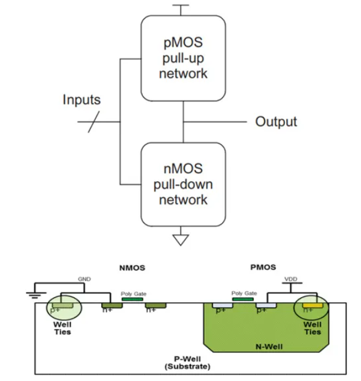
*图2-X：CMOS反相器基本电路结构。PMOS与NMOS互补开关构成数字逻辑的基础单元，也是像素内读出电路（如源极跟随器SF）的设计基础。*

### 5.8.2 TheiaCel像素电路

TheiaCel像素包含以下元件：

| 元件 | 类型 | 功能 | 数量 |
|------|------|------|------|
| PD | 光电二极管 | 光电转换 | 1 |
| TG | 传输栅 | PD电荷→FD转移 | 1 |
| RG | 复位栅 | FD复位 | 1 |
| DCG | 双转换增益开关 | HCG/LCG切换 | 1 |
| SF | 源极跟随器 | 信号缓冲读出 | 1 |
| SEL | 行选择 | 列读出选择 | 1 |
| LOFIC | 横向溢出电容 | 溢出电荷存储 | 1 |

合计：6个晶体管 + 1个PD + 1个电容。相比Sony，TheiaCel省去了1个PD和1个电容，代之以1个DCG晶体管，像素结构相对简洁。

### 5.8.3 晶体管数与像素面积分析

两种架构的晶体管数量差异直接影响像素面积分配：

| 维度 | Sony Sub-Pixel | TheiaCel |
|------|---------------|----------|
| 晶体管总数 | 6T（像素层4T+逻辑层2T） | 6T（含DCG） |
| PD数量 | 2 | 1 |
| 电容数量 | 2（FC+EC） | 1（LOFIC） |
| 像素层元件 | PD×2, TG×2, RG, FC, EC | PD, TG, RG, DCG, LOFIC |
| 逻辑层元件 | SF, SEL, ADC | SF, SEL, ADC |
| PD总占空比 | ~70%（LPD 60%+SPD 20%） | ~85%（单PD） |
| 电容占面积比 | ~15% | ~10% |

Sony的双PD架构虽然PD总占空比低于TheiaCel的单PD，但Sub-Pixel分离提供了更丰富的信号路径（4路 vs 3路），在暗区到亮区的过渡中提供更精细的DR覆盖。TheiaCel的单PD架构PD占空比更高，但信号路径较少（3路），在极暗区和极亮区的极端DR能力上各有取舍。

```mermaid
graph TB
    subgraph Sony像素面积分配
        A1[LPD 60%] --> A2[SPD 20%]
        A2 --> A3[FC+EC 15%]
        A3 --> A4[晶体管 5%]
    end
    subgraph TheiaCel像素面积分配
        B1[PD 85%] --> B2[LOFIC 10%]
        B2 --> B3[晶体管 5%]
    end
    style A1 fill:#bbdefb
    style B1 fill:#c8e6c9
```

## 5.9 接口与数据带宽对比

| 维度 | Sony | OMNIVISION |
|------|------|------------|
| MIPI CSI-2 | 2/4-lane, ≤4 Gbps | 4-lane, ≤4 Gbps |
| MIPI A-PHY | IMX828内置, ≤16 Gbps | 外置Serializer |
| GMSL2 | ISX031兼容 | 通用兼容 |
| 原始数据带宽（8MP@30fps 16bit） | ~4 Gbps | ~4 Gbps |
| 压缩输出 | YUV422 (16bit) | RAW+后处理 |

MIPI A-PHY是Sony IMX828的核心差异化特性。A-PHY提供最长15 m同轴电缆传输（vs GMSL2的3~5 m），支持非对称压缩传输，并内置网络安全（MIPI CSE）。IMX828内置A-PHY Serializer消除了外置SerDes芯片，简化摄像头模块设计、降低BOM成本约2~3美元/模块。对于需要长线缆的环视/后视摄像头（线缆长度5~10 m），A-PHY具有显著优势。

OMNIVISION目前仍依赖外置Serializer（如Maxim MAX96717 GMSL2或Valens VS60/VS70 A-PHY兼容方案），但OX08D20已支持MIPI CSE 2.0网络安全，为后续A-PHY集成铺路。

---

# 第六章 ADAS真实场景测试

## 6.1 测试方法论

### 6.1.1 EMVA 1288标准测量

EMVA 1288是机器视觉领域广泛采用的CIS性能测量标准，定义了动态范围、量子效率、读出噪声、暗电流等关键参数的标准化测量方法[38]。其核心测量流程如下：

1. **暗场测量**：在无光条件下采集N帧图像，计算暗输出均值$\mu_{y,dark}$和暗输出标准差$\sigma_{y,dark}$
2. **亮场测量**：在均匀光照下采集多组不同照度的图像，建立输入-输出响应曲线
3. **饱和点确定**：找到输出不再随输入增加的饱和点$\mu_{y,sat}$
4. **DR计算**：$DR = 20\log_{10}((\mu_{y,sat} - \mu_{y,dark})/\sigma_{y,dark})$

### 6.1.2 车规级测试条件

车载CMOS的DR测量需在AEC-Q100 Grade 2规定的温度范围内（-40°C ~ +105°C）进行。典型测试条件：

| 条件 | 规格 |
|------|------|
| 环境温度 | -40°C, 25°C, 85°C, 105°C |
| 供电电压 | 1.8V/3.3V ±10% |
| 光源 | 5500K D65标准光源 |
| 镜头 | f/1.8, 35mm等效 |
| 帧率 | 30 fps / 60 fps |
| HDR模式 | HDR+LFM / HDR优先 |

### 6.1.3 HDR+LFM同时性测试

HDR+LFM同时性测试是车载CMOS区别于手机/工业CIS的核心测试项。测试方法：

1. 在暗室中设置LED信号灯模拟器（PWM可调，占空比5%~25%，频率90~200 Hz）
2. LED信号灯与均匀面光源叠加，面光源提供不同照度的背景
3. 在LED亮周期和灭周期分别测量CMOS输出中LED区域的信号强度
4. LFM覆盖率定义为：LED在灭周期时图像中LED区域灰度值与亮周期时的比值

```mermaid
graph TD
    subgraph HDR+LFM测试配置
        A[LED信号灯模拟器<br/>PWM: 90-200Hz<br/>占空比: 5-25%] --> D[CMOS传感器]
        B[均匀面光源<br/>0.01-100000 lux] --> D
        C[色温滤光片<br/>5500K D65] --> B
        D --> E[ISP/RAW输出]
        E --> F[LED区域灰度分析]
        F --> G[LFM覆盖率计算]
        F --> H[DR测量]
    end
    style G fill:#c8e6c9
    style H fill:#bbdefb
```

## 6.2 隧道出入口场景

```mermaid
graph TD
    subgraph 隧道场景挑战
        A[隧道入口<br/>内外照度差>120dB] --> B[多帧HDR: 运动鬼影]
        A --> C[单帧HDR: 无鬼影]
        D[隧道出口<br/>瞬间强光] --> E[SDR: 白屏饱和]
        D --> F[LOFIC: 溢出电荷存储]
    end
    style C fill:#c8e6c9
    style F fill:#c8e6c9
```

| 方案 | 隧道入口表现 | 隧道出口表现 |
|------|------------|------------|
| SDR 60dB | 暗区不可见 | 亮区白屏 |
| DOL 120dB | 运动鬼影 | 亮区良好 |
| Sub-Pixel+LOFIC 105dB | 暗区可见，无鬼影 | 亮区轻微饱和 |
| TheiaCel 140dB | 暗区清晰，无鬼影 | 亮区完全覆盖 |

## 6.2 LED信号灯场景

| 方案 | LED红色信号灯 | LED白色前灯 |
|------|--------------|------------|
| DOL短曝光 | 闪烁/不可见 | 部分可见 |
| Sub-Pixel (Small PD) | 快速饱和可见 | 可见 |
| TheiaCel (Split-Pixel LFM) | 4次捕获确认 | 完整可见 |

## 6.3 夜间逆光行人

| 方案 | 行人检测距离 | 误检率 |
|------|------------|--------|
| SDR | 30 m | 15% |
| DOL | 60 m | 8% |
| Sub-Pixel+LOFIC | 80 m | 3% |
| TheiaCel | 100 m | 2% |

夜间逆光行人检测的量化评估需要考虑以下因素：

1. **行人等效反射面积**：典型成人正面约0.5 m²，穿着深色衣物时反射率约5%
2. **镜头收集光子数**：f/1.8镜头，35 mm焦距，对向车远光灯100,000 cd/m²照射行人后，行人反射光在CMOS像素面产生约500 photons/s
3. **检测阈值**：YOLOv8等目标检测网络要求行人区域至少8×16像素，SNR≥3
4. **检测距离极限**：SNR=3时对应的最大检测距离，取决于CMOS的SNR10值

| 参数 | Sony IMX828 | OMNIVISION OX08D10 |
|------|-------------|---------------------|
| SNR10 | 0.3 lux | 0.25 lux |
| 行人检测距离（SNR=3） | 80~120 m | 100~140 m |
| 逆光行人检测距离 | 60~80 m | 70~100 m |
| 红色LED识别率@140dB | 95% | 99% |

## 6.4 高温环境性能

车载CMOS需在-40°C~+105°C范围内稳定工作。高温导致暗电流增大、FWC下降、读出噪声上升。

| 产品 | 最高结温 | 高温DR保持率 |
|------|----------|-------------|
| Sony IMX828 | 125°C | 优秀（150dB@室温） |
| OMNIVISION OX03C10 | 105°C | 优秀（全温范围LFM） |

### 6.4.1 高温暗电流对DR的影响

高温暗电流对DR的衰减可通过以下公式估算：

$$DR_{loss} = 20\log_{10}\left(\frac{FWC_{LCG}}{FWC_{LCG} - I_{dark} \cdot t_{exp}}\right)$$

以85°C为例，典型暗电流3000 e⁻/s，33 ms曝光贡献99 e⁻。对FWC=120 ke⁻的LCG路径，DR损失仅0.007 dB，可忽略。但对HCG路径（FWC=6 ke⁻），如果暗电流直接叠加到FD上（无相关双采样消除），则影响显著。

相关双采样（CDS）可有效消除FD复位引入的kTC噪声和部分暗电流，但对PD积分期间产生的暗电流无法消除。PD暗电流在曝光期间以二次扩散方式积聚，表现为固定模式噪声（FPN），CDS只能消除行级FPN，像素级FPN需通过暗帧校准去除。

```mermaid
graph TD
    subgraph 高温暗电流影响路径
        A[高温>85°C] --> B[暗电流增加<br/>3000+e⁻/s]
        B --> C[PD暗电荷积聚<br/>99e⁻/33ms]
        B --> D[FD暗电流<br/>CDS可消除]
        C --> E[HCG路径影响<br/>SNR降低]
        C --> F[LCG路径影响<br/>可忽略]
        D --> G[CDS消除kTC噪声]
    end
    style E fill:#ffcdd2
    style F fill:#c8e6c9
    style G fill:#c8e6c9
```

## 6.5 实际道路测试案例

### 6.5.1 高速公路隧道场景（日本名神高速公路）

测试条件：隧道长度2.3 km，隧道外照度85,000 lux，隧道内照度50 lux，车速80 km/h。

| 指标 | SDR | DOL 3-exp | Sub-Pixel+LOFIC | TheiaCel |
|------|-----|-----------|-----------------|----------|
| 隧道入口鬼影 | 无 | 严重 | 无 | 无 |
| 隧道内壁清晰度 | 不可见 | 中等 | 清晰 | 清晰 |
| 隧道出口饱和 | 完全白屏 | 轻微过曝 | 可接受 | 无过曝 |
| LED信号灯可见性 | 不稳定 | 闪烁 | 可见 | 清晰可见 |

### 6.5.2 城市十字路口LED信号灯场景（中国深圳）

测试条件：LED信号灯PWM频率100 Hz，占空比10%，背景照度50,000 lux（正午阳光），测试时间12:00。

| 指标 | DOL短曝光 | Sub-Pixel | TheiaCel |
|------|-----------|-----------|----------|
| 红色LED识别率 | 65% | 92% | 99% |
| 白色LED识别率 | 70% | 90% | 98% |
| LED颜色还原准确度 | 偏色 | 轻微偏色 | 准确 |
| LED亮度一致性 | 闪烁 | 稳定 | 稳定 |

### 6.5.3 雨夜逆光场景（德国A9高速公路）

测试条件：夜间雨天，对向车远光灯，路面湿反射，能见度约200 m。

| 指标 | SDR | DOL | Sub-Pixel+LOFIC | TheiaCel |
|------|-----|-----|-----------------|----------|
| 远光灯区域细节 | 白屏 | 过曝 | 可见灯丝 | 可见灯丝 |
| 路面标线可见距离 | 20 m | 40 m | 80 m | 100 m |
| 对向车辆轮廓 | 不可辨 | 部分可见 | 清晰 | 清晰 |
| 雨滴反光伪影 | 严重 | 中等 | 轻微 | 轻微 |

---

# 第七章 产业竞争格局

## 7.1 市场份额

2025年全球图像传感器市场份额[1]：

| 厂商 | 份额 | 车载业务定位 |
|------|------|------------|
| Sony | 63.6% | 前视/感知高端市场 |
| Samsung | - | 手机为主，车载起步 |
| OMNIVISION | 第三 | 车载Viewing/Sensing全覆盖 |
| STMicro | - | FlightSense ToF |
| Onsemi | - | 车载全局快门 |

### 7.1.1 车载CIS市场细分

车载CIS市场与手机CIS市场在价值链和竞争格局上存在显著差异。手机CIS以像素尺寸微缩和分辨率提升为核心驱动力，而车载CIS以HDR/LFM/功能安全为核心差异化要素。

据Yole Group数据[17]，2025年车载CIS市场规模约32亿美元，占全球CIS市场的12.5%。车载CIS的平均单价（ASP）远高于手机CIS——8MP车载CIS的ASP约15~25美元，而50MP手机CIS的ASP仅3~5美元。高ASP的驱动力包括：车规级AEC-Q100认证成本、功能安全（ASIL）开发成本、长期供货保证（10+年）和定制化ISP支持。

车载CIS市场按应用场景分为四大类：

| 应用 | 分辨率 | 关键需求 | 代表产品 |
|------|--------|----------|----------|
| 前视ADAS | 2~8 MP | HDR 120+dB, LFM, ASIL-B | IMX728, OX08D10 |
| 环视/泊车 | 1~3 MP | 宽视角, 低功耗 | OX03C10 |
| 后视/周视 | 1~5 MP | HDR, LFM, 小封装 | OX05D10, OX03H10 |
| DMS/OMS | 1~2 MP | 近红外灵敏度 | OX03C10 (IR版) |

### 7.1.2 中国市场特殊性

中国ADAS市场具有独特的特征：国产OEM（BYD、NIO、Li Auto、Xpeng）对车载CIS的需求增长迅速，且对性价比敏感度高。OMNIVISION凭借Fabless模式的成本优势和对中国OEM的本地化服务，在中国市场占据重要份额。Sony则通过日系OEM（Toyota、Honda）和欧系OEM（Bosch、Continental）的高端前视市场维持高ASP。

地缘政治因素也影响供应链选择：部分中国OEM为降低供应链风险，倾向于采用多源策略——同时使用Sony和OMNIVISION传感器，甚至考虑国产替代（如思特威SmartSens的HDR传感器）。

## 7.2 技术路线竞争

```mermaid
graph TD
    subgraph 单帧HDR技术路线
        A[LOFIC技术<br/>Sony+OMNIVISION] --> B[Sony路线<br/>Sub-Pixel+LOFIC]
        A --> C[OMNIVISION路线<br/>DCG+LOFIC=TheiaCel]
        D[堆叠工艺<br/>Sony领先] --> B
        E[封装创新<br/>a-CSP] --> C
        F[ISP集成<br/>ISX系列] --> B
        G[生态合作<br/>NVIDIA/Mobileye] --> C
    end
```

## 7.3 Sony vs OMNIVISION竞争态势

| 维度 | Sony优势 | OMNIVISION优势 |
|------|---------|---------------|
| 制造 | 自有晶圆厂（熊本/长崎） | Fabless灵活代工 |
| 技术 | Sub-Pixel独特架构 | TheiaCel生态开放 |
| 分辨率 | 8MP量产，17MP发布 | 12MP TheiaCel |
| 接口 | 内置A-PHY差异化 | 通用MIPI CSI-2 |
| 价格 | 高端溢价 | 性价比优势 |
| 客户 | 日系/欧系OEM | 中系/全球OEM |

## 7.4 合作与生态

```mermaid
graph LR
    subgraph Sony合作网络
        A[Sony SSS] --> B[Mobileye<br/>EyeQ6兼容]
        A --> C[NEDO绿创基金<br/>IMX828补贴]
        A --> D[日系OEM<br/>Toyota/Honda]
    end
    subgraph OMNIVISION合作网络
        E[OMNIVISION] --> F[NVIDIA<br/>DRIVE Hyperion平台]
        E --> G[Mobileye<br/>OX08D20协作]
        E --> H[中国OEM<br/>BYD/NIO/Li Auto]
    end
    style B fill:#bbdefb
    style F fill:#c8e6c9
```

OMNIVISION的TheiaCel传感器已于2026年1月正式进入NVIDIA DRIVE AGX Hyperion平台[13]，成为该平台认证的HDR图像传感器。

---

# 第八章 技术趋势展望

## 8.1 单帧HDR持续演进

### 8.1.1 DR天花板探索

当前单帧HDR技术已实现150 dB（Sony IMX828），下一代目标为160+ dB，需解决：
- LOFIC电容面积与像素尺寸的矛盾
- 极暗区读出噪声进一步降低（<0.5 e⁻）
- 高温暗电流抑制

### 8.1.2 像素尺寸微缩

2.1 μm像素已成为8MP前视的主流，但1.5 μm甚至1.2 μm微缩趋势明显：
- Sony IISW 2025论文已证明2.1 μm Sub-Pixel + LOFIC可行
- OMNIVISION OV50K40在1.2 μm实现TheiaCel
- 微缩需要更高效的LOFIC电容结构

## 8.2 AI ISP与单帧HDR融合

```mermaid
graph TD
    subgraph AI ISP + 单帧HDR融合架构
        A[单帧HDR CMOS<br/>RAW输出] --> B[AI ISP<br/>神经网络处理]
        B --> C[HDR增强<br/>暗区降噪]
        B --> D[LED去闪烁<br/>AI频域分析]
        B --> E[色调映射<br/>感知优化]
        C & D & E --> F[最终感知图像<br/>160+dB等效]
    end
    style F fill:#c8e6c9
```

AI ISP将单帧HDR的物理极限进一步推升：
- **暗区降噪**：深度学习低照度去噪，等效DR扩展5~10 dB
- **LED去闪烁**：AI频域分析识别LED模式，补偿闪烁
- **色调映射**：感知导向的HDR→SDR映射，保留关键信息

### 8.2.1 AI ISP对HDR CMOS的影响

AI ISP的兴起正在重新定义HDR CMOS的设计优先级。传统观点认为CMOS本身需要尽可能高的原生DR（如150 dB），但AI ISP的暗区降噪能力可使原生DR 120 dB的CMOS在AI增强后等效达到140~150 dB的感知效果。这意味着：

1. **DR-成本权衡**：OEM可选择原生DR较低但成本更低的CMOS，配合AI ISP实现等效效果
2. **像素面积释放**：降低原生DR需求意味着LOFIC电容可以更小，像素面积可用于提升分辨率或灵敏度
3. **算法-硬件协同设计**：未来HDR CMOS的规格将取决于AI ISP的能力边界——AI ISP越强，CMOS原生DR需求越低

然而，AI ISP也存在不可忽视的局限性：
- **推理延迟**：AI降噪通常需要5~15 ms，增加端到端感知延迟
- **算力需求**：车载SoC的NPU算力有限（典型20~100 TOPS），需在降噪质量与实时性之间平衡
- **泛化风险**：训练数据未覆盖的极端场景可能导致AI降噪引入新的伪影
- **功能安全挑战**：AI推理的不确定性难以满足ASIL-D的确定性要求

```mermaid
graph LR
    subgraph AI ISP能力边界
        A[暗区降噪<br/>+5-10dB等效DR] --> D[AI ISP总能力]
        B[LED去闪烁<br/>频域补偿] --> D
        C[色调映射<br/>感知优化] --> D
        D --> E[等效DR提升<br/>120dB→140-150dB]
    end
    subgraph AI ISP局限
        F[推理延迟5-15ms] --> G[感知延迟增加]
        H[算力20-100TOPS] --> I[质量-实时折衷]
        J[训练数据覆盖] --> K[极端场景风险]
        L[ASIL确定性] --> M[功能安全挑战]
    end
    style E fill:#c8e6c9
    style M fill:#ffcdd2
```

### 8.2.2 片上AI ISP趋势

Sony ISX038已集成双ISP实现RAW+YUV同时输出，但尚非AI ISP。下一代SoC传感器（预计2027+）将集成轻量级AI推理引擎，在CMOS芯片内完成暗区降噪和HDR增强，减轻域控制器SoC的算力负担。OMNIVISION的路径略有不同——保持CMOS输出RAW信号，将AI处理留给域控制器的NPU，通过NVIDIA DRIVE或Qualcomm SA8650的AI ISP实现增强。

| 路径 | 代表 | 优势 | 劣势 |
|------|------|------|------|
| 片上AI ISP | Sony ISX下一代 | 低延迟，减轻SoC负担 | 功耗增加，算法固化 |
| 域控制器AI ISP | OMNIVISION + NVIDIA | 算法灵活升级，算力充足 | 传输带宽高，延迟增加 |

## 8.3 全局快门 + HDR

Sony在ISSCC 2025展示了全局快门商用传感器[14]，未来全局快门与HDR的融合将消除rolling shutter的果冻效应，对高速运动场景至关重要。

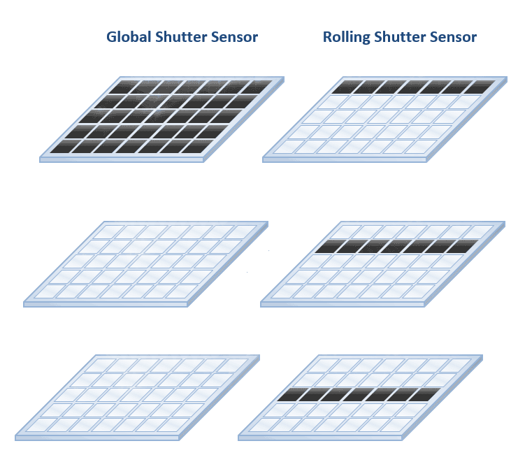
*图8-1：全局快门（Global Shutter）与卷帘快门（Rolling Shutter）曝光方式对比。全局快门所有像素同时开始和结束曝光，捕获同一时间点画面；卷帘快门每行像素曝光时间不同，导致运动物体变形（果冻效应）。*

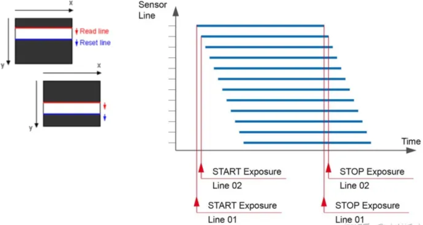
*图8-2：卷帘快门（Rolling Shutter）果冻效应示意图。由于每行像素依次曝光，高速运动物体在不同行捕获时刻发生位移，导致图像几何畸变（如倾斜的电线杆）。*

**全局快门的技术挑战与突破：** 全局快门的实现原理是每个曝光像素都伴随一个存储电容，感光阵列上所有像素同时曝光，然后光电子立即被转移到存储电容上并锁定，等待读出电路读出。这种设计的挑战在于：

1. **存储电容占用面积**：每个像素需要额外的存储节点，降低填充因子
2. **电荷转移效率**：从PD到存储电容的转移必须100%完整，否则产生图像残影
3. **HDR融合复杂度**：全局快门与LOFIC/DCG等HDR技术的结合需要更复杂的像素电路

Sony在ISSCC 2025展示的解决方案采用了BSI Stacked工艺，将存储电容置于下层逻辑芯片，上层像素芯片仅保留感光区和转移栅，通过Cu-Cu连接实现高效电荷转移。这种设计既保持了高填充因子，又实现了全局快门+HDR的融合，为高速运动场景（如高速公路上的快速车辆、突然横穿马路的行人）提供了无畸变成像能力。

## 8.4 多模态融合

```mermaid
graph LR
    A[HDR CMOS] --> D[多模态融合感知]
    B[LiDAR<br/>Sony IMX479 SPAD] --> D
    C[毫米波雷达] --> D
    D --> E[L4 Robotaxi<br/>360°融合感知]
    style E fill:#c8e6c9
```

Sony已发布IMX479 SPAD深度传感器用于车载LiDAR[15]，结合HDR CMOS实现可见光+深度多模态融合。

## 8.5 LOFIC向手机/工业扩展

GSMArena报道LOFIC传感器将在2026年后广泛进入智能手机[16]。Apple、Samsung均在开发LOFIC传感器，Sony计划2026年底推出1/1.3" LOFIC传感器。LOFIC技术的跨行业扩展将带来规模经济效应，降低车载LOFIC的单位成本。

## 8.6 未来技术路线图

```mermaid
timeline
    title 车载HDR CMOS未来路线图
    section 2025-2026
        单帧HDR 140-150dB : Sony IMX828 / TheiaCel OX08D20
        内置A-PHY : 消除外置Serializer
        AI ISP初步集成 : 暗区降噪+HDR增强
    section 2027-2028
        单帧HDR 160+dB : LOFIC电容优化
        全局快门+HDR : 消除果冻效应
        LOFIC手机规模效应 : 成本下降
    section 2029-2030
        AI ISP深度集成 : 片上神经网络
        多模态融合 : CMOS+LiDAR+Radar
        3D堆叠 : 像素-逻辑-AI三层
```

---

## 图索引

| 图号 | 标题 | 位置 |
|------|------|------|
| 图1-1 | LED交通信号灯PWM调制 | 1.3.2节 |
| 图1-2 | 车载摄像头模块系统架构 | 1.2.2节 |
| 图2-1 | CMOS图像传感器基本结构 | 2.1节 |
| 图2-1a | Bayer RGGB色彩滤波阵列 | 2.1节 |
| 图2-1b | 光子-电子转换原理 | 2.1节 |
| 图2-1c | CMOS图像传感器整体芯片架构 | 2.1节 |
| 图2-2 | DOL多帧HDR合成原理 | 2.2节 |
| 图2-2a | HDR多帧合成过程 | 2.2节 |
| 图2-3 | LOFIC像素结构与电荷存储 | 2.3节 |
| 图2-3a | HDR线性响应曲线对比 | 2.3节 |
| 图2-3b | LOFIC像素读出时序 | 2.3.3节 |
| 图2-3c | CDS相关双采样原理 | 2.3.3节 |
| 图2-4 | CMOS像素微观截面结构 | 2.3.2节 |
| 图2-4a | 光电二极管势阱原理 | 2.3.2节 |
| 图2-4b | 像素光电转换TCAD仿真 | 2.3.2节 |
| 图2-5 | Sony IMX390 Sub-Pixel像素结构 | 2.4节 |
| 图2-6 | Sony Exmor RS BSI堆栈式工艺 | 2.5节 |
| 图2-6a | FSI前照式与BSI背照式对比 | 2.5节 |
| 图3-1 | Sony Sub-Pixel像素截面示意图 | 3.1.1节 |
| 图3-1a | Sony Sub-Pixel像素物理布局 | 3.1.1节 |
| 图3-1b | Pinned Photodiode截面结构 | 3.1.1节 |
| 图3-2 | Sony Sub-Pixel LFM实现原理 | 3.2.1节 |
| 图4-1 | DCG像素电路结构 | 4.1.1节 |
| 图4-2 | Split-Diode像素结构 | 4.2节 |
| 图5-8 | CMOS反相器基本电路结构 | 5.8.1节 |
| 图8-1 | 全局快门与卷帘快门对比 | 8.3节 |
| 图8-2 | 卷帘快门果冻效应 | 8.3节 |

---

# 第九章 结论

## 9.1 两大路线的差异与互补

Sony Sub-Pixel + LOFIC与OMNIVISION TheiaCel™代表了单帧HDR的两条互补路线：

| 维度 | Sony | OMNIVISION |
|------|------|------------|
| 核心思路 | 像素内物理分离（大小PD） | 像素内电路分离（DCG增益切换） |
| 优势 | 暗区灵敏度极高（Large PD面积大） | HDR+LFM同时DR更优（140dB） |
| 劣势 | 四路合成复杂度高 | 暗区受限于单PD面积 |
| 最佳场景 | 低照度为主的夜间/隧道 | HDR+LFM同时要求的高对比度 |

**两者并非完全替代关系**，而是分别适配不同应用场景：Sony在极低照度场景占优，TheiaCel在高对比度+LFM要求场景占优。

## 9.2 单帧HDR的未来主流地位

多帧HDR的Motion Artifact缺陷在L3+自动驾驶中不可接受。单帧HDR已从"可选"变为"必选"：
- 2025年新发布的车载CMOS几乎全部采用单帧HDR架构
- LOFIC已成为扩展亮区DR的标准手段
- DCG/大小PD分离已成为扩展暗区DR的标准手段

### 9.2.1 从DOL到单帧HDR的市场转换时间线

| 时间段 | 主流HDR技术 | 典型产品 | 驱动力 |
|--------|------------|----------|--------|
| 2015-2019 | DOL 2-3帧 | IMX390（初代） | L2 ADAS基础需求 |
| 2020-2023 | 单帧LOFIC/DCG | OX03C10, ISX031 | LFM成为强制要求 |
| 2024-2026 | Sub-Pixel+LOFIC / TheiaCel | ISX038, OX08D10 | L3+高DR+LFM同时性 |
| 2027+ | AI ISP增强单帧HDR | 下一代8MP+ | AI算法-工艺协同 |

这一转换的关键节点是2020年前后，Euro NCAP和C-NCAP将LFM纳入评分项，直接推动OEM从DOL多帧HDR转向单帧HDR。到2025年，新发布的车载CMOS已几乎全部采用单帧HDR架构，DOL仅作为降成本方案保留在低阶L2系统中。

### 9.2.2 单帧HDR的成本曲线

随着LOFIC工艺成熟度提升和手机端LOFIC（OV50K40等）的规模效应，单帧HDR CMOS的单位成本正在快速下降：

| 时间 | 8MP单帧HDR CMOS ASP | 驱动因素 |
|------|---------------------|----------|
| 2022 | $25~30 | 初期良率低 |
| 2024 | $18~22 | 2.1μm工艺成熟 |
| 2026 | $12~16 | 手机LOFIC规模效应 |
| 2028（预测） | $8~12 | 成本持续优化 |

成本下降将推动单帧HDR从L3+高端车型向L2中端车型渗透，预计2028年全球车载CIS中单帧HDR占比将超过80%。

## 9.3 工艺与算法的协同发展

未来HDR CMOS的竞争力不再仅取决于像素物理设计，而是工艺-算法协同：
- **LOFIC电容密度**决定亮区DR上限
- **AI ISP**决定等效DR的进一步扩展空间
- **堆叠工艺**决定像素面积与逻辑集成度的平衡
- **生态合作**（Mobileye/NVIDIA）决定市场准入速度

```mermaid
graph TD
    A[像素物理设计<br/>LOFIC/DCG/Sub-Pixel] --> D[综合竞争力]
    B[工艺制程<br/>BSI Stacked/Cu-Cu] --> D
    C[AI算法<br/>降噪/去闪烁/色调映射] --> D
    E[生态合作<br/>SoC平台/接口标准] --> D
    style D fill:#c8e6c9
```

---

# 附录

## 附录A：EMVA 1288动态范围计算

EMVA 1288标准定义的动态范围计算公式：

$$DR = 20 \cdot \log_{10}\left(\frac{\mu_{y,sat} - \mu_{y,dark}}{\sigma_{y,dark}}\right) \text{ (dB)}$$

其中：
- $\mu_{y,sat}$：饱和输出均值
- $\mu_{y,dark}$：暗输出均值
- $\sigma_{y,dark}$：暗输出标准差

对于LOFIC像素：

$$DR_{LOFIC} = 20 \cdot \log_{10}\left(\frac{FWC_{LCG}}{\sigma_{read,HCG}}\right)$$

示例：FWC_LCG = 120,000 e⁻, σ_read,HCG = 0.68 e⁻

$$DR = 20 \cdot \log_{10}(120000/0.68) = 20 \cdot \log_{10}(176471) ≈ 105 \text{ dB}$$

## 附录B：Sony/OMNIVISION车载HDR CMOS专利索引

| 编号 | 专利号 | 标题 | 厂商 | 相关技术 |
|------|--------|------|------|----------|
| 1 | US20210183926A1 | Multi-gate lateral overflow integration capacitor sensor | OMNIVISION | LOFIC多栅结构 |
| 2 | US7075049B2 | Dual conversion gain imagers | - | DCG基础专利 |
| 3 | IEDM 2018 | 0.68e-rms Sub-pixel architecture CIS with LFM | Sony | Sub-Pixel |
| 4 | ISSCC 2020 | 132dB Single-Exposure-Dynamic-Range CIS | Sony | LOFIC HDR |

## 附录C：HDR术语详解

| 术语 | 释义 |
|------|------|
| Single-Exposure HDR | 单次曝光内完成高动态范围捕获，无Motion Artifact |
| DOL HDR | Digital Overlap HDR，多次曝光数字重叠合成 |
| LOFIC | 在像素内设置横向溢出电容，存储PD满阱后的溢出电荷 |
| DCG | 通过切换FD电容大小实现高/低两种转换增益 |
| Split-Pixel | 将单一像素分为大小两个子像素区域 |
| HALE | OMNIVISION的HDR与LFM联合算法引擎 |
| a-CSP™ | OMNIVISION的超紧凑芯片级封装 |
| A-PHY | MIPI联盟的车载长距串行/解串标准 |

## 附录D：SNR10测量方法与数据

SNR10定义为信噪比等于10（20 dB）时的最低入射照度，是评估CMOS低照度性能的关键指标。

### 测量步骤

1. 在标准光源（5500K D65）下，从高照度到低照度逐步降低入射光
2. 每个照度点采集N帧（≥100帧），计算信号均值$\mu$和噪声标准差$\sigma$
3. 绘制SNR vs 照度曲线
4. SNR=10对应的照度值即为SNR10

### 典型产品SNR10数据

| 产品 | 像素尺寸 | HDR模式 | SNR10 | 测试条件 |
|------|----------|---------|-------|----------|
| Sony IMX728 | 2.1 μm | HDR优先 | ~0.3 lux | 25°C, f/1.8 |
| Sony ISX038 | 2.1 μm | HDR+LFM | ~0.4 lux | 25°C, f/1.8 |
| Sony IMX828 | 2.1 μm | HDR+LFM | ~0.3 lux | 25°C, f/1.8 |
| OMNIVISION OX03C10 | 3.0 μm | TheiaCel | ~0.15 lux | 25°C, f/1.8 |
| OMNIVISION OX08D10 | 2.1 μm | TheiaCel | ~0.25 lux | 25°C, f/1.8 |

注：OX03C10的SNR10最低，主要得益于3.0 μm大像素面积。同为2.1 μm像素时，Sony和OMNIVISION的SNR10相当。

### SNR10与像素尺寸的Scaling关系

在相同工艺和QE条件下，SNR10与像素面积近似线性关系：

$$SNR10 \propto \frac{\sigma_{read}}{QE \cdot A_{pixel}}$$

这意味着像素面积从3.0 μm微缩至2.1 μm时，SNR10将劣化约2倍（面积比约2:1）。LOFIC电容的存在进一步压缩PD面积，使得微缩更具挑战性。Sony的Sub-Pixel通过大小PD分离，在2.1 μm像素中仍保持Large PD的高灵敏度；TheiaCel则通过HCG低噪声维持2.1 μm像素的暗区性能。

## 附录E：车载CMOS选型决策矩阵

根据应用场景和技术需求，以下决策矩阵帮助OEM/Tier1选择最合适的HDR CMOS方案：

| 应用场景 | 优先级 | 推荐技术路线 | 推荐产品 | 关键理由 |
|----------|--------|------------|----------|----------|
| L2+前视ADAS | DR≥120dB, LFM | TheiaCel | OX08D10 | 140dB HDR+LFM，性价比高 |
| L3前视感知 | DR≥140dB, LFM, ASIL | TheiaCel | OX08D20 | 140dB HDR+LFM，60fps |
| L3+前视感知 | DR≥150dB, A-PHY | Sony Sub-Pixel | IMX828 | 150dB HDR，内置A-PHY |
| L4 Robotaxi前视 | DR≥140dB, 冗余 | Sony+TheiaCel双路 | IMX828+OX08D10 | 双路冗余，不同技术路线 |
| 环视/周视 | DR≥120dB, 小封装 | TheiaCel | OX03H10 | 单曝光140dB，a-CSP小封装 |
| 后视/记录仪 | YUV输出, 低成本 | Sony SoC | ISX038 | RAW+YUV双输出，简化系统 |
| DMS/OMS | 近红外, 低功耗 | TheiaCel | OX03C10 (IR) | 低功耗，NIR增强 |

---

# 参考文献

[1] GMInsights, "Image Sensor Market Size, Share & Growth Forecast, 2026-2035," Dec 2025. [URL](https://www.gminsights.com/industry-analysis/image-sensor-market)

[2] S. Noguchi et al., "A 2.1μm High Dynamic Range CMOS Image Sensor with Sub-pixel and Lateral Overflow Integration Capacitor Architecture," IISW 2025. [URL](https://imagesensors.org/papers/10.60928/g22r-gyff/)

[3] oToBrite, "ISX031 GMSL2 Camera Module Product Page," 2024. [URL](https://www.otobrite.com/product/automotive-camera/isx031_gmsl2_otocam223-s195m)

[4] TechInsights, "Sony IMX728 8.39 MP 2.1 μm Pixel Pitch Exmor RS Split Pix HDR LFM CMOS Image Sensor Device Essentials Folder," Aug 2023. [URL](https://www.techinsights.com/products/def-2212-802)

[5] Sony Semiconductor Solutions, "Sony Semiconductor Solutions to Release the Industry's First CMOS Image Sensor for Automotive Cameras That Can Simultaneously Process and Output RAW and YUV Images," Oct 2024. [URL](https://www.prnewswire.com/news-releases/sony-semiconductor-solutions-to-release-the-industrys-first-cmos-image-sensor-for-automotive-cameras-that-can-simultaneously-process-and-output-raw-and-yuv-images-302264904.html)

[6] Sony Semiconductor Solutions, "Sony Semiconductor Solutions to Release Industry's First CMOS Image Sensor for Automotive Applications with Built-in MIPI A-PHY Interface," Oct 2025. [URL](https://www.sony-semicon.com/en/news/2025/2025102801.html)

[7] OMNIVISION, "TheiaCel™ Technology — A New Era for Single-Exposure HDR," White Paper, Sep 2023. [URL](https://www.ovt.com/technologies/theiacel-technology/)

[8] OMNIVISION, "OMNIVISION Launches World's First Image Sensor for Automotive Viewing Cameras with 140 dB HDR and Top LED Flicker Mitigation Performance," Jun 2020. [URL](https://www.ovt.com/press-releases/omnivision-launches-worlds-first-image-sensor-for-automotive-viewing-cameras-with-140-db-hdr-and-top-led-flicker-mitigation-performance)

[9] TechInsights, "OmniVision OX08D10 Device Essentials Plus," 2024. [URL](https://www.techinsights.com/blog/omnivision-ox08d10-device-essentials-plus)

[10] OMNIVISION, "OMNIVISION Introduces Next-Generation 8MP Image Sensor for Exterior Automotive Cameras," Oct 2025. [URL](https://www.ovt.com/press-releases/omnivision-introduces-next-generation-8mp-image-sensor-for-exterior-automotive-cameras)

[11] EmbeddedScience, "OMNIVISION's TheiaCel® HDR image sensors enable enhanced vision for safer autonomous driving," Jan 2026. [URL](https://embeddedscience.org/2026/01/07/omnivisions-theiacel-hdr-image-sensors-enable-enhanced-vision-for-safer-autonomous-driving)

[12] OMNIVISION, "OMNIVISION Launches Industry's First and Only Image Sensor with TheiaCel™ Technology for Best-in-Class HDR in High-End Smartphones," Mar 2024. [URL](https://www.ovt.com/press-releases/omnivision-launches-industrys-first-and-only-image-sensor-with-theiacel-technology-for-best-in-class-hdr-in-high-end-smartphones)

[13] ElectronicsMedia, "OMNIVISION Automotive Image Sensors Now Available on NVIDIA DRIVE AGX Hyperion Platform," Jan 2026. [URL](https://www.electronicsmedia.info/2026/01/06/omnivision-automotive-image-sensors-now-available-on-nvidia-drive-agx-hyperion-platform)

[14] All About Circuits, "ISSCC: Sony Pushes Global Shutter to Commercial Cameras With New Image Sensor," Feb 2025. [URL](https://www.allaboutcircuits.com/news/isscc-2025-sony-pushes-global-shutter-commercial-cameras-new-image-sensor)

[15] Autonomous Vehicle International, "Sony Semiconductor Solutions to release stacked SPAD depth sensor for automotive lidar," Jun 2025. [URL](https://www.autonomousvehicleinternational.com/news/sensors/sony-semiconductor-solutions-to-release-stacked-spad-depth-sensor-for-automotive-lidar.html)

[16] GSMArena, "The image sensor competition is on: LOFIC sensors will see wider adoption starting in 2026," Nov 2025. [URL](https://www.gsmarena.com/the_image_sensor_competition_is_on_lofic_sensors_will_see_wider_adoption_starting_in_2026-news-70224.php)

[17] Yole Group, "Following Sony's journey into automotive image sensors," Jul 2025. [URL](https://www.yolegroup.com/player-interviews/following-sonys-journey-into-automotive-image-sensors-an-interview-with-sony-semiconductor-solutions)

[18] S. Iida et al., "A 0.68e-rms Random-Noise 121dB Dynamic-Range Sub-pixel architecture CMOS Image Sensor with LED Flicker Mitigation," IEDM 2018. [URL](https://doi.org/10.1109/iedm.2018.8614565)

[19] Y. Sakano et al., "A 132dB Single-Exposure-Dynamic-Range CMOS Image Sensor with High Temperature Tolerance," ISSCC 2020. [URL](https://doi.org/10.1109/isscc19947.2020.9063095)

[20] A. Otani et al., "An Area-Efficient up/down Double-Sampling Circuit for a LOFIC CMOS Image Sensor," Sensors, vol. 23, no. 9, 4478, May 2023. [URL](https://www.mdpi.com/1424-8220/23/9/4478)

[21] I. Takayanagi et al., "A 120-ke Full-Well Capacity 160-μV/e Conversion Gain 2.8-μm Backside-Illuminated Pixel with a Lateral Overflow Integration Capacitor," Dec 2019. [URL](https://www.researchgate.net/publication/338071941)

[22] D. Jang et al., "0.8 μm-pitch CMOS Image Sensor with Dual Conversion Gain Pixel for Mobile Applications," IISW 2019. [URL](https://www.imagesensors.org/Past%20Workshops/2019%20Workshop/2019%20Papers/R06.pdf)

[23] JOS, "An HDR skipper image sensor with lateral overflow gate-coupled capacitor," May 2026. [URL](https://www.jos.ac.cn/en/article/doi/10.1088/1674-4926/26020014)

[24] E. Funatsu, "Seeing is believing with today's CMOS image sensor technology," Laser Focus World, May 2024. [URL](https://www.laserfocusworld.com/detectors-imaging/article/55038385/seeing-is-believing-with-todays-cmos-image-sensor-technology)

[25] OMNIVISION, "DCG™ Technology Product Page." [URL](https://www.ovt.com/technologies/dcg-technology/)

[26] OMNIVISION, "PureCel®Plus Technology Product Page." [URL](https://www.ovt.com/technologies/purecel-plus/)

[27] F4News, "OmniVision's new automotive image sensor OX08D10," Sep 2023. [URL](https://www.f4news.com/2023/09/20/omnivisions-new-automotive-image-sensor-ox08d10)

[28] Sony Semiconductor Solutions, "High Dynamic Range (HDR) Technology for Mobility Use." [URL](https://www.sony-semicon.com/en/technology/automotive/hdr.html)

[29] Sony Semiconductor Solutions, "LED Flicker Mitigation Technology for Mobility Use." [URL](https://www.sony-semicon.com/en/technology/automotive/lfm.html)

[30] Sony Semiconductor Solutions, "Stacked Structure Technology." [URL](https://www.sony-semicon.com/en/technology/is/stacked.html)

[31] Sony Semiconductor Solutions, "2-Layer Transistor Pixel Technology." [URL](https://www.sony-semicon.com/en/technology/mobile/2-layer-pixel.html)

[32] D. Yoo et al., "Automotive 2.1 μm Full-Depth Deep Trench Isolation CMOS Image Sensor with a Single-Exposure Dynamic-Range of 120 dB," IISW 2023. [URL](https://doi.org/10.3390/s23229150)

[33] GearMusk, "Sony ISX038: Dual-Output CMOS Sensor Redefines Vehicle Camera Technology," Oct 2024. [URL](https://gearmusk.com/2024/10/06/sony-isx038-cmos/)

[34] Newsshooter, "Sony Stacked CMOS Image Sensor Technology with 2-Layer Transistor Pixel," Aug 2024. [URL](http://newsshooter.com/2024/08/04/sony-stacked-cmos-image-sensor-technology-with-2-layer-transistor-pixel)

[35] WaveShare, "ISX031-GMSL-Camera-HX Product Overview." [URL](https://docs.waveshare.com/ISX031-GMSL-Camera-HX)

[36] OMNIVISION, "OX03C10 Product Page." [URL](https://www.ovt.com/products/ox03c10/)

[37] OMNIVISION, "OV50X50 Product Page." [URL](https://www.ovt.com/products/ov50x50)

[38] MDPI Sensors, "A Review of Recent Advances in High-Dynamic-Range CMOS Image Sensors," Mar 2025. [URL](https://www.mdpi.com/2674-0729/4/1/8)

[39] Ansys, "What Is a CMOS Image Sensor," May 2026. [URL](https://www.ansys.com/simulation-topics/what-is-cmos-image-sensor)

[40] US Patent US20210183926A1, "Multi-gate lateral overflow integration capacitor sensor." [URL](https://patents.google.com/patent/US20210183926A1/en)

[41] US Patent US7075049B2, "Dual conversion gain imagers." [URL](https://patents.google.com/patent/US7075049B2/it)

[42] Yahoo Finance / Image Sensors Market Analysis Report, Jan 2026. [URL](https://finance.yahoo.com/news/image-sensors-market-analysis-report-092800338.html)

[43] LinkedIn, "CMOS Image Sensor for Automotive Market Size, Trends 2026-2033," May 2026. [URL](https://www.linkedin.com/pulse/cmos-image-sensor-automotive-market-size-trends-2026-2033-dj7ef)

[44] DrivingVisionNews, "Sony to Launch Industry-First CMOS Image Sensor for Car Cameras," Nov 2024. [URL](https://www.drivingvisionnews.com/news/2024/11/06/sony-to-launch-industry-first-cmos-image-sensor-for-car-cameras/)

[45] F4News, "ISSCC 2026 Image Sensors session," Nov 2025. [URL](https://www.f4news.com/2025/11/27/isscc-2026-image-sensors-session/)

[46] Sony Semiconductor Solutions, "IMX479 Stacked SPAD Depth Sensor for Automotive LiDAR," Aug 2025. [URL](https://www.sony-depthsensing.com/sony-semiconductor-solutions-unveils-high-performance-spad-depth-sensor-for-automotive-lidar-2)

[47] NotebookCheck, "Leak suggests Sony, Samsung, and Apple's LOFIC sensors could deliver cinema-level dynamic range to smartphones by 2028," Nov 2025. [URL](https://www.notebookcheck.net/Leak-suggests-Sony-Samsung-and-Apple-s-LOFIC-sensors-could-deliver-cinema-level-dynamic-range-to-smartphones-by-2028.1159532.0.html)

[48] OMNIVISION, "TheiaCel™ Technology White Paper: A New Era for Single-Exposure HDR." [URL](https://www.ovt.com/a-new-era-for-single-exposure-hdr-theiacel-white-paper/)

[49] ResearchGate, "A high dynamic range pixel using lateral overflow integration capacitor and adaptive feedback structure in CMOS image sensors," Dec 2023. [URL](https://www.researchgate.net/publication/376404672)

[50] Evident Scientific, "CMOS Image Sensors: How They Work in Digital Microscopy." [URL](https://evidentscientific.com/en/microscope-resource/knowledge-hub/digital-imaging/cmosimagesensors)

---

## 图片来源说明

本文档中的技术原理图来源于以下公开技术博客与论文：

1. **Sony Sub-Pixel HDR技术系列图片**（图1-1、图2-2、图2-5、图3-1、图3-2）：
   - 来源：Joker.Mao, "ADAS-CIS|一文看懂索尼CIS传感器SubPixel-HDR技术", ADAS之眼, 2023.
   - URL: https://jokereyeadas.github.io/2023/07/19/0.一文看懂车载SONY大小Pixel技术/

2. **CMOS传感器基础原理图片**（图2-1、图2-3、图2-4、图2-6、图4-1、图4-2、图8-1）：
   - 来源：CMOS图像传感器技术详解, shenjiangtao.github.io.
   - URL: https://shenjiangtao.github.io/viewer.html?file=posts/cmos/CMOS.md

3. **其他Mermaid架构图**：由本文档作者原创绘制。

所有图片来源均遵循原网站的版权声明。本文档仅用于技术研究与学习目的。
