**CMOS图像传感器**

**CMOS图像传感器**

摄像机用来成像的感光元件叫做image
sensor或imager。图像传感器是摄像头的核心部件。Image
sensor（图像传感器）是一种半导体芯片，其表面有几十万到几百万个光电二极管，光电二极管受到光照就会产生电荷，将光线转换成电信号。其功能类似于人的眼睛，因此sensor性能的好坏将直接影响到camera的性能。

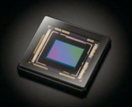{width="2.6875in" height="2.1875in"}

CMOS 是英文Complementary Metal Oxide Semicondutor
的缩写，这是一种主流的半导体工艺，具有功耗低、速度快的优点，被广泛地用于制造CPU、存储器和各种数字逻辑芯片。基于CMOS
工艺设计的图像传感器叫做CMOS Image Sensor
(CIS)，与通用的半导体工艺尤其是存储器工艺相似度达到90%以上。

CCD（电荷耦合器件）和
CMOS（互补金属氧化物半导体）是图像传感器中将光转换为电信号时使用的两种技术。**CCD
将光能产生的电荷累积并传输，之后电荷在终端转换为电信号。而 CMOS
图像传感器的像素中内置有放大信号的放大器，可将光能产生的电荷直接放大为电信号后进行传输。**在移动设备中通常使用
CMOS 图像传感器，其功耗低且可将多个电路集成为一个。特别是，以前 CCD
的更低噪点有利于获取高品质图像，但最近随着 CMOS 画质的大幅改善，CMOS
图像传感器在 DSLR 或微单等专业相机中也得到了广泛应用。

CMOS技术的主要特点是成对地使用PMOS和NMOS两种晶体管，PMOS负责拉高，NMOS负责拉低，两者配合可以实现数字信号的快速切换，这就是Complementary的具体含义。下图以最基本的反相器为例说明了CMOS技术的基本原理。

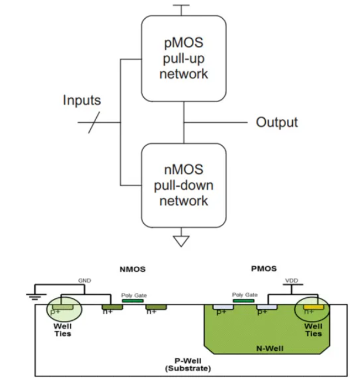{width="5.75in" height="6.072916666666667in"}

CMOS 技术基础 - 反相器：**传统的 CMOS
数字电路使用\'0\'和\'1\'两种逻辑电压控制晶体管的Gate从而控制晶体管的电流流动。**

**CMOS sensor
则是让光子直接进入晶体管内部生成电流，**光信号的强弱直接决定了电流的大小。这是CMOS
sensor与CMOS 数字逻辑的主要区别之处。 **CMOS sensor
通常由行驱动器、列驱动器、时序控制逻辑、像敏单元阵列、AD转换器、数据总线输出接口、控制接口等几部分组成。**这几部分功能通常都被集成在同一块硅片上，其工作过程一般可分为复位、光电转换、积分、读出几部分，如下所示。

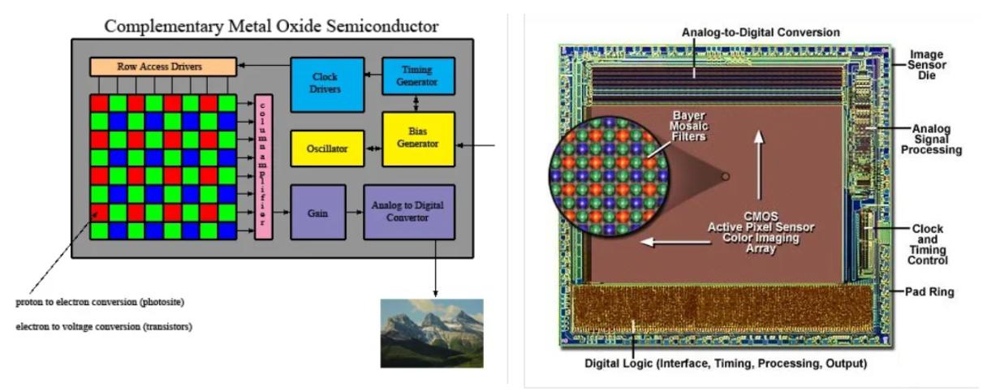{width="5.75in" height="2.25in"}

column amplifier，

光到电的转换(photosite)，

电到电压的转换(transistors)

cmos图像传感器的结构通常如下图所示，

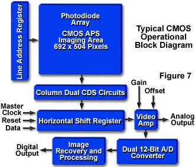{width="3.4375in" height="2.9479166666666665in"}

图像产生过程：景物通过 Lens 生成的光学图像投射到 sensor 表面上，
经过光电转换为模拟电信号， 消噪声后经过 A/D 转换后变为数字图像信号，
再送到数字信号处理芯片（ DSP） 中加工处理。

图像传感器的设计基础是将模拟信号光信息转换为电信号的元件。在拜耳阵列中，每个像素都拥有色彩滤波器，只允许
RGB（三原色）
中一种颜色的光通过，光能进入后产生的电荷被放大为电信号，生成各种颜色的值。之后，软件根据每个像素临近像素的颜色值通过插值的方式确定最终颜色，从而构成了我们看到的彩色图像

**光电转换**

目前大部分的sensor都是以**硅为感光材料**制造的，硅材料的光谱响应如下图所示。

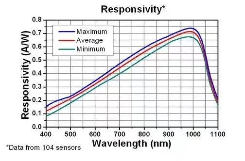{width="5.25in" height="3.4583333333333335in"}

从图中可以看到，硅材料的光谱响应在波长1000nm的红外光附近达到峰值，在400nm的蓝光处只有峰值的15%左右，因此硅材料用于蓝光检测其实不算特别理想。在实际CIS产品中，特别是在暗光环境下，蓝色像素往往贡献了主要的噪声来源，成为影响图像质量的主要因素。从上图中可以看到，裸硅在可见光波段的光电转换效率大约是峰值的20%\~60%，与入射光的波长有关。
**Sensor感光的基本单元叫做"像点"，英文是photosite，每个sensor上承载了几百万甚至更多的像点，它们整齐、规律地排成一个阵列，构成sensor的像敏区。当可见光通过镜头入射到像点并被光敏区吸收后会有一定概率激发出电子，这个过程叫做光电转换，如下图所示。**

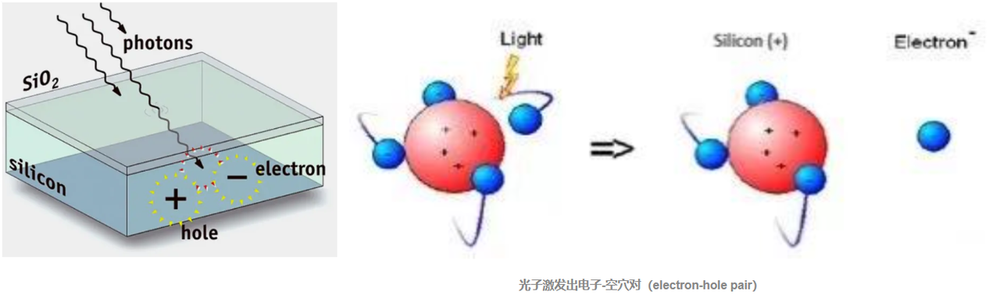{width="5.75in" height="1.71875in"}

光子激发出电子的概率也称为量子效率，由光激发产生的电子叫做光生电子或光电子。**光子激发出电子会被像点下方的电场捕获并囚禁起来备用**，如下图所示。这个电场的专业名称叫做"势阱"。

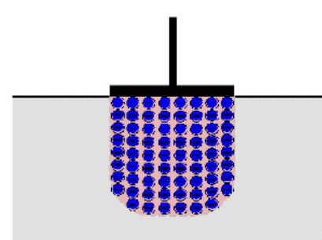{width="4.260416666666667in"
height="3.1770833333333335in"}

**像点的作用可以类比成一个盛水的小桶，它可以在一定范围内记录其捕获的光电子数，**如果入射的光子太少则可能什么都记录不到，如果入射的光子太多则只能记录其所能容纳的最大值，多余的光电子由于无处安置只能就地释放，就像水桶盛满之后再继续接水就会溢出一样。溢出的自由电子会被专门的机制捕获并排空。像点曝光的过程，非常类似下图所示的用很多小桶接雨水的过程。

{width="5.75in" height="2.9375in"}

**像点微观结构**

**每个sensor上承载了几百万甚至更多的像点，其中**一个像点的解剖结构如下图所示。

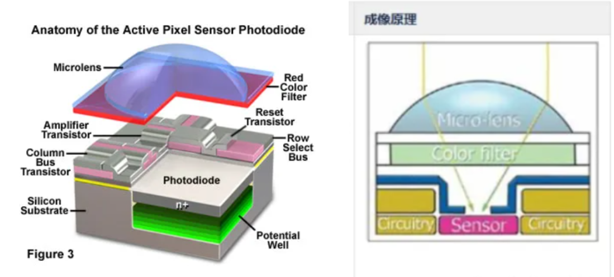{width="5.75in" height="2.59375in"}

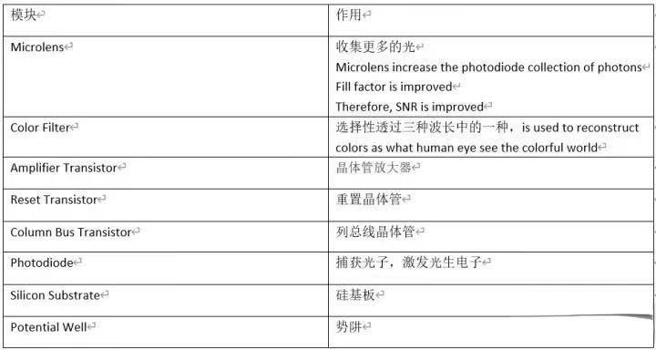{width="5.75in" height="3.0625in"}

从图中可以看到，一个像点主要由五部分功能构成:

硅感光区photodiode: 捕获光子，激发光生电子

势阱potential well: 用电场捕获、存储光生电子

电路:将电荷数量变换为电压信号；以及复位、选择、读出逻辑；

滤光膜color filter: 选择性透过三种波长中的一种

微透镜(Micro lens): 将入射光线会聚到感光区。

**Bayer Filter**

牛顿已经告诉我们，用棱镜可以把白光分成多个颜色，而且光的三原色就是红绿蓝，我们只需要记录这三种颜色就可以了。

可能我们会有这样的思路：光通过镜头进来，我们先通过棱镜把它分成三种颜色，红，绿，蓝。每种颜色用一颗光电二极管阵列记录下来，合起来就是一幅图了。如下图所示，需要三个感光阵列分别记录红绿蓝三种颜色。

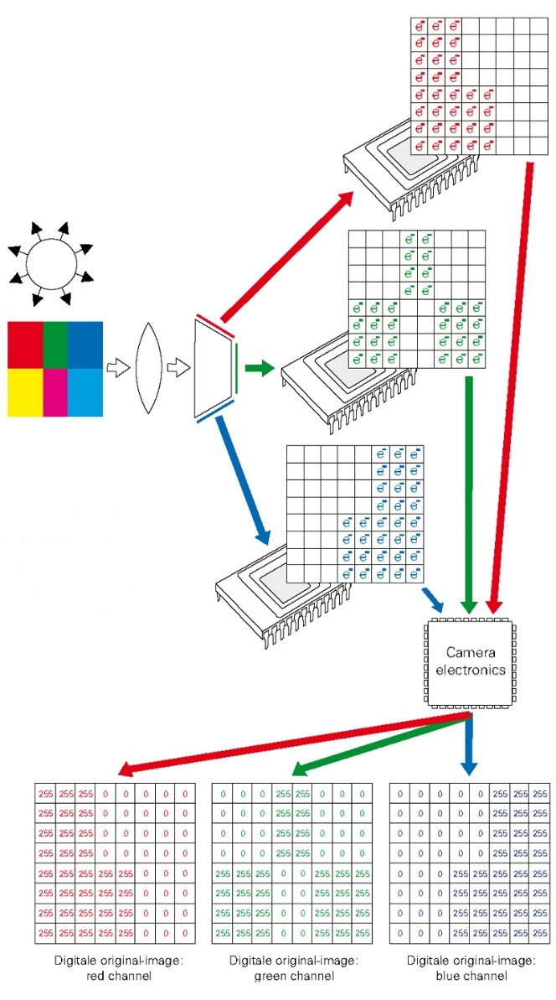{width="5.75in" height="10.322916666666666in"}

但是这种方法是行不通的，原因主要在于：第一，如果三个色彩要拼成一副图像，那么棱镜分解后的光到每个感光阵列的角度和距离要是一模一样的。这个工程实现十分困难。

第二：为了得到一幅彩色图像，需要三个感光阵列，成本太高。

这个时候就提出了Bayer
pattern。那就是在每个光电二极管前面加一个滤光单元，只允许红绿蓝其中一种颜色透过。如下图所示：

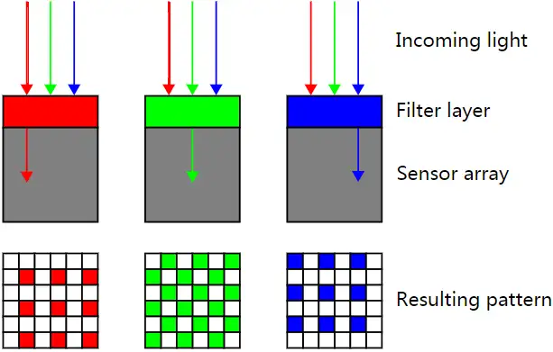{width="5.75in" height="3.6666666666666665in"}

Bayer Pattern工作原理

光源经过 Bayer Filter
后，只有特定颜色的光可以穿过相应颜色的滤波器，一个Bayer filter
可以由一个个RGGB小矩阵构成，如下图中橘黄框圈起来的RGGB filter矩阵所示。

RAW图像就是CMOS或者CCD图像感应器将捕捉到的光源信号转化为数字信号的原始数据。

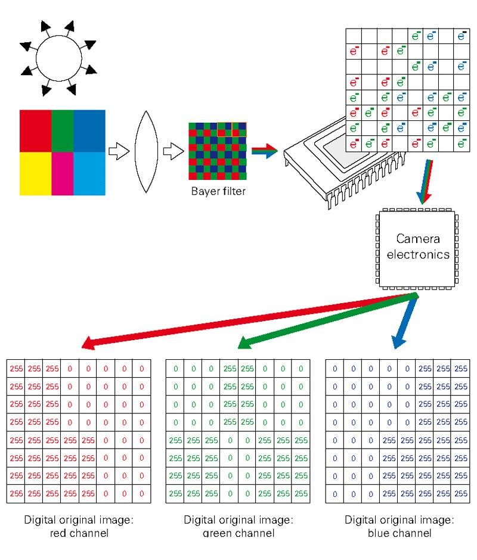{width="5.75in" height="6.75in"}

Bayer pattern又叫RGGB pattern，如下所示：

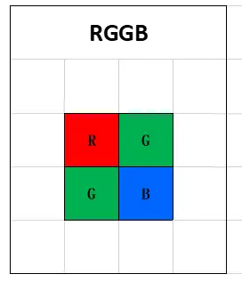{width="2.8333333333333335in"
height="3.3020833333333335in"}

对于二极管的感光阵列（又叫image
array）,每4个点作为一个整体。其中一个点只能通过红色光，一个点只能通过蓝色光，两个点能通过绿色光。这就是Bayer
patten。Image array可以看作Bayer pattern的不断复制：

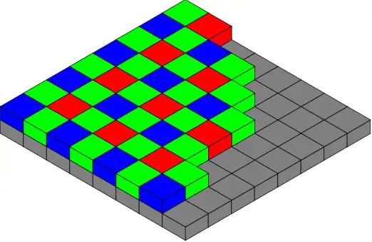{width="5.4375in" height="3.53125in"}

这样，我们只要知道第一个点是通过什么光：红，绿，还是蓝，就能知道image
array每个点的滤光情况了。

然后，根据Image array + sensor
patten再加上ISP需要做到的插值或者叫去马赛克，我们就可以得到每个点的红，绿，蓝的值了。

插值或者叫去马赛克，的主要原理是，第一个点是蓝色，那么我们可以通过它周围的绿色点利用图像算法预测出第一个点的绿色的值大概是多少，同样红色值也是如此。

插值或者去马赛克是ISP的一个主要模块，也就是说通过bayer
格式的滤波器后得到的像点需要插值才能得到每个点的红绿蓝信息。

因为人眼对绿色的敏感程度恰好是红色或者蓝色的两倍，这样把两个点分给绿色最符合人眼的习惯，也就能得到最符合人眼的视觉的图像了，所以选择Bayer
patten绿色点是俩个，而红色蓝色点是是一个。

为了能够区分颜色，人们在硅感光区上面设计了一层滤光膜color
filter，每个像素上方的滤光膜可以透过红、绿、蓝三种波长中的一种，而过滤掉另外两种，如下图所示。

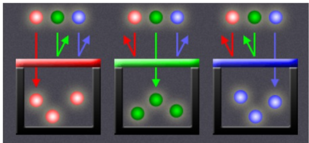{width="5.75in" height="2.6666666666666665in"}

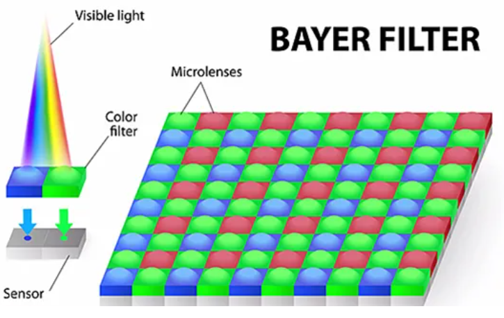{width="5.75in" height="3.6145833333333335in"}

像点之所以叫像点而不叫像素正式因为这了原因，一个严格意义上的像素，即pixel，是一个具备红、绿、蓝三个颜色分量的组合体，能够表达RGB空间中的一个点。

而sensor上的一个像点只能表达三种颜色中的一个，所以在sensor范畴内并不存在严格意义上的像素概念。

但是很多情况下人们并不刻意区分像素和像点在概念上的差别，经常会用像素来指代像点，一般也不会引起歧义。
所有的像点按照一定格式紧密排成一个阵列，构成sensor的像敏区，即color
imaging array。像点阵列的微观效果如下图所示。

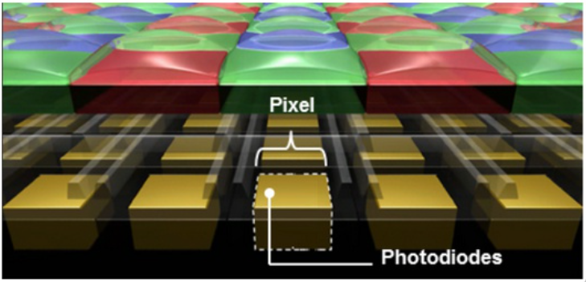{width="5.75in" height="2.7604166666666665in"}

其中感光膜的布局叫做Bayer Mosaic Color Filter Arrary，通常简写为Bayer
CFA或CFA。
早期的工艺微透镜之间是存在无效区域的，为了提高光能量的利用率，人们会努力扩大微透镜的有效面积，最终实现了无缝的透镜的阵列。

{width="5.75in" height="3.1875in"}

索尼的Power HAD CCD 技术在Hyper HAD
技术基础上缩小了微透镜间距，进一步提升了像素感光能力。

{width="5.75in" height="3.1875in"}

Bayer格式图片是伊士曼·柯达公司科学家Bryce
Bayer发明的，拜耳阵列被广泛运用与数字图像处理领域。

不同的sensor可能设计成不同的布局方式，下面是几种常见的布局!

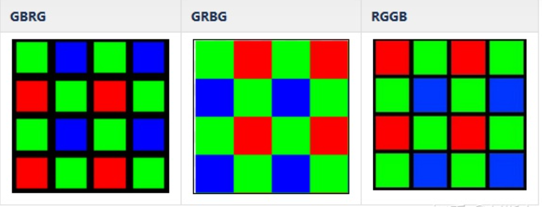{width="5.75in" height="2.1979166666666665in"}

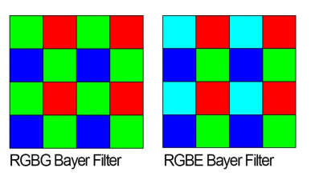{width="4.03125in" height="2.34375in"}

下面是光线通过微透镜和Bayer阵列会聚到硅势阱激发出光生电子这一物理过程的示意图。需要说明的是光生电子本身是没有颜色概念的，此图中把电子的颜色只是为了说明该电子与所属像点的关系。

{width="5.75in" height="3.0104166666666665in"}

Bayer格式的数据一般称为RAW格式，需要用一定的算法变换成人们熟悉的RGB格式。

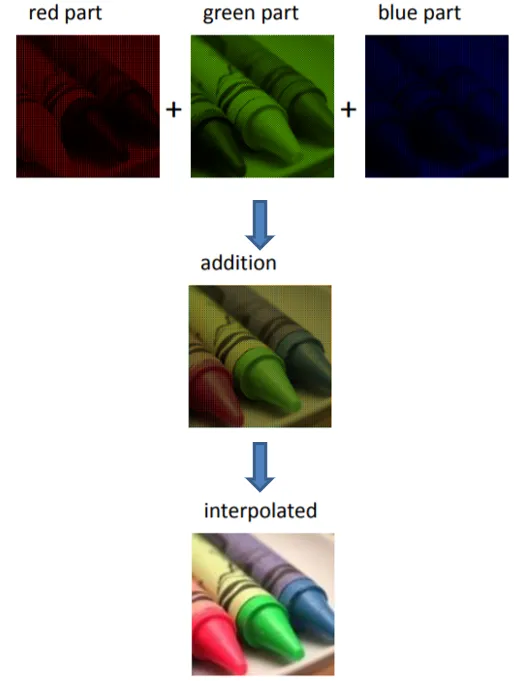{width="5.40625in" height="7.09375in"}

从RAW 数据计算RGB 数据的过程在数学上是一种不适定问题（ill-posed
problem），理论上有无穷多种方法，因此与其说是一种科学，不如说是一种艺术。
下面介绍一种最简单的方法。这个方法考虑3x3范围内的9个像素，为简单起见只考虑两种情形，即中心像素为红色和绿色，其它情形同理。

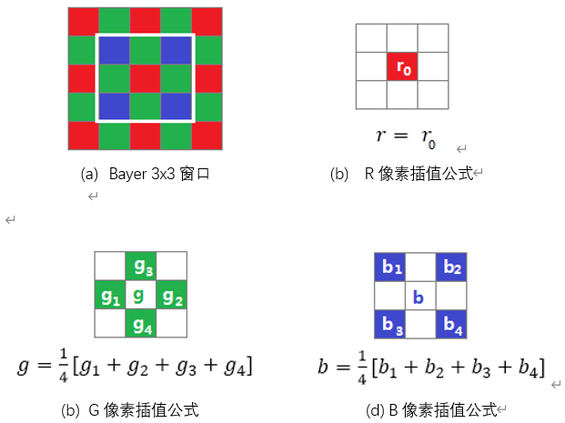{width="5.75in" height="4.302083333333333in"}

中心像素为R

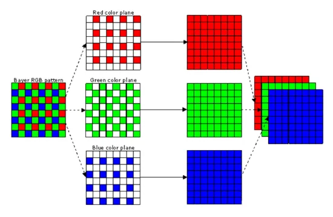{width="5.729166666666667in" height="3.75in"}

中心像素为Gr

上述过程常称为Bayer
Demosaic，或者Debayer，经过此操作之后，每个像素就包含了3个完整的颜色分量，如下图所示。

{width="5.729166666666667in" height="3.75in"}

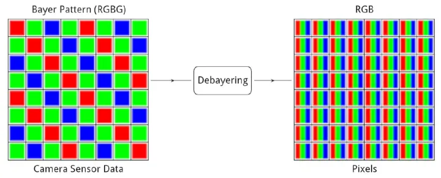{width="5.75in" height="2.3125in"}

**上述各种Bayer格式的共同特点是接受一种颜色而拒绝两种颜色，因此理论上可以近似认为光能量损失了2/3，**这是非常可惜的。为了提高光能量的利用率，人们提出了RYYB的pattern，这是基于CMY三基色的CFA
pattern，Cyan是青色（Red的补色），Magenta是品红（Green的补色），Yellow是黄色（Blue的补色）。目前这种特殊的Bayer
pattern已经在华为P30系列和荣耀20手机上实现了量产。据华为终端手机产品线总裁何刚透露，为了保证RYYB阵列在调色方面的准确性，华为付出了整整3年的时间。

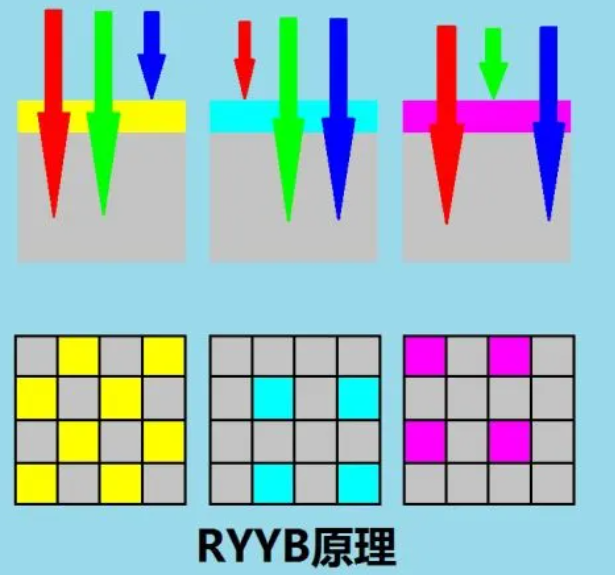{width="5.75in" height="5.375in"}

**成像与读出**

Sensor成像的过程可以比喻成用水桶接水的过程，如下图所示。在这个比喻中，雨水即相当于光子，每个水桶即相当于一个像点，水桶收集雨水的过程即相当于像点的曝光过程。当收集到合适数量的雨水后，会有专门的工序统计每一个水桶收集到多少雨水，然后将桶倒空，重新开始下一次收集。

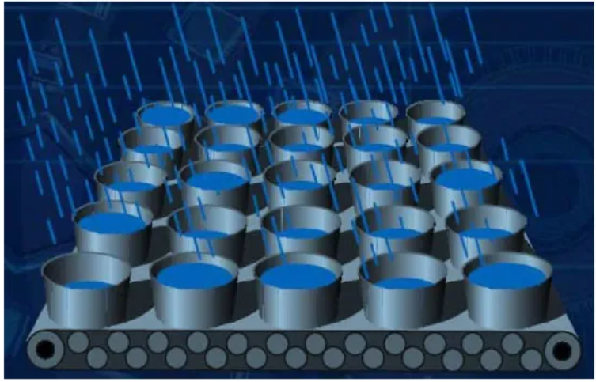{width="5.75in" height="3.6875in"}

像点记录光信号以及信号读出的原理和计算机内存的工作原理非常相似。sensor
会使用一个行选信号(Row Select)和一个列选信号(Column
Select)来选中一个存储单元(Pixel)，被选中的存储单元与输出放大器联通，将其存储的电荷数转换成电压值输出到阵列外部。下图说明了这个过程。

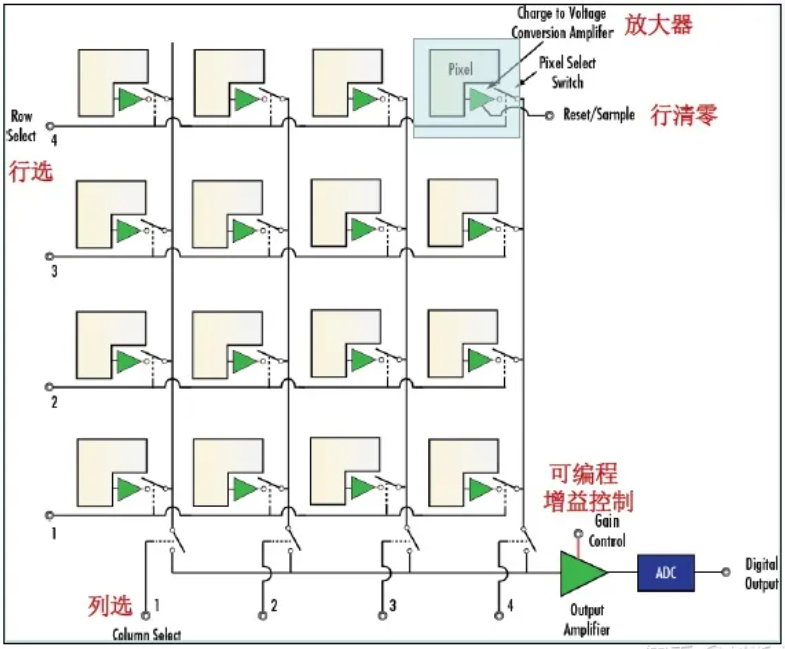{width="5.75in" height="4.75in"}

像素读出的基本过程是 每个像素内置一个电荷/电压放大器（Charge/Voltage
Converter, CVC），将像素势阱中电荷的数量转换成电压信号
读出逻辑选中某一行，该行所有像素的电荷/电压放大器的输出信号与列输出信号联通
读出逻辑继续选中某一列，该列信号与可编程输出放大器（Output
Amplifier）联通，被选中的像素的电压信号被放大一定倍数
放大后的电压信号经ADC转换器后变成数字信号，在sensor
内部经过一定的ISP处理，最后通过一定的接口协议（如MIPI）输出到外部!

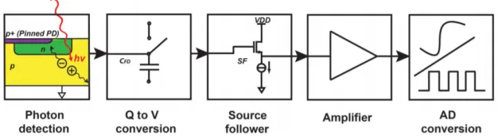{width="5.75in" height="1.6041666666666667in"}

**卷帘曝光（rolling shutter）**

CMOS sensor 的典型曝光方式称为卷帘曝光(rolling
shutter)，其曝光过程涉及两个控制信号，即 一个reset
信号负责将某一行像素清零，使其从零开始积累电荷 一个read
信号负责选择某一行，导致该行被读出 这两个信号的工作时序是reset
信号在先，read
信号在后，之间相差一个恒定的间隔，这个间隔在空间上看是两个信号前后相差固定的行数，在时间上看是一行像素被清零后，等待固定的时间后即被读出。
一行像素在遇到reset 信号之前处于"自由曝光"的状态，在遇到reset
之后开始"受控曝光"，在遇到read
信号之后又恢复到"自由曝光"状态，如下图所示。

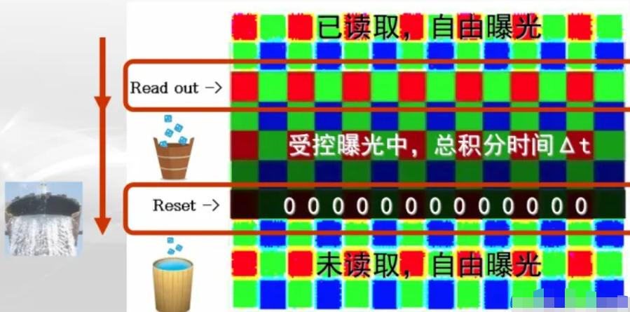{width="5.75in" height="2.84375in"}

读出机制 - rolloing shutter

下图显示了一个像素的曝光过程。
一个曝光过程从RESET开始，RESET信号保持一段时间后像素清零，恢复高电压
像素自由积分，时间取决于用户设置的曝光时间 像素采样，准备读出

{width="5.75in" height="2.1041666666666665in"}

Rolling shutter 在空间和时间上的关系如下图所示。

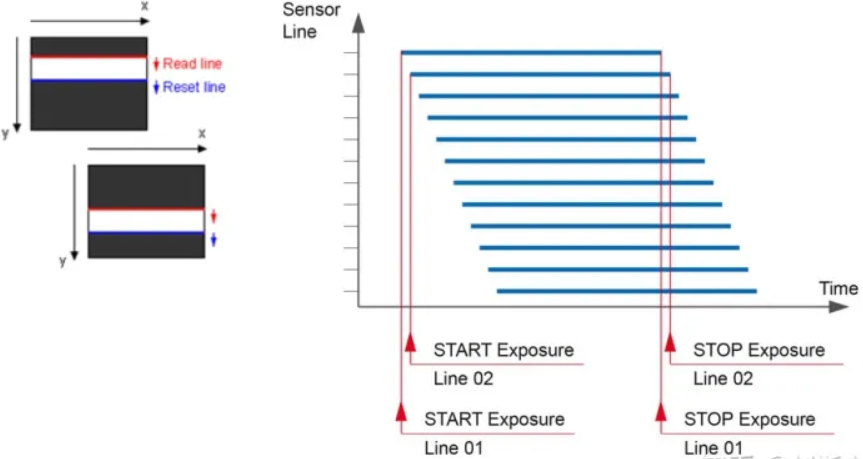{width="5.75in" height="3.0520833333333335in"}

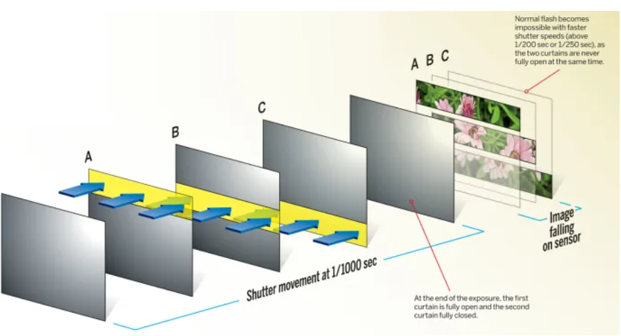{width="5.75in" height="3.1145833333333335in"}

显然，sensor read 信号与 reset
信号之间的时间间隔就是每个像素能够积累光信号的时间，也就是人们所熟知的"曝光时间（exposure
time）"，在技术领域则更多会使用"积分时间（integration
time）"这个术语，它一般是以行为单位的一个量，能够精确地反映像素曝光过程的物理本质和实现原理。
熟悉摄影的人都会知道，如果被拍摄的物体在相对摄像机运动，则需要使用比较短的曝光时间，否则画面就会出现运动模糊，这是因为在曝光过程中物体不断从一个像素位置转移到另一个像素位置，物体运动速度越快，运动模糊越严重，如下图所示。

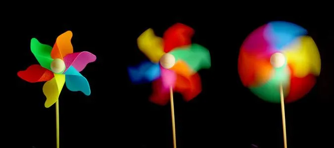{width="5.75in" height="2.5520833333333335in"}

在下图的例子中，由于弹琴的手在不停地移动位置，所以在很多像素上都会留下一点曝光的痕迹，却没有任何一个像素上停留足够久的时间。

{width="4.9375in" height="3.28125in"}

以拍摄人物为例，当在画面中以正常速度步行时，如果曝光时间大于1/30秒（约30ms）则画面就开始出现运动模糊，下图给出了一组经验值，用于参考绝对曝光时间和运动模糊的关系。

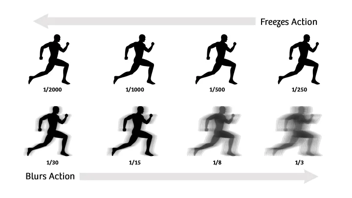{width="5.75in" height="3.2291666666666665in"}

在智能交通（ITS）领域，普通城市路面监控一般要求曝光时间短于1/60s，否则拍到的车牌就开始模糊，如果曝光时间更长则夜间的车灯就会出现明显的拖尾现象，如下图所示。

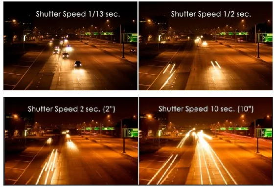{width="5.75in" height="3.9166666666666665in"}

如果拍摄对象是鸟类这种动若脱兔的目标，则曝光时间不能超过1/125s（\<10ms），否则很容易出现运动模糊。

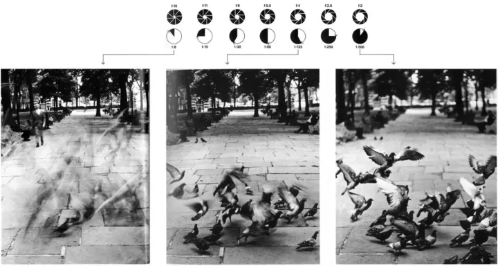{width="5.75in" height="3.0625in"}

当然，摄影技术中还存在一个专门的分支叫做高速摄影和超高速摄影，通常用于捕捉高速飞行的子弹，或者火箭发动机点火的过程，此时曝光时间需要锁定在微秒甚至纳秒级别。

{width="5.75in" height="4.510416666666667in"}

**Rolling shutter 效应**

卷帘曝光的最显著特点是每一行像素开始曝光的时间点是不同的，是与像素位置有关的的函数。当画面中存在运动的物体时，物体在曝光过程中空间位置在不断变化，画面就发生变形，物体速度越快，变形就越严重。

这种形变通常称为RS效应，或者"果冻效应"(Jello
effect)，指图像出现扭曲、倾斜等现象，仿佛进入了"时空扭曲"的世界一般。

{width="5.75in" height="4.197916666666667in"}

与rolling shutter 做对比的是CCD sensor 采用的全局快门 (global
shutter)，其特点是sensor
上所有像素是在同一瞬间全部开始曝光的，因此sensor
采集的是物体在同一时间点的画面。下图是两种曝光方式的对比。

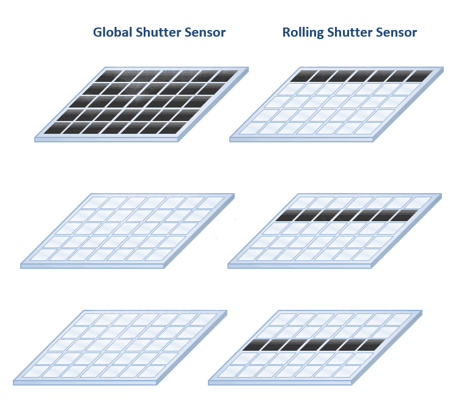{width="5.75in" height="5.197916666666667in"}

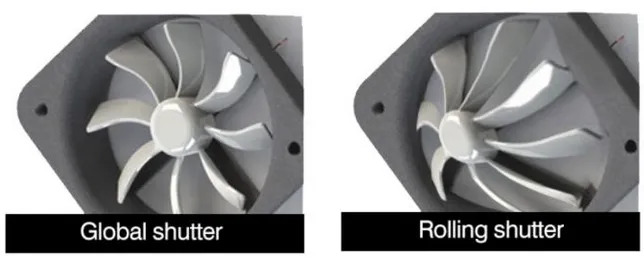{width="5.75in" height="2.375in"}

一般来说，RS效应存在三种表现形式，前两种属于画面畸变，合称果冻效应。
整体倾斜（skew），如下图车辆的例子 !

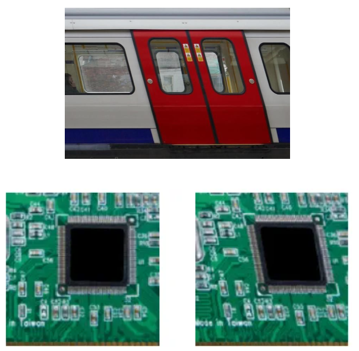{width="5.75in" height="5.614583333333333in"}

传送带上的电路板图像运动skew !

图像摇摆（wobble），如下图所示
在无人机、车载等应用中，camera本身随载具平台一起运动，平台的高频机械振动会对成像造成较大扰动，图像产生摇摆。即使在安防场景中，如果camera附近存在振动源（如空调电机）也会产生同样的问题。

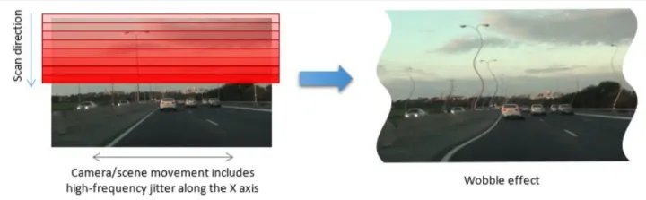{width="5.75in" height="1.7708333333333333in"}

部分闪光（partial flash），如下图所示 普通摄影闪光灯的闪光时间
通常只有几个毫秒，显著短于一帧图像的成像时间，因此只有一部分画面能够被闪光照亮。

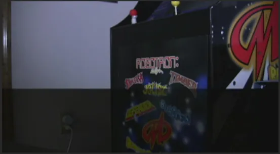{width="5.75in" height="3.1666666666666665in"}

微软研究院的Simon等人使用光流法追踪摇摆像素的运动矢量，从而对摇摆进行校正。

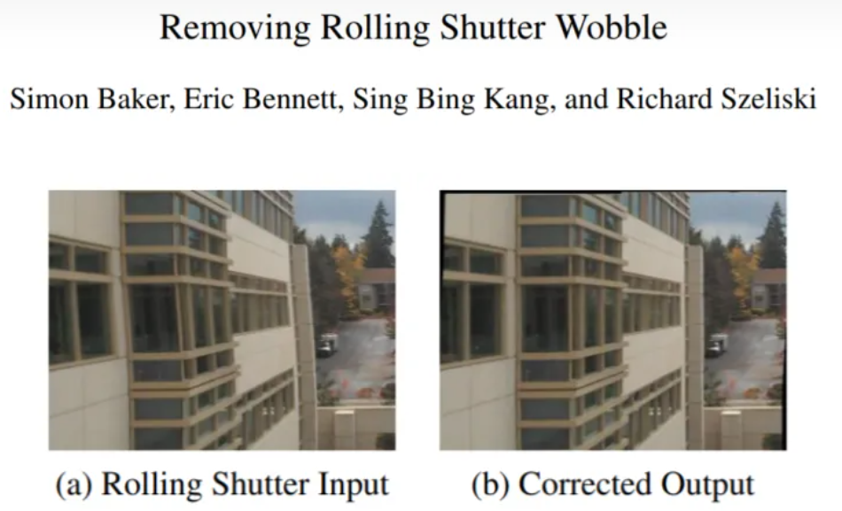{width="5.75in" height="3.4895833333333335in"}

针对手机拍摄的场景，斯坦福的Alexandre等人使用手机自带的加速度传感器提取camera的加速度信号用于补偿图像摆动。

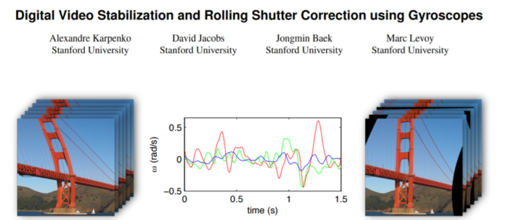{width="5.75in" height="2.4895833333333335in"}

**积分时间 (integration time)**

用户在使用camera拍摄时需要根据场景特点决定所采用的曝光时间（exposure
time），或者让camera
在设定范围内自动选择最合适的曝光时间，这时所涉及的曝光时间概念主要与拍摄场景有关，一般是以毫秒为单位计算的绝对时间，也是用户比较熟悉和容易理解的概念。

而sensor
中用来控制曝光长短的寄存器参数称为积分时间，一般是以行为单位的，这个概念是源于sensor
的技术特性，一般不需要用户去理解。

曝光时间和积分时间存在确定的换算关系。比如说int_t=159，指的是sensor
reset 信号和read
信号之间的间隔为159行，而每行所占的绝对时间（line_time）与sensor
主频(pixel clock, PCLK)的和每一行包含多少像素(行长 )有关，具体公式是：

line_time=h_size / pclk

其中h_size 为行长，以PCLK 数为单位，1/pclk
为一个时钟周期，即扫描一个像素需要花费的绝对时间
因此曝光时间与积分时间的换算公式如下：

exposure time = int_t \* line_time

举例来说，假设一个1080p sensor
PCLK=76MHz，每行配置成2000个PCLK（由有效像素和blanking组成），则有
line_time = 2000 / 76MHz = 26.32 us

如果某个场景需要10ms曝光时间，则sensor 积分时间应如下计算， int_t =
10000us / 26.32us = 379.9 （行）

显然这个例子可以安全地将sensor
寄存器配置为380行，就能得到10ms的曝光时间。 但是当 int_t \< 2
时问题就会变得有些复杂。假设计算出的理想积分时间是1.5行，此时自动曝光算法就很容易产生振荡，不停在1行和2行之间切换而无法稳定在一个固定值。因此有些sensor
会支持分数行，可以帮助解决这个问题。

**工频闪烁 (flicker)**

工频闪烁，通常发生在室内场景，曝光时间设置如果不是光源能量周期的整数倍，则图像不同位置处积累的信号强度不同，并呈周期性变化，这是单帧图像的情况。在视频序列上，如果满足一定条件，视频会出现条纹模式在垂直方向上缓慢移动。

{width="5.75in" height="2.8541666666666665in"}

\(a\) flicker (b) no flicker

工频闪烁的形成原因与CMOS sensor rolling
shutter的工作原理相关，并且受交流电的频率影响。对于同样的积分时间t，sensor不同位置处的像点开始积分时所处电信号的相位不同，所以同样时间t
内能够积累的光子数也不同。如下图所示。

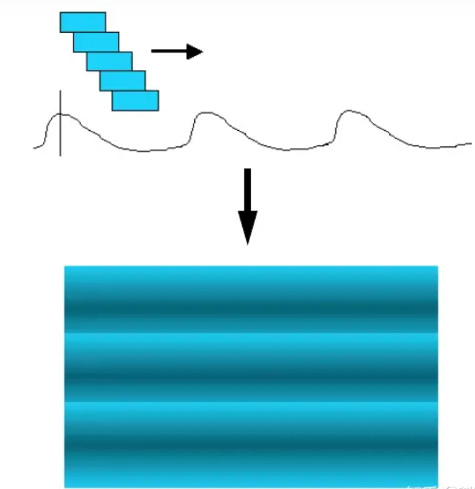{width="5.75in" height="5.90625in"}

flicker
的本质是像素曝光起始点相对交流电的相位关系在不断变化。这个问题不仅存在于一帧图像内部，在帧与帧之间也存在同样的问题。
以电频率50Hz为例，如果sensor 工作在25或50fps（frame per
second），则帧频率刚好与电频率同步，每帧图像的flicker
表现（明暗位置）与上一帧完全相同，所以明暗条纹在视频上是静止不动的。如果sensor工作在30或60fps，则每帧的flicker与上一帧会产生固定的相移，视频上的明暗条纹图样会在画面垂直方向上缓慢移动。
在室内，为了避免工频闪烁，曝光时间应设置为光源能量周期的整数倍。在中国，光源能量周期为10ms(交流电周期的1/2)，在美国则为8.3ms，调整曝光时间时要特别注意这一点。

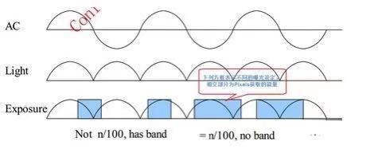{width="4.895833333333333in"
height="1.9479166666666667in"}

**与CCD的对比**

CCD技术的发展起源于1960年代，在2000年以前曾是image sensor
的主流解决方案，下图对比了CCD和CMOS读出方式的主要区别。

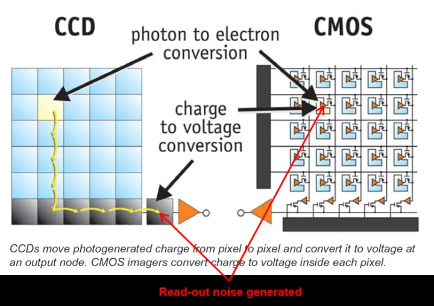{width="5.75in" height="4.041666666666667in"}

如图所示，CCD 器件通常只有一个电荷-电压转换器（Charge-Voltage
Converter），当sensor读出像素数据时，每一行像素中积累的电荷需要在行电压的控制下一步步"蠕动"到下一行，直到最终抵达阵列所属的行缓冲（row
buffer），然后开始在列电压的控制下继续一步步"蠕动"到阵列出口处的电荷-电压转换器，完成读出过程。

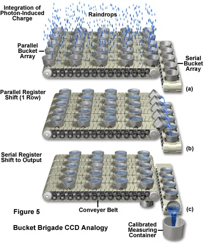{width="4.385416666666667in"
height="5.239583333333333in"}

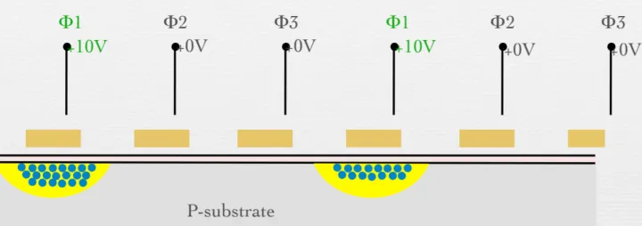{width="5.75in" height="2.0208333333333335in"}

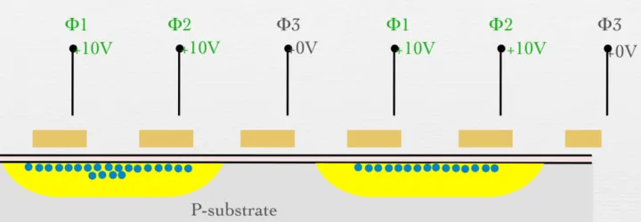{width="5.75in" height="1.9895833333333333in"}

{width="5.75in" height="1.9791666666666667in"}

CCD的一个主要优点在于所有像素共享同一个电荷-电压转换器，所以像素一致性非常好。相比之下CMOS每个像素都有自己专用的电荷-电压转换器，一致性很不容易控制。
当CCD像素数多于200万时，所有像素共用一个电荷-电压转换器会严重影响读出速度，所以此时会考虑把像素设计成两个或四个阵列，每个阵列配备专用的行缓冲和电荷-电压转换器，可以成倍加快读出速度。

**改进的曝光方式**

**Interlaced 曝光**

为了改善rolling shutter 曝光方式存在的问题，有人提出了Interlaced
曝光和读出方式，如下图所示，新的曝光顺序将一帧拆分成8组，第一组包含行号
{0,8,16,24\...}，第二组包含行号 {1,9,17,25,\...}
，以此类推，第八组包含行号 {7,15,23,31,\....}
。这种曝光方式的优点是组与组之间的曝光延时为一帧时间的八分之一，以1080p@30fps
为例，一帧的读出时间大致在28ms左右，在新的曝光方式下像素间的最大曝光延时仅为3.5ms，可以更好地捕捉运动场景。

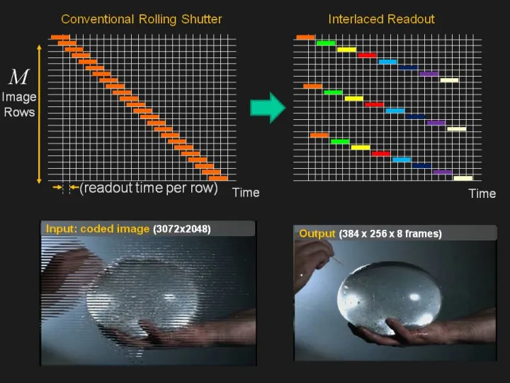{width="5.75in" height="4.3125in"}

**斩波曝光（chopped）**

在智能交通领域常会遇到拍摄交通信号灯的需求。大部分信号灯直接使用220V市电供电，因此会存在10ms的光能量周期（美国是110V，周期8.3ms）。偶尔也会有信号灯厂家偷工减料，使用半波整流器件将电频率的负半周过滤不用，这就导致信号灯每亮10ms之后就会熄灭10ms。虽然人眼看不出来，但sensor看的非常清楚。P.S.
遇到这种偷工减料的信号灯，一般可以要求业主更换信号灯供应商，并拉黑原供应商。
由于信号灯存在10ms的明暗周期，当sensor曝光时间很短时，就会遇到某一帧图像里信号灯碰巧全都不亮的尴尬场景，如下图所示。

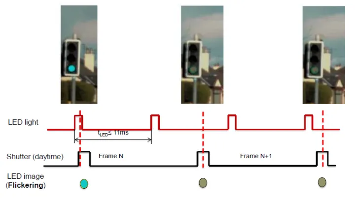{width="5.75in" height="3.2083333333333335in"}

一般在晴朗的夏天，sensor曝光时间可能会需要短于1ms才能保证画面不过曝，此时遇到信号灯近似熄灭的概率已接近50%。而在夜晚则曝光时间通常需要大于10ms，所以不会遇到信号熄灭的问题，相反会遇到信号灯光太强以致sensor过饱和，全部信号变成白灯的问题。

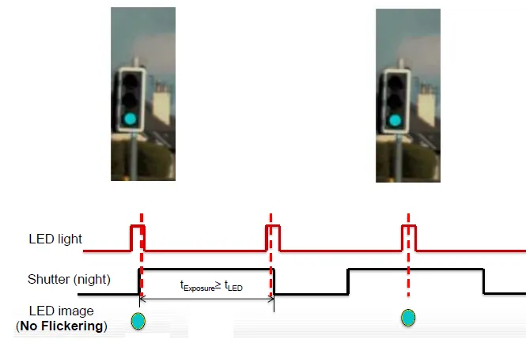{width="5.75in" height="3.75in"}

除了红绿灯之外，很多汽车上使用的LED大灯或者信号灯也是有频率的，而且平均点亮的时间（占空比，duty
cycle）可能更短，如下图所示，这种情况sensor抓拍到LED（信号）灯熄灭的概率会更大。

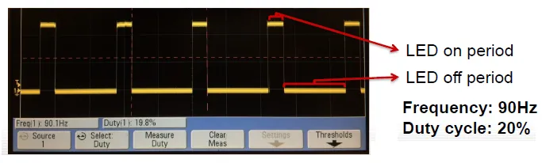{width="5.75in" height="1.7291666666666667in"}

为了缓解这个问题，有人提出了斩波曝光的工作模式，其原理是把正常曝光所需的曝光时间（比如1ms）分散到11ms的固定时间间隔内执行，通过多次短暂曝光的效果累加实现1ms等效曝光时间，且能保证采样到信号灯最亮的时刻，如下图所示。

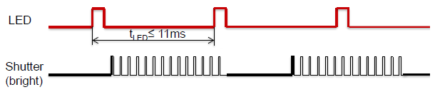{width="5.75in" height="1.34375in"}

这种方法的好处是增大了捕捉到信号灯点亮的概率，但是由于捕捉的时间短，所以画面上信号灯的亮度会比正常的要弱。所以这种方法并没有完美解决问题，只是一种缓解（mitigation）的方法。

**画幅**

{width="5.75in" height="2.1875in"}

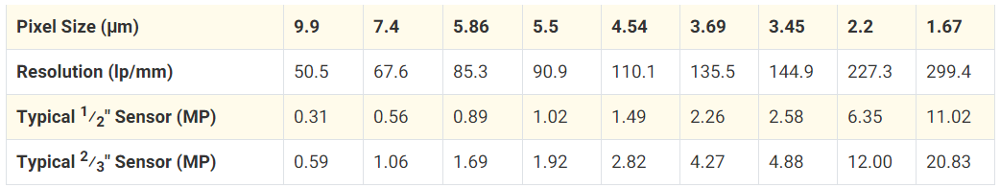{width="5.75in" height="1.0729166666666667in"}

中画幅的sensor典型尺寸为44或53mm宽，3千万\~1亿像素。

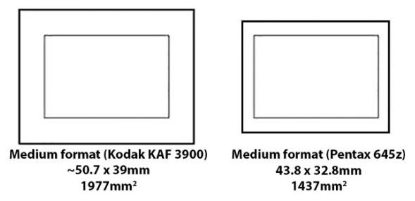{width="5.75in" height="2.78125in"}

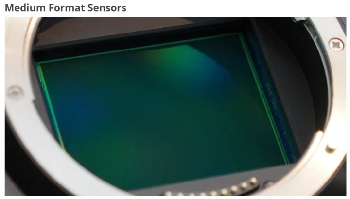{width="5.75in" height="3.2708333333333335in"}

中画幅

全画幅的sensor典型尺寸为35mm宽，和早期的电影胶片一样大，具有1千万\~5千万像素不等。

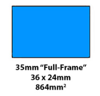{width="2.1354166666666665in" height="2.0625in"}

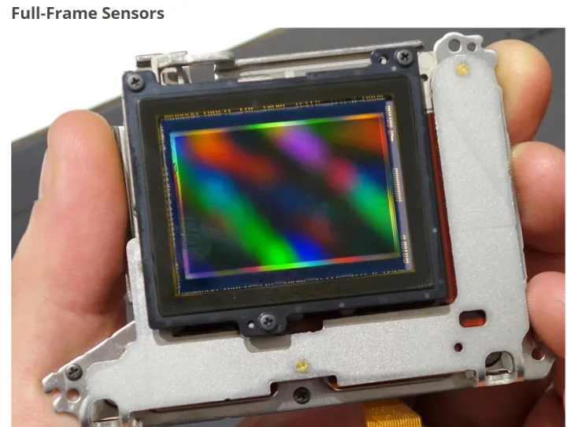{width="5.75in" height="4.322916666666667in"}

APS-C sensor
典型尺寸22mm宽，是单反相机的主力军，具有6百万\~5千万像素不等。

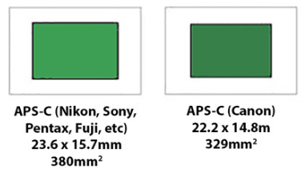{width="3.96875in" height="2.25in"}

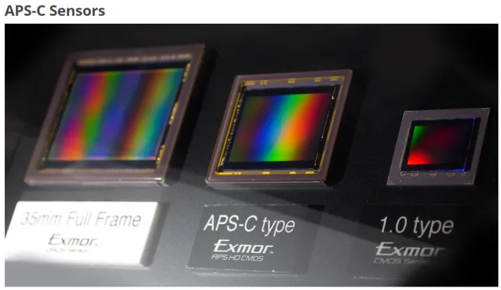{width="5.75in" height="3.3229166666666665in"}

4/3英寸画幅sensor，典型尺寸17.3mm宽，微单产品的主力，具有8百万\~2千万像素不等。

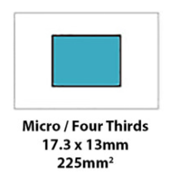{width="1.9479166666666667in"
height="2.09375in"}

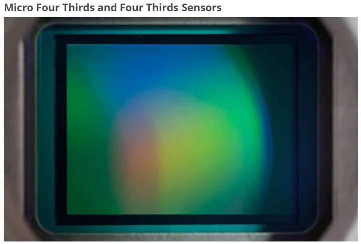{width="5.75in" height="3.875in"}

1英寸画幅sensor，典型尺寸13.2mm宽，用于单反和高端安防产品

{width="1.9166666666666667in"
height="1.96875in"}

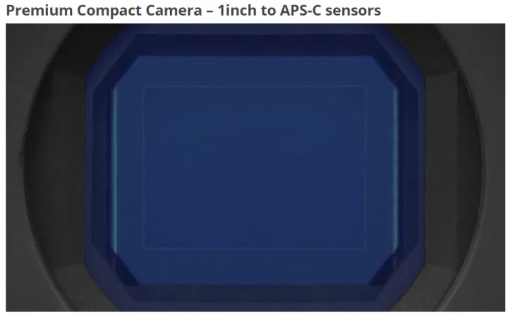{width="5.75in" height="3.5520833333333335in"}

1/3\~2/3英寸sensor，便携camera和安防camera的主力军，1百万\~2千万像素不等。

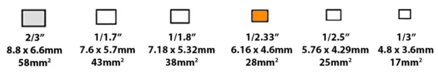{width="5.75in" height="1.0104166666666667in"}

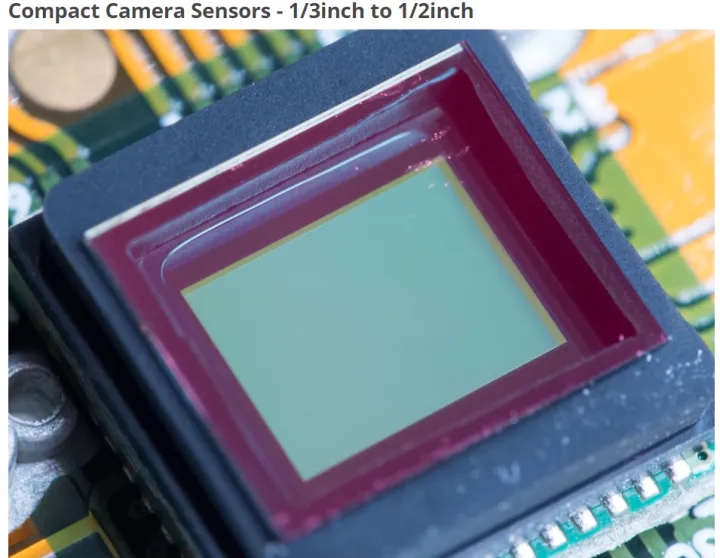{width="5.75in" height="4.447916666666667in"}

1/4\~1/2英寸sensor，主要用于手机camera模组，8百万\~4千万像素不等。

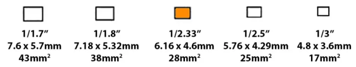{width="5.75in" height="1.0833333333333333in"}

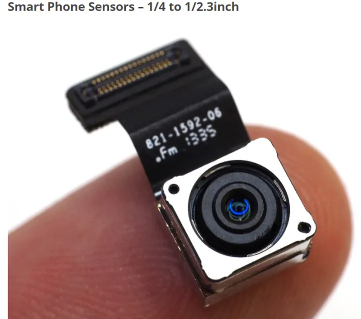{width="5.75in" height="5.072916666666667in"}

**像素类型 (Pixel type)**

**被动像素 （Passive pixel）**

最简单的Pixel结构只有一个PN结作为感光结构，以及一个与它相连的reset晶体管（RS）作为一个开关，如下图所示。

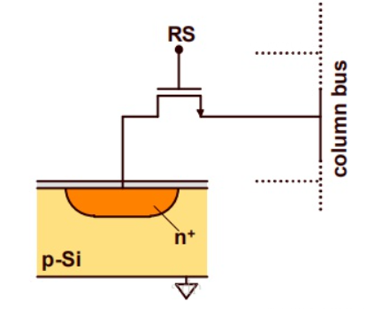{width="4.416666666666667in"
height="3.6354166666666665in"}

开始曝光前，像素的行选择地址会上电，于是RS使能，连通PN结与列选择器（column
bus），同时列选择器会上电，使PN结上加高反向电压（如3.3
V），短暂延时后PN结内电子空穴对达到平衡，于是reset 操作完成，RS
信号失效，隔断PN结与column bus的连通。
开始曝光时，PN结内的硅在吸收光子激发出电子-空穴对。受PN结内电场的影响，电子会流向PN结的n+端，空穴会流向PN结的p-substrate。因此，曝光后的的PN结反向电压会降低。
曝光结束后，RS再次使能，读出电路会测量PN结内的电压，该电压与原反向电压之间的差值即正比于PN结接受到的光子数。
在读出感光信号后，会对PN结进行再次reset，准备下次曝光。 当sensor
控制逻辑需要读出阵列中的某个特定像素时，需要发出该像素的行地址和列地址，地址会被两个译码器（address
decoder）解析并激活该像素所在的行选择线和列选择线，使该像素的PN结电容经过RS三级管连接到输出放大器上，如下图所示。

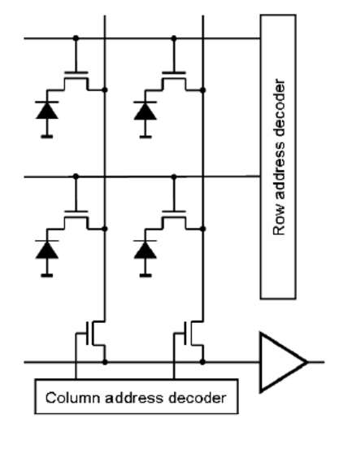{width="4.34375in" height="5.864583333333333in"}

这种像素结构因为读出电路完全位于像素外面所以称为Passive
Pixel，其优点是PN结可以独占像素面积，缺点是噪声较大，主要有2个原因：
PN结的电容小于读出电路上的电容，所以对电路噪声很敏感。
PN结的信号需要先读出才进行放大，因此读出电路的噪声会被一起放大。
当RS使能且列选择器通高电平时，在电路原理上相当于对PN结的电容进行充电，但是充电后得到的电压值却有一定的随机性，一方面每个PN结的实际电容大小会服从一定的概率分布，结与结之间存在固定的偏差，这会构成一种固定模式噪声（Fixed
Pattern Noise,
FPN）；另一方面由于电路中存在暗电流噪声，即使是同一个结每次充电后得到的实际电压也不完全一样，这就构成了另一种模式的噪声，它与PN结的结构、温度和结电容大小都有关，称为kTC噪声。

**像素kTC噪声**

在研究PN结的噪声特性时可将其简化为下图所示的由电阻电容形成的低通滤波网络。

{width="3.6145833333333335in"
height="2.8333333333333335in"}

可以证明，由电子热运动引起的宽带热噪声经PN结滤波后反应在结电容上的输出噪声功率用kT/C描述，其中T为PN结温度，C为结电容，k为常系数，因此合称kTC噪声。

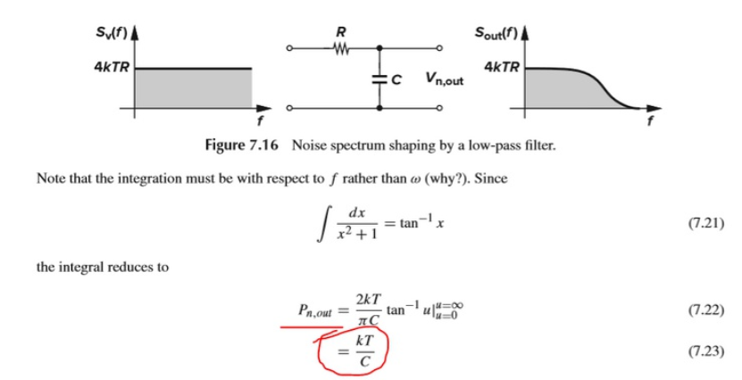{width="5.75in" height="2.9375in"}

注意，KT/C的单位是V\^2,我们还可以将√(KT/C)视为在输出中测量的总均方根噪声电压。例如，对于1-pF电容器，在T=300
K时，总噪声电压等于64.3μVrms 。

**主动像素 （Active pixel）结构**

目前主流的CMOS传感器都采用Active Pixel 结构设计。

3T结构：下图所示的Active Pixel
结构称为3T结构，每个像素包含一个感光PN结和3个晶体管，即一个复位管RST，一个行选择器RS，一个放大器SF。

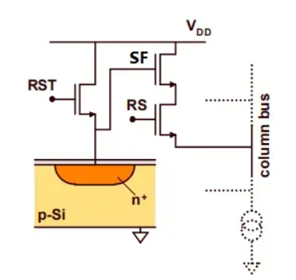{width="3.8645833333333335in"
height="3.6666666666666665in"}

3T结构的经典版图设计如下所示。

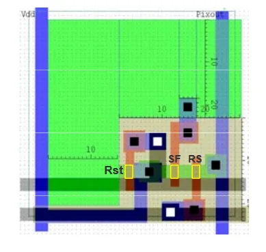{width="4.052083333333333in" height="3.84375in"}

3T结构的工作方式是，
复位。使能RST给PN结加载反向电压，复位完成后撤销RST。 曝光。与Passive
Pixel 原理相同。
读出。曝光完成后，RS会被激活，PN结中的信号被SF放大后读出。
循环。读出信号后，重新复位，曝光，读出，不断输出图像信号。
基于PN结的Active Pixel
流行与90年代中期，它解决了很多噪声问题。但是由PN结复位引入的kTC噪声却并没有得到解决。

PPD结构：为了解决复位kTC噪声，减小暗电流，在3T结构之后又出现了PPD结构（Pinned
Photodiode
Pixel），包括一个PN结感光区和4个晶体管，所以也称4T结构，它在3T结构的基础上增加了一个TX三极管起控制电荷转移的作用。

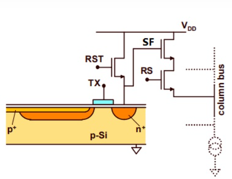{width="4.895833333333333in"
height="3.7916666666666665in"}

PPD结构的经典版图设计如下所示。

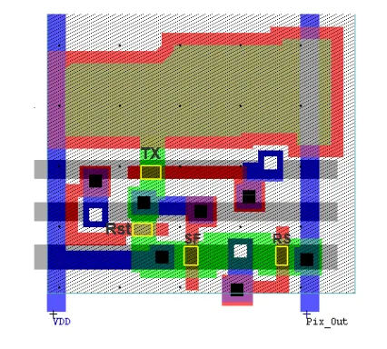{width="4.4375in" height="4.0in"}

PPD的出现是CMOS性能的巨大突破，它允许相关双采样（CDS）电路的引入，消除了复位引入的kTC噪声，运放器引入的1/f噪声和offset噪声。

它的工作方式如下：

曝光。

复位。 曝光结束时使能RST，将读出区（n+区）复位到高电平。

读复位电平。读出n+区的电平，其中包含运放的offset噪声，1/f噪声以及复位引入的kTC噪声，将读出的信号存储在第一个电容中。

电荷转移。使能TX，将电荷从感光区完全转移到n+区准备读出，这里的机制类似于CCD中的电荷转移。

读信号电平。将n+区的电压信号读出到第二个电容。这里的信号包括：光电转换产生的信号，运放产生的offset，1/f噪声以及复位引入的kTC噪声。

信号输出。将存储在两个电容中的信号相减（如采用CDS，即可消除Pixel中的主要噪声），得到的信号在经过模拟放大，然后经过ADC采样，即可进行数字化信号输出。

PPD像素结构有如下优点：

读出结构（n+区）的kTC噪声完全被CDS消除。

运放器的offset和1/f噪声，都会因CDS得到明显改善。 -
感光结构因复位引起的kTC噪声，由于PPD电荷的全转移，变的不再存在。

光敏感度，它直接取决于耗尽区的宽度，由于PPD的耗尽区一直延伸到近Si−SiO2界面，PPD的光感度更高。

由于p-n-p的双结结构，PPD的电容更高，能产生更高的动态范围。 -
由于Si−SiO2界面由一层p+覆盖，减小了暗电流。

PPD共享结构：PPD结构有4个晶体管，有的设计甚至有5个，这大大降低了像素的填充因子（即感光区占整个像素面积的比值），这会影响传感器的光电转换效率，进而影响传感器的噪声表现。为了解决这个问题又出现了PPD共享结构，像素的感光区和读出电路由TX晶体管隔开，相邻像素之间可以共用读出电路，如下图所示。

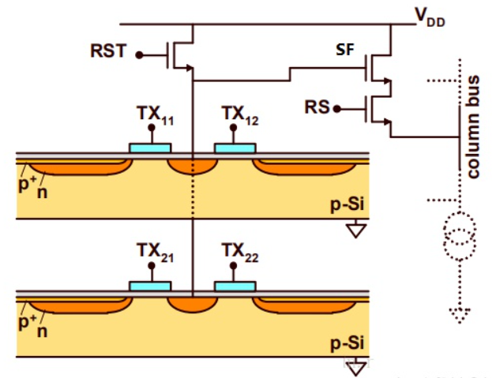{width="5.75in" height="4.416666666666667in"}

图中2x2像素共享一个读出电路，一共使用7个晶体管，平均一个像素1.75个晶体管。这样可以大大减少每个像素中读出电路占用的面积，提高填充因子。美中不足的是，由于这2x2个像素的结构不再一致，会导致固定模式噪声（FPN）的出现，需要在后续ISP处理中消除。

**双相关采样（CDS）**

双相关采样即Correlated Double
Samping，其基本思想是进行两次采样，先采样一个参考信号用于评估背景噪声，延迟很短时间后再采集目标信号，从第二次采样中减去参考信号即得到去除了大部分背景噪声的目标信号，其原理模型如下图所示。

{width="3.3645833333333335in"
height="1.3333333333333333in"}

CDS成立的条件是在两次采样间背景噪声的幅度变化不大，因此它对去除固定噪声（FPN）和低频噪声效果比较理想，如1/f噪声，kTC噪声等

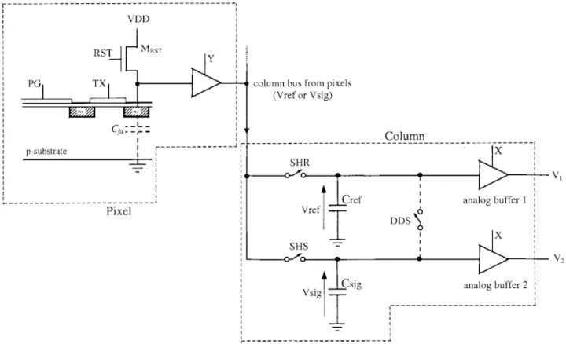{width="5.75in" height="3.4895833333333335in"}

下图以伪彩色的形式显示了CDS技术对像素低频噪声的过滤效果

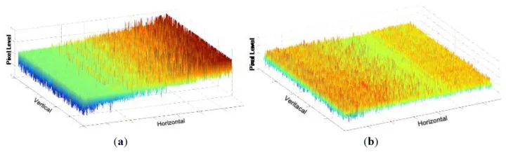{width="5.75in" height="1.7291666666666667in"}

pixel noise variation (a) 无CDS (b) 有CDS

**CMOS Sensor特性**

CMOS
sensor的本质是计量光电转换事件的线性传感器，在一定意义上可以说是光子计数器，sensor上每个像素的读值都反映了指定时间内该像素捕获光子的数量。一个理想的sensor
应该具备以下一些特性
输出与输入恒成正比（无sensor噪声，只有信号本身的噪声）
输入输出均可以无限大 高灵敏度，小的输入激励大的输出 高帧率 高分辨率
低功耗 工艺简单 低成本 理想 CMOS sensor 的响应特性下图所示

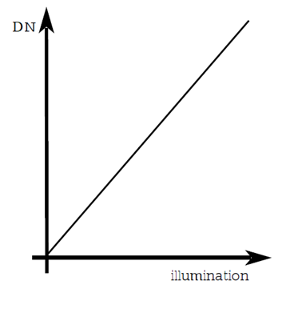{width="3.8333333333333335in"
height="4.177083333333333in"}

理想sensor的响应特性

图中直线的斜率决定了单位输入能够激励的响应大小，这个斜率称为增益系数（gain）。sensor
会提供一组接口用于调节实际生效的增益值。

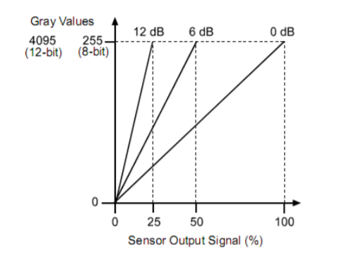{width="5.072916666666667in"
height="3.7916666666666665in"}

而实际的sensor只能是在一段有限的区间内保持线性响应，对于幅度过小或者过大的输入信号会不能如实地表示。

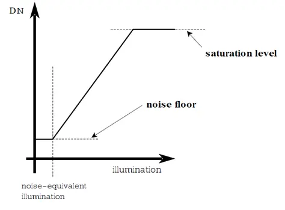{width="4.9375in" height="3.6354166666666665in"}

实际sensor的响应特性（简化模型）

下图是用示波器实测像素线性度的测试数据。

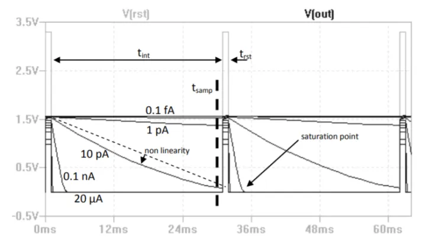{width="5.75in" height="3.28125in"}

下图是实验测量的输入输出曲线，横坐标是入射到sensor的光子数，纵坐标是sensor输出的数值（Digital
Number, DN）。

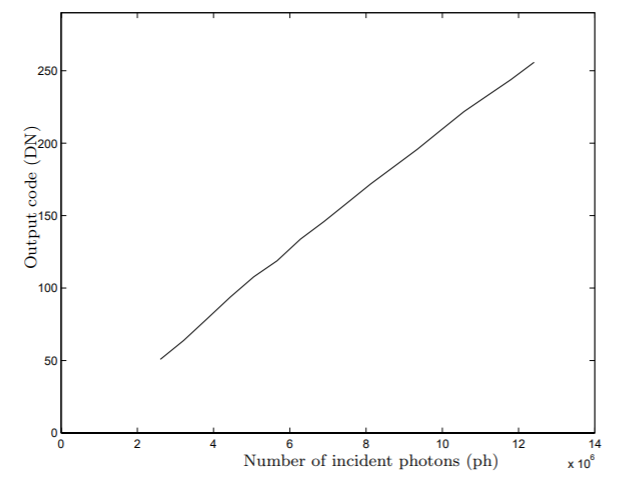{width="5.75in" height="4.395833333333333in"}

以上关系用公式描述就是 S(N, t) = q(λ)·N·t

其中，S(N, t)是sensor的一个像素采集到的电子数，
q(λ,)是sensor在波长λ处的光电转换效率，N是单位时间内入射到sensor表面的光子数（波长λ的单色光），t是曝光时间。

sensor
最终输出的像素值是使用ADC对S(N,t)进行采样和AD转换得到的量化值，该值会有PV(Pixel
Value)，ADU(Analog-Digital Unit)，DN(Digital Number)，Output
Code等多种表述方式，并且 DN=g\*S(N, t)
其中符号g代表增益系数gain，意义是多少个光子能够激励出1个比特的DN值。
下图描述了一个CMOS像素发生光电转换和收集光生电子的过程。

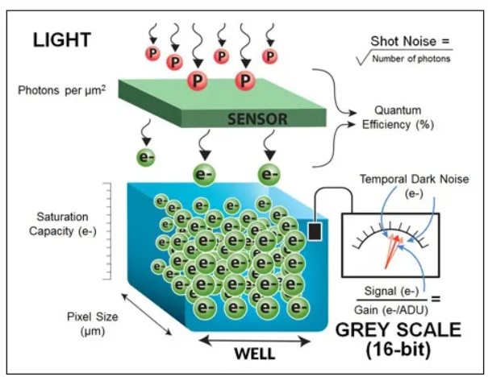{width="5.75in" height="4.447916666666667in"}

以上过程会涉及几个关键性的参数，下面简要给出描述。

**量子效率 （Quantum Efficiency）**

量子效率是描述光电器件光电转换能力的一个重要参数，它是在某一特定波长下单位时间内产生的平均光电子数与入射光子数之比。
由于sensor存在三种像素，所以量子效率一般针对三种像素分别给出。下图是一个实际sensor的量子效率规格示例。

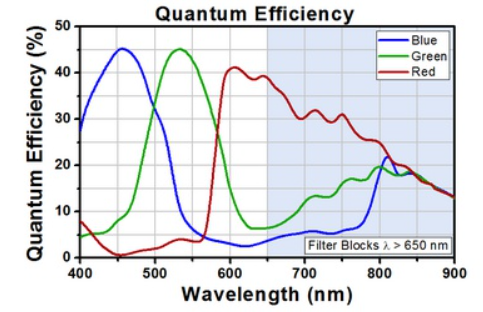{width="5.03125in" height="3.25in"}

**势阱容量 （Saturation Capacity）**

势阱容量又称Full Well
Capacity，指一个像素的势阱最多能够容纳多少个光生电子，消费类的sensor一般以2000\~4000较为常见，此值越大则sensor的动态性能越好。
下图给出一个包含势阱容量规格的例子。

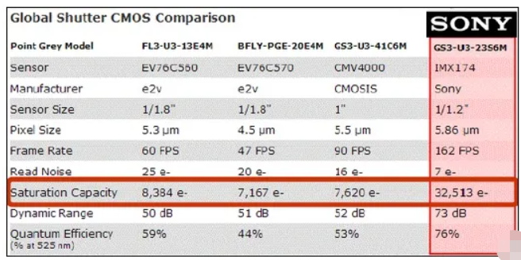{width="5.75in" height="2.875in"}

图中可以看出，不同厂家的像素工艺可以相差很大，较先进的工艺可以在34μm2的面积上容纳超过3万个电子，平均每μm2可以容纳近1000个电子，而普通的工艺每μm2只能容纳不到400个电子。
下图是两款SONY sensor进行比较。

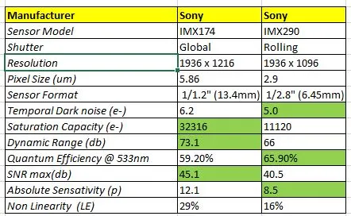{width="4.604166666666667in"
height="2.8333333333333335in"}

下图是一些单反相机sensor的饱和阱容比较。

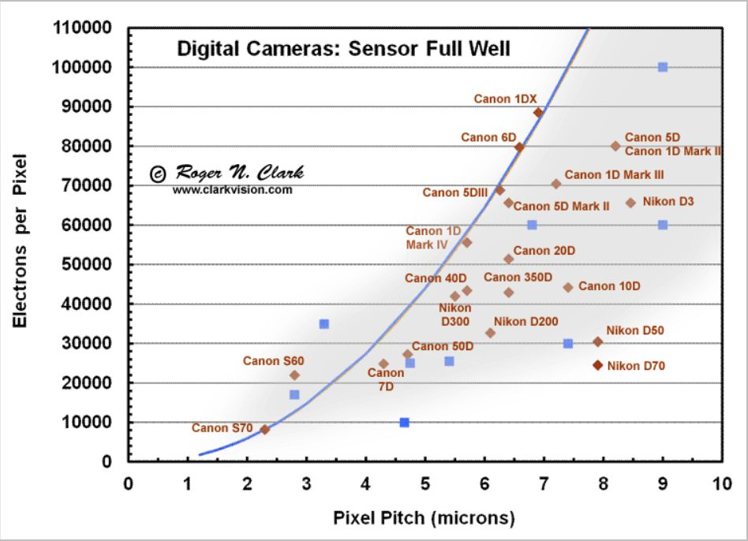{width="5.75in" height="4.15625in"}

**噪声 （Noise）**

"噪声"的广义定义是：在处理过程中设备自行产生的信号，这些信号与输入信号无关。
由于电子的无规则热运动产生的噪声在所有电子设备中普遍存在，是不可避免的，因此被重点研究，并赋予了很多名字，如本底噪声、固有噪声、背景噪声等，英文中常见noise
floor, background
noise等提法。如下图所示，器件的温度越高，电子的热运动越剧烈，产生的噪声也就越大。

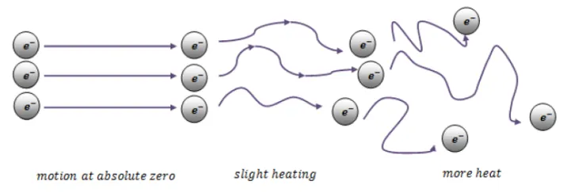{width="5.75in" height="1.9375in"}

真实世界中的所有信号都是叠加了噪声的，图像信号也不例外，如下图所示，当有用信号的幅度小于背景噪声时，这个信号就淹没在噪声中而难以分辨，只有当有用信号的幅度大于噪声时这个信号才是可分辨的。

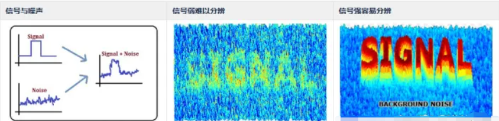{width="5.75in" height="1.3958333333333333in"}

假设照明强度恒定、均匀，相机拍摄图像中的噪声是测量信号中空间和时间振动的总和。下图以传递函数的形式总结了CMOS
sensor 光、电转换模型以及几种主要噪声的数学模型。

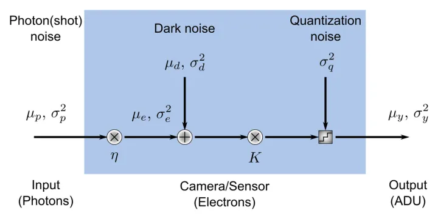{width="5.75in" height="2.875in"}

下图更加细致地描述了CMOS sensor 成像过程中各种噪声的来源和作用位置。

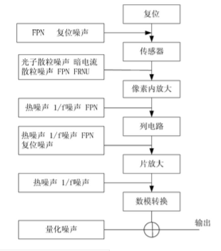{width="3.2291666666666665in"
height="3.6770833333333335in"}

下图是对噪声图像的数值分析。

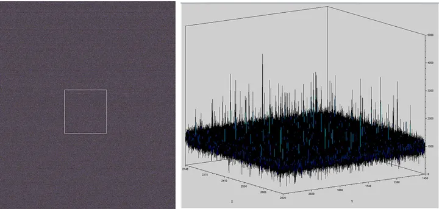{width="5.75in" height="2.7291666666666665in"}

了解各种噪声类型之前首先回顾一下概率与统计课程中学习过的泊松分布公式，后面将多次遇到这个分布。

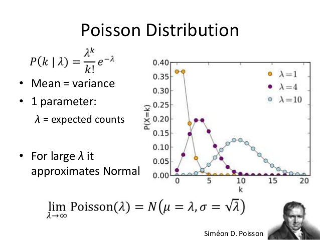{width="5.75in" height="4.3125in"}

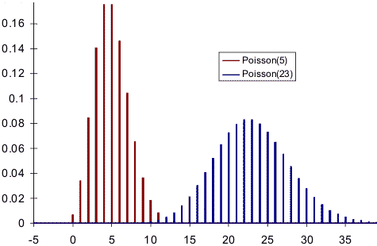{width="4.947916666666667in"
height="3.2291666666666665in"}

泊松分布是最重要的离散分布之一，它适合描述单位时间内随机事件发生的次数。举例来说，假设某高速公路在某时段的车流量是每小时1380辆，平均每分钟23辆，可是如果进一步以分钟为单位进行统计，我们就会发现某一分钟只通过了15辆，而另一分钟则通过了30辆，这个概率分布就需要用泊松分布来描述。同理，我们可以把这个例子中的车流换成芯片内流过PN结的电子流，或者换成通过镜头入射到像素的光子流，这两种情况在统计意义上是完全一样的，都需要用泊松分布来描述。

下面这篇文章较详细地解释了泊松分布的推导过程和它的现实意义。\[泊松分布的现实意义是什么，为什么现实生活多数服从于泊松分布？\][[(https://www.zhihu.com/question/26441147)]{.underline}](https://www.zhihu.com/question/26441147)

sensor 噪声中含有几部分分量：

暗散粒噪声(σD):
硅片中电子的热运动会导致一些价电子随机激发至导带中形成暗电流（dark
current），所以即使完全没有光子入射，sensor也会存在一定的信号输出。在曝光过程中，暗电流的随机变化即形成暗散粒噪声。暗电流变化的主要原因是电子穿过PN结时会遇到PN结的电势屏障（barrier），电子穿越屏障需要经历动能-势能-动能的转换过程，所以需要耗费一些时间。暗散粒噪声在统计上服从泊松分布，与光信号的高低水平无关，但与传感器的温度有关，一般的规律是温度每升高8°C暗电流翻一倍。所以在设计电路时必须注意把容易发热的电子元件尽可能布置在远离sensor的地方。

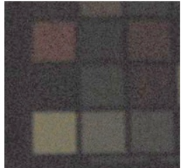{width="2.6979166666666665in"
height="2.5104166666666665in"}

暗电流随温度的变化规律

读出噪声 (σR):
该噪声是在产生电子信号时生成的。Sensor中使用AD转换器（ADC）将模拟放大器输出的模拟电压采样为数字电压。由于数字信号的精度总是有限的，通常为10比特至14比特，幅值位于两个相邻数字之间的模拟信号会四舍五入到最接近的数值，所以这个过程会引入量化噪声，这是读出噪声的重要组成部分。该噪声由传感器的设计决定，意义是至少需要多少个电子才能驱动读出电路的ADC变化一个比特。它与信号高低水平和传感器温度无关。

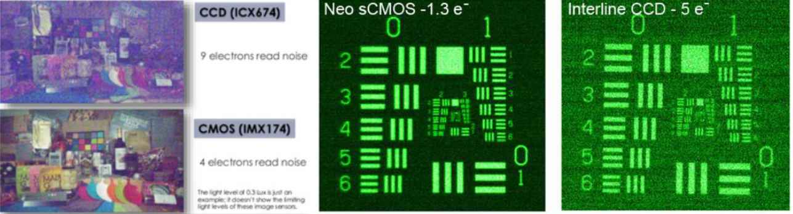{width="5.75in" height="1.5520833333333333in"}

光子散粒噪声(σS): Shot noise,
该噪声是与落于传感器像素上光子相关的统计噪声。在微观尺度下，光子流到达传感器的行为在时间和空间上都是不均匀的，就像统计高速公路上的车流，有时车流比较密集，过一会又变得稀疏。有时左边的车道密集，过一会右边的车道密集，整体上其统计规律符合泊松分布。光子散粒噪声是与被测信号的高低水平有关的，与传感器温度无关。

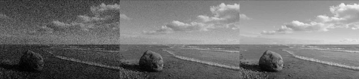{width="5.75in" height="1.2604166666666667in"}

光散粒噪声 （shot noise）

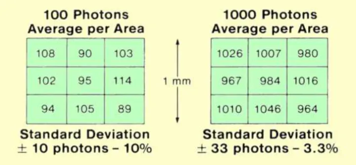{width="5.75in" height="2.6666666666666665in"}

固定模式噪声 (σF): Fixed-pattern noise（FPN）,
该噪声是由像素的空间不均匀性引起的，CMOS sensor
每个像素内都配置一个电荷电压放大器，每行、每列都有一些晶体管用于控制像素的复位和读出，这些器件的工作参数相对理论值的漂移就构成一种固定模式噪声。另外，坏像素、瑕疵像素也可以视为一种固定模式噪声。FPN效果大致上可以用下面的示意图模拟。

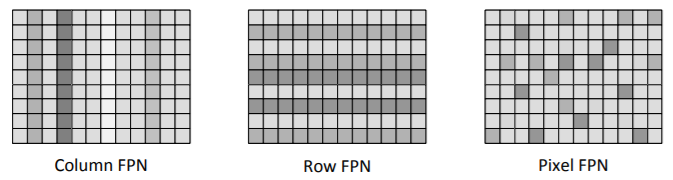{width="5.75in" height="1.53125in"}

下图是一个Pixel FPN的实际例子。

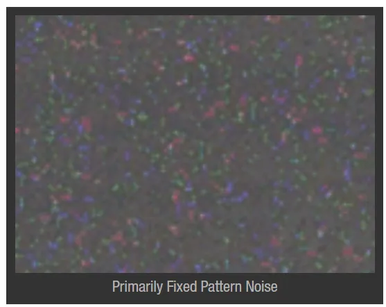{width="5.75in" height="4.5625in"}

在所有像素中，总会有一些像素相对平均值漂移较大，这些像素称为离群像素（outliers），如下图所示。离群像素的数量能够反映sensor品质的好坏。

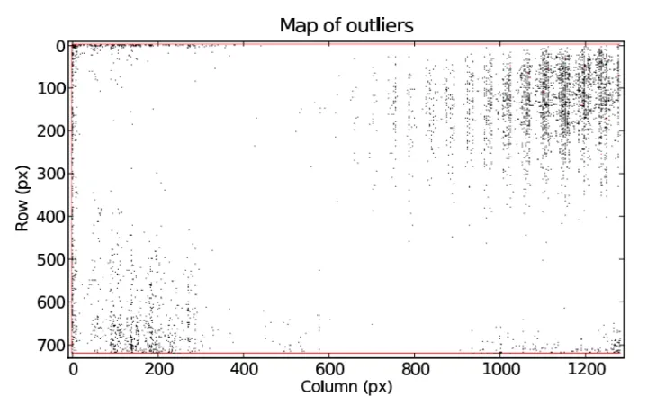{width="5.75in" height="3.59375in"}

下面两图所示的噪声在sensor中比较常见，并且有专用的名字叫做条带噪声（banding
noise），它的一种来源与像素参数和ADC参数的飘移有关，此时它是一种FPN噪声，但有时它是由外部电压不稳定造成的，此时它是一种随机噪声（Troubleshooting
Image Quality
Problems）。事实上，只有sensor厂家才有条件研究清楚这两种噪声来源的具体比例结构。

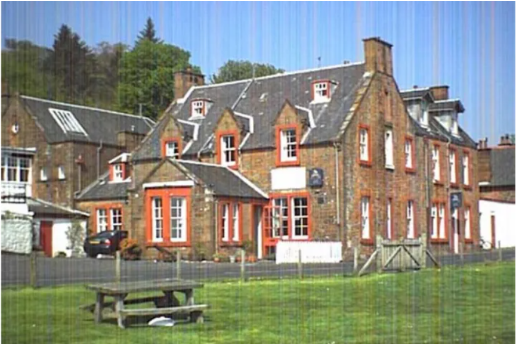{width="5.75in" height="3.8333333333333335in"}

{width="5.75in" height="4.239583333333333in"}

固定模式噪声是固定不变的，与信号高低水平和传感器温度无关，因此可以通过标定的方法减除，在计算噪声时可忽略该项。
复位噪声 (σr):
卷帘曝光方式需要在先对势阱复位，将势阱中自由积累的电荷全部释放，为后续的读出准备。但是由于暗电流的存在，每次复位后都会残留一些大小随机的噪声信号，即复位噪声，其大小与像素结构、芯片温度、PN结电容有关，因此也称为kTC噪声。
像素的复位是需要一定时间的。定量的研究表明，即使是采用较大的复位电流，一般也需要1ms以上的时间才能将电荷释放干净，如下图所示。

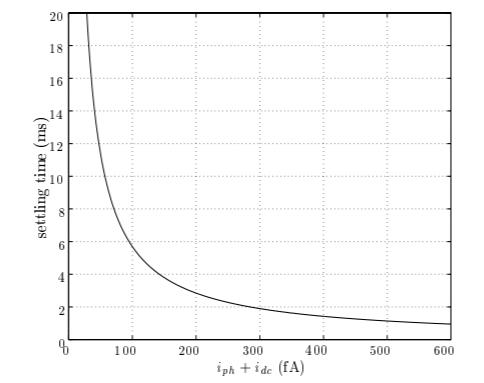{width="5.041666666666667in"
height="3.9895833333333335in"}

实际的复位控制信号通常会短于1ms，因此下一帧图像多多少少会残存一些上一帧图像的影子，这个残影叫做image
lag，也是噪声的一种形式。下图显示了有残影和无残影的图像对比。

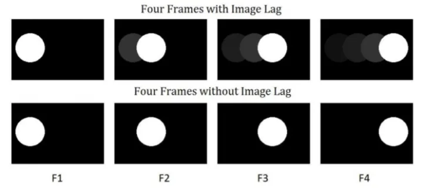{width="5.75in" height="2.5520833333333335in"}

1/f噪声 (σf): 1/f 噪声是一种低频噪声，在有些文献中也称flicker
noise（闪烁噪声） 或pink
noise（粉红噪声），它广泛存在于半导体器件中。在低频的时候1/f噪声一般显著高于电散粒噪声。
一种理论认为，半导体晶格中都会存在一些缺陷，这些缺陷能够捕获一些自由电子并将其束缚一段时间，这可以解释1/f噪声的一种来源。广义的1/f噪声是功率谱密度符合
1/（f\^β）公式的噪声形式，其中指数β 的取值范围在0.5\~2.0 之间。
研究发现，CMOS sensor 中的1/f
噪声功率谱密度与频率成反比，下图定性地表示了1/f
噪声的频谱特征以及与热噪声的关系。

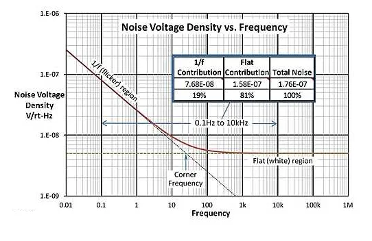{width="5.645833333333333in"
height="3.6666666666666665in"}

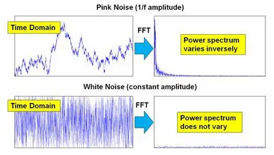{width="4.833333333333333in"
height="2.7395833333333335in"}

从上图中可以看到，"pink"与"white"这两种\"颜色\"的主要区别在于功率谱的分布。白噪声的功率在所有频段上是均匀分布的，而粉红噪声的功率主要集中在低频。
人们不仅在电子装置中观测到1/f噪声，在音乐、生物学乃至经济学中也观察到这种噪声1。关于1/f噪声的来源仍存在很大争议，几乎每届学术会议上都有人想来个"正本清源"，可惜N多年也没争出个一二三四来。每个试图解决问题的人都能提出某个模型，但是这个模型只能在一定条件下或者是一定范围内成立，不具有一般性。

光响应非均匀性 (σp): 英文为PRNU，Photo Response
Non-Uniformity。Bayer格式的sensor
通常存在四种像素(R,Gr,Gb,B)，这四种像素的光电转换特性（即增益特性）不可能是完全一样的，不同种像素间存在种间差异，同种像素之间也存在个体差异，如下图所示。

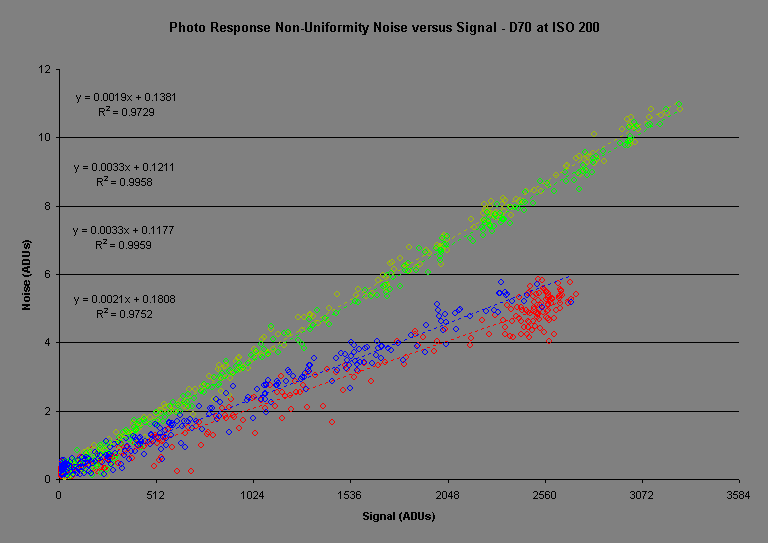{width="5.75in" height="4.0625in"}

PRNU通常占总噪声的1\~2%左右，很多时候是可以忽略的。从下图中可以看出当信号较大时光信号本身的散粒噪声远大于像素的非线性响应噪声。

某些科研级的sensor 的线性度指标已经达到了惊人的99.9%。

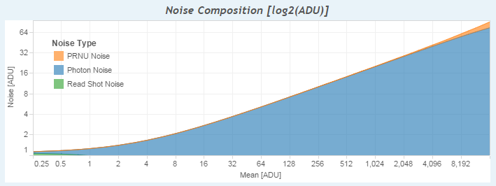{width="5.75in" height="2.15625in"}

串扰 :
英文为Crosstalk，在通信领域中指两条信号线之间由于屏蔽不良而发生了的信号耦合，一条线路上的信号通过线缆间存在的互感和互容馈送到了附近的信号线上，在模拟通信时代可能导致听到别人的通话。在sensor领域，串扰指的是入射到一个像素A的光信号没有在这个像素里被捕获，反而被其周围的像素B捕获，导致B产生了不该有的信号。
在下图例子中，粉色表示的是不透光的像素，不应该有任何输出，黄色表示正常像素，应该有输出。实际上，光子是可以在硅片中穿透一定的距离的，从而有机会进入到粉色像素的感光区，从而变成粉色像素的信号，这就是CMOS
sensor的串扰机制。

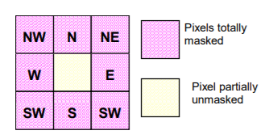{width="3.4270833333333335in"
height="1.7916666666666667in"}

下图显示了串扰的原理，黄色像素周围的多个像素都有可能捕获一些本属于黄色的光子，这也是一种噪声来源。

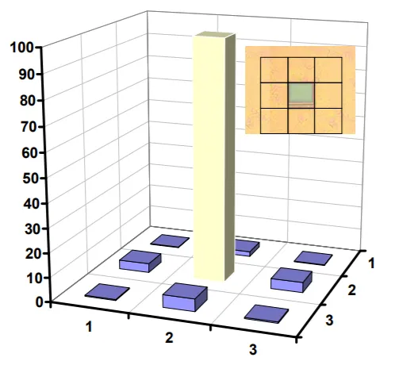{width="5.1875in" height="4.791666666666667in"}

从下图可以看出，波长越长，串扰越严重，某些像素位置串扰能量可以达到5%。

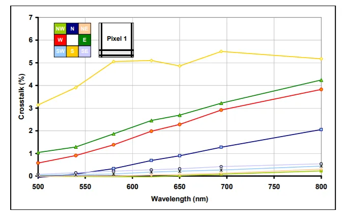{width="5.75in" height="3.53125in"}

三星公司研发了ISOCELL技术用于抑制串扰，该技术使用metal
grid制造电势屏障阻止电子进入相邻的像素，但是会引入一些新的问题，所以后来又发展出了ISOCELL
Plus技术，该技术是在ISOCELL的基础上改进了材料，避免了metal grid
引起的不良反应。

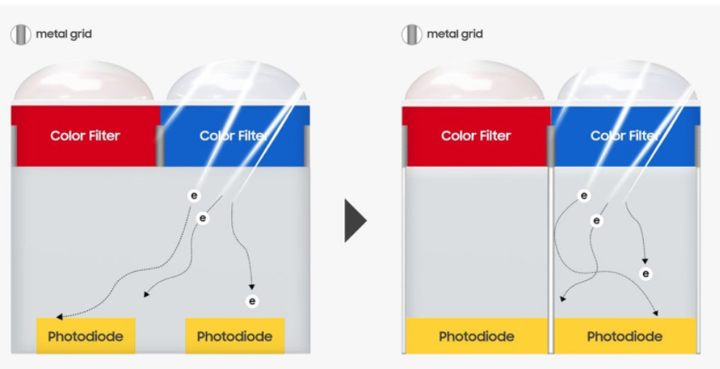{width="5.75in" height="2.9375in"}

索尼的HAD
CCD技术给像素设计了一个特别的盖子,可以防止像素内的光电子逃逸，同时也防止像素外的自由电子进入像素内部。

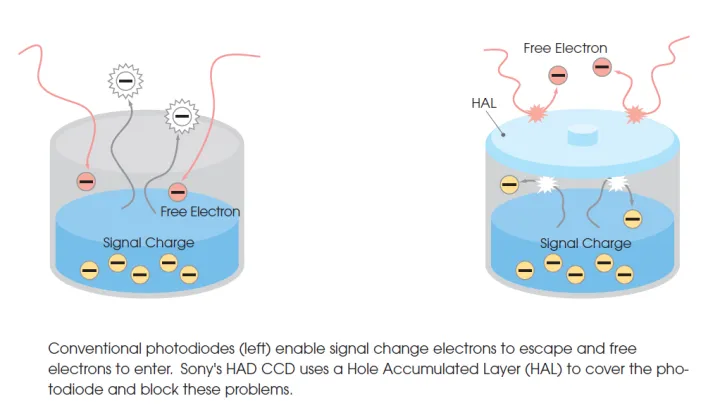{width="5.75in" height="3.25in"}

**噪声模型**

下图测量了sensor中4种像素的光响应特性，从图种可以看出4种噪声的表现机理。PRNU体现的是红、绿、蓝三种像素的增益差异。对于任一种像素，光信号越强像素值抖动越大，这体现了光信号本身的散粒噪声。光信号为零时，输出幅度最小的像素体现了半导体的暗散粒噪声，而
红、绿、蓝三种像素之间的差异体现了FPN噪声。

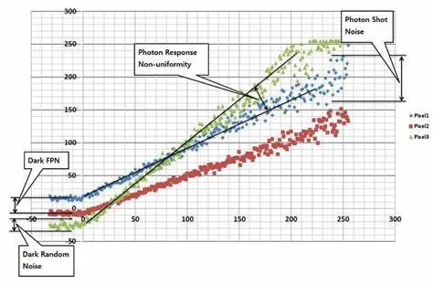{width="4.9375in" height="3.25in"}

尽管像素噪声有多种来源，但每种噪声的贡献程度并不是同等重要的。为了简化计算，实际上经常采用简化的噪声模型，只考虑光散粒噪声、暗散粒噪声、读出噪声、以及ADC器件的量化噪声，如下图所示。

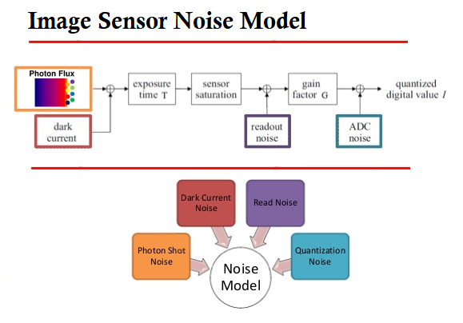{width="5.75in" height="4.010416666666667in"}

甚至可以进一步将量化噪声吸收到读出噪声中，于是每个像素的总有效噪声是下列所有噪声的总和：

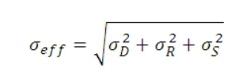{width="3.25in" height="1.0625in"}

由于暗散粒噪声和sensor工作温度有关，因此降低sensor温度有助于减少图像噪声。在科学、武器等应用中常会使用液氮给sensor制冷以提高图像信噪比。
很多装备了CCD/CMOS camera
的导弹会带一个盛液氮的杜瓦瓶，导弹开机后杜瓦瓶向sensor 吹冷气使sensor
保持在零下几十度低温工作。 下图所示的是某科学级sCMOS
sensor，通过气冷或者水冷的方式可以工作在-40\~-30度低温下，像素的噪声得到极大的改善。

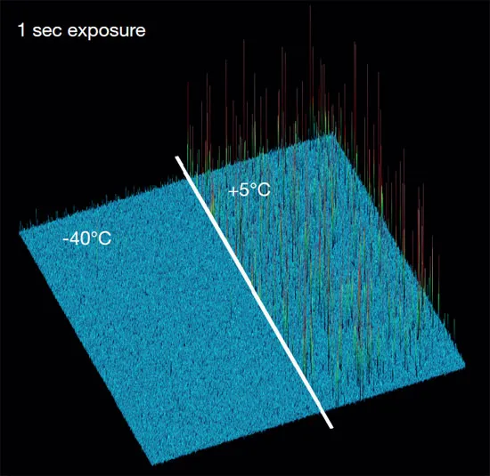{width="5.729166666666667in"
height="5.572916666666667in"}

Hot pixels 对比

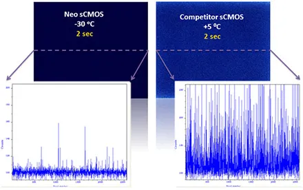{width="4.583333333333333in" height="2.875in"}

暗电流噪声对比
目前的CMOS工艺水平已经非常先进，对于科学水平的sensor，读出噪声的典型值通常小于10
e-，在极限条件下甚至已经可以做到1e-。下图给出了一些常见单反sensor和仪器sensor的读出噪声水平。

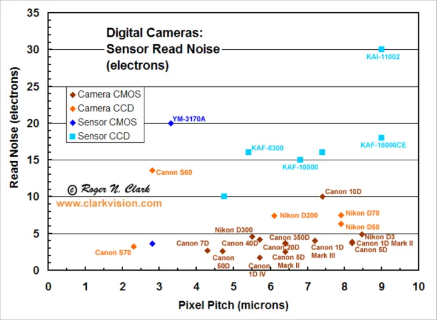{width="5.75in" height="4.208333333333333in"}

下面一篇文章专题讨论了降噪的算法，可以结合阅读。

[刘斯宁：Understanding ISP Pipeline - Noise
Reduction](https://zhuanlan.zhihu.com/p/102423615)

**信噪比 （SNR）**

信噪比是一个电子设备或者电子系统中信号与噪声的比例，如下图所示。这里面的信号指的是来自设备外部需要通过这台设备进行处理的电子信号，而噪声是指该设备自行产生的无规则信号，并且该种信号并不随外部输入信号的变化而变化。

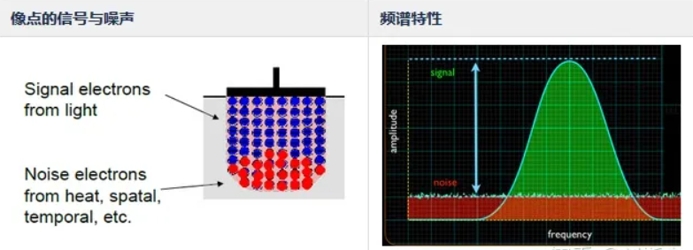{width="5.75in" height="2.0729166666666665in"}

在图像处理领域，信噪比是评价图像质量的主要依据。对于一个小信号总是可以通过增益的方式把它放大到适合观察处理的水平，但是信号中的噪声也必然会得到同样程度的放大，如果该信号的信噪比很低，单纯的放大操作并不增加任何有用的信息，无助于改善图像质量。

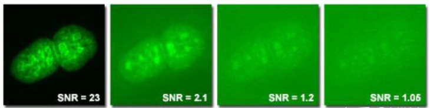{width="5.75in" height="1.4479166666666667in"}

下面分析sensor图像的信噪比。如前所述，设S为传感器上每个像素上入射光子通量为N光子/秒情况下产生的"信号"电子的数量，其中量子效率为QE，曝光时间为t秒，那么

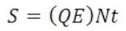{width="1.6145833333333333in"
height="0.40625in"}

通过S，可以将光子散粒噪声表示为：

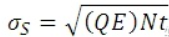{width="1.7604166666666667in"
height="0.3854166666666667in"}

信噪比（SNR）可以由下式进行估算：

{width="1.7708333333333333in"
height="0.9166666666666666in"}

前面已经提到.

举个具体的例子。如果我们假设有足够高的光子通量和量子效率，可以让一个像素在5秒曝光时间内积累的信号S高达10,000
e-，那么可以对光子散粒噪声进行估算，约为10,000的开平方值，即100
e-。读出噪声为10
e-（与曝光时间无关）。当曝光时间为5秒，传感器温度为25、0和-25
°C时，有效噪声为：

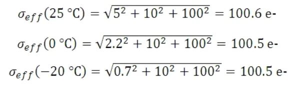{width="5.75in" height="1.6666666666666667in"}

图给出了sensor信号（光电子数S）与噪声(σeff)之间的关系和变化规律。

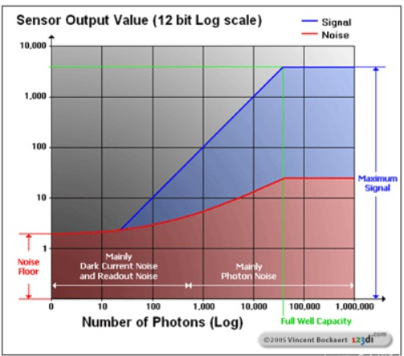{width="5.239583333333333in"
height="4.614583333333333in"}

从这张图上我们可以看到，传感器在光子数达到一个阈值后才开始有信号的（图上是在10与100个光子之间），也就是说如果传感器接受的光子数少于某个阈值，就不会有信号输出。这个阈值一般认为是读出噪声。在像素达到饱和前，光电子数随着入射光子数的增加而线性增加，而噪声随入射光子数增加按根号规律增加，噪声增加的速率低于信号增加的速率，因此总的信噪比不断增长。
当S很小时，SNR主要由σR决定，即sensor暗电流和读出噪声是主要来源。当S很大时，SNR主要由σS决定，即光信号本身的统计涨落是噪声的主要来源。如下图所示。

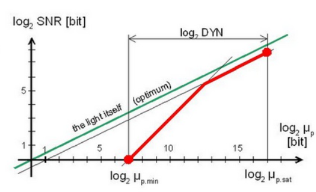{width="5.552083333333333in" height="3.375in"}

如前所述，光信号的统计噪声符合泊松分布，即
σS=sqrt(S)，考虑到光数与光电子存在正比关系，因此sensor的最大信噪比出现在势阱饱和的条件下，即
SNRmax = √N= 20log(√N)，其中N代表饱和阱容。 考虑前面提到的SONY sensor
的例子（截图如下），将饱和阱容（32316）带入上式可得
SNR=20log(√32316)=20log(179.766)=45.1

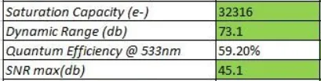{width="4.260416666666667in"
height="1.0833333333333333in"}

一般认为，SNR=10dB
是可接受（acceptable）的图像质量标准，该值意味着信号幅度是噪声的3.16倍。而SNR=40dB
是优秀（excellent）的图像质量标准，该值意味着信号幅度是噪声的100倍，因此至少需要10000e-饱和阱容。介于中间的是SNR=30dB，该值要求像素提供1000e-以上的饱和阱容，这刚好是很多手机sensor的指标范围。
下图是一些单反相机的典型SNR对比。

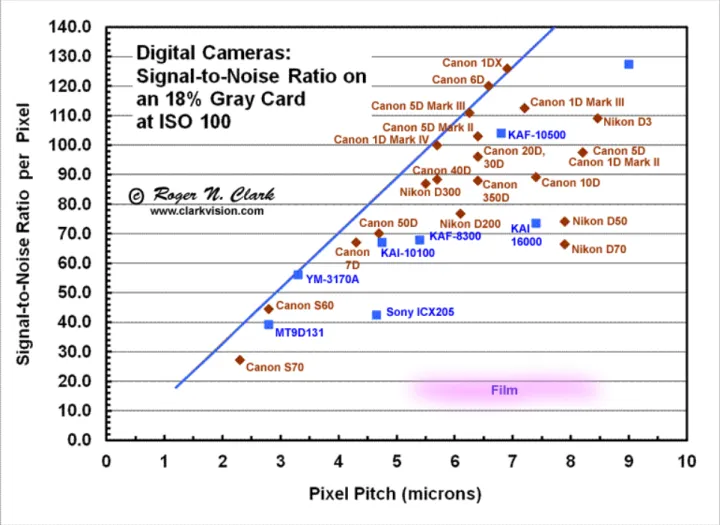{width="5.75in" height="4.1875in"}

下图是Canon 1D3
单反相机在不同ISO下的信噪比曲线，横坐标是曝光量，纵坐标是SNR，都是以\"stop\"为单位，即以2为底的log-log坐标。

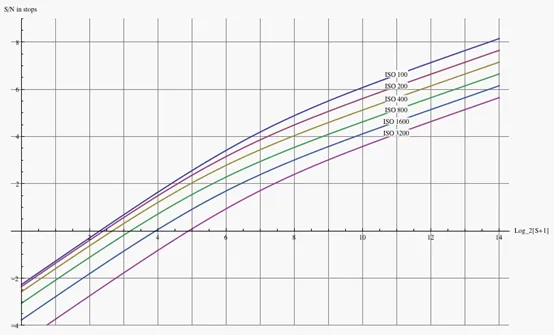{width="5.75in" height="3.46875in"}

在评估图像质量时，常用以下公式计算噪声和信噪比

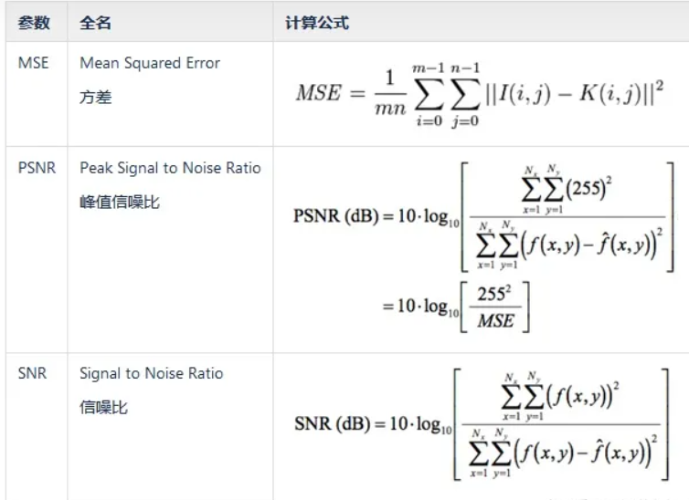{width="5.75in" height="4.177083333333333in"}

回顾前文中的公式 DN=g\*S(N, t)
可知，通过图像DN值和sensor增益系数g可以反推光子数S，而通过DN值和光子数S也可以反推sensor的增益系数g。

一个非常有用的问题是，图像上某个小区域的像素噪声与该区域的像素均值符合怎样的函数关系呢？我们可以进行这样的分析：
\*令s表示像素均值，S表示光信号绝对值，则s=S\*g；
\*令n表示像素噪声均值，N表示噪声绝对值，则n=N\*g；
\*假设该小区域是均匀的，理想上像素DN值应该完全一样，因此实际得到的起伏就是噪声引起的，以DN值计量的噪声单位是
n=sqrt(MSE)，或者MSE=n\^2； \*光信号本身的噪声符合泊松分布
N=sqrt(S)，所以有 n/g = sqrt(s/g)，或n=sqrt(s\*g);

所以能够得到的结论是：
图像中任一像素邻域内，图像噪声(DN值)与像素均值的平方根成正比，比例系数是sqrt(g)。

**动态范围**

（Dynamic Range）
一个信号系统的动态范围被定义成最大不失真电平和噪声电平的比值，在实际应用中经常用以10为底的对数来表示，单位是分贝。对于胶片和感光元件来说，动态范围表示图像中所包含的从"最暗"至"最亮"的取值范围。根据ISO15739的定义，"最亮"指的是能够使输出编码值达到特定"饱和值"的亮度；而"最暗"指的是图像信噪比下降至1.0时的亮度。
sensor
动态范围越大，所能表现的层次越丰富，所包含的色彩空间也越广。下图是用来测量sensor动态范围性能的常用方法。

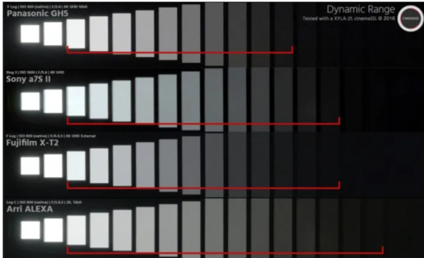{width="5.75in" height="3.4895833333333335in"}

前面已经提到，sensor是由数以百万个甚至更多像素组成的，这些像素在曝光过程中吸收光子转化成电荷。一旦这些像素容量达到饱和，多余的电荷便会溢出导致输出信号不再增加，此时像素的值不能反映光信号的真实强度，如下图所示。

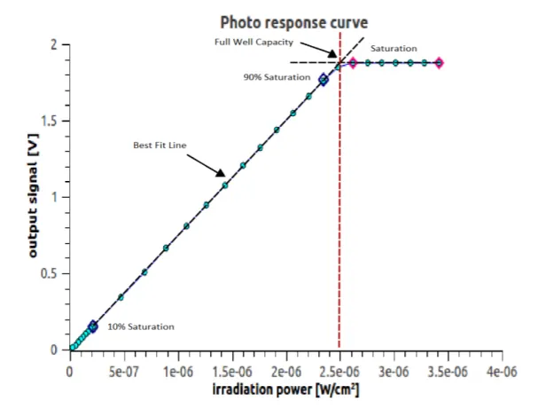{width="5.75in" height="4.364583333333333in"}

因此sensor能够输出的最大不失真信号就等于sensor像素的势阱容量，而sensor输出的最小值则取决于像素的背景噪声水平，一般起主导作用的是读出噪声。

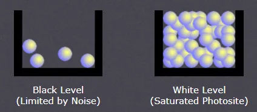{width="4.416666666666667in"
height="1.9270833333333333in"}

根据动态范围的定义，sensor动态范围的分贝表示用以下公式计算

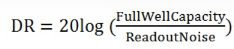{width="4.114583333333333in"
height="0.8645833333333334in"}

当读出噪声为一个电子时，sensor的动态范围即达到理论极限值

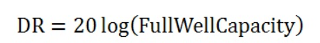{width="4.791666666666667in"
height="0.6458333333333334in"}

根据上面的公式可以简单计算出动态范围与FullWellCapacity之间的关系。

{width="2.96875in"
height="2.4791666666666665in"}

显然，目前较好的工艺水平（SONY）可以做到每个像素容纳10000\~30000个电子，可以提供80\~90dB的极限动态范围，但是更多就不合理也不经济了，因为更大的势阱容量需要更大的像素面积，而像素大到一定程度之后就会遇到成品率瓶颈，下面有专题说明，因此超过80dB的动态范围往往需要依赖其它技术实现。
下图列举了一些典型单反相机sensor的动态范围指标，纵坐标可以理解为AD转换器的位数。例如12位ADC能够表示的动态范围是2\^12=4096，而14位ADC能够表示2\^14=16384，以此类推。

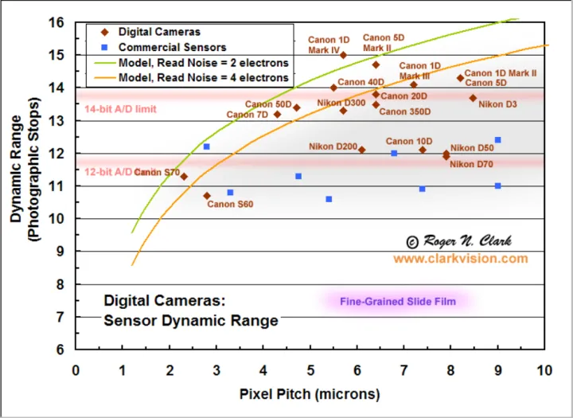{width="5.75in" height="4.1875in"}

P.S.
ADC位数的选择必须是和sensor的动态范围相适配的，ADC位数高于sensor是没有任何意义的性能浪费，低于sensor则不能完全发挥出sensor的性能优势，也是一种性能浪费。从图中可以看到，单反相机的主流是采用14位ADC，更高端的则采用16位ADC。
白天的天空可以看作是一个非常明亮的光源，如果sensor动态范围不足，拍摄天空时就很容易出现过曝，蓝天变浅，白云失去层次感，甚至完全变白。

{width="5.75in" height="3.0625in"}

下图列举了一些典型场景的动态范围。

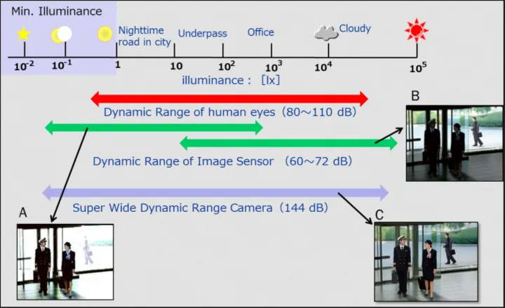{width="5.75in" height="3.5in"}

在日常生活中会经常遇到动态范围\>100dB的场景，一个sensor如果具备120dB的动态范围即可满足绝大部分场景的拍摄需求。普通人眼可轻易应对80\~100dB的场景，然而普通的CMOS
sensor
却只能提供50\~70dB的动态范围，更高的动态范围一般需要通过多帧合成的办法实现。

在摄影领域经常使用"f-stop"术语描述镜头的通光量，这里stop指曝光档位，镜头光圈旋转到一个f-stop档位的时候会自动锁定，伴随一个轻微的"咔嚓"声。档位的设定依据是非常明确的，即相邻两档的通光量是2倍关系，因此镜头的通光量是按照2的指数倍规律变化的。
在摄影领域经常使用"light stop"术语描述场景的动态范围。

举例来说，如果室内最暗处照度是1lux，而室外最亮处照度是3万lux，则场景动态范围是30000（90dB），需要15个light
stop。 当一幅画面同中时存在亮部和暗部的时候，往往就是考验sensor
动态范围性能的时候了。动态范围小的sensor
无法同时兼顾亮部和暗部，通常只能牺牲一个保证另一个，或者两者都做出一定的牺牲（下图左）。如果希望暗部和两部能够同时得到较好的还原，则只能使用宽动态性能更好的sensor（下图右）。

{width="5.75in" height="2.0520833333333335in"}

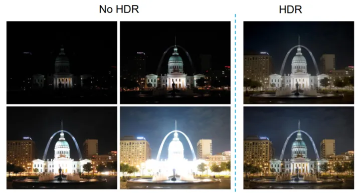{width="5.75in" height="3.0729166666666665in"}

ND滤镜

使用高动态范围的sensor是拍摄高动态场景的主要手段。另一方面，人们也可以使用光学滤镜来调节输入信号的能量分布，从而压缩输入信号的动态范围。在拍摄天际线场景时，由于天空的亮度高，且分界明显，所以可以使用渐变式中性滤镜（Neutral
Density Gradient Filter）抑制天空区域的亮度，改善成像效果。

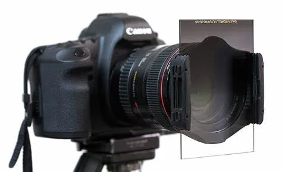{width="4.9375in"
height="3.0104166666666665in"}

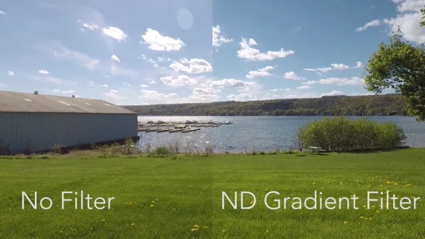{width="5.75in" height="3.2291666666666665in"}

**灵敏度 （Sensitivity）**

CMOS sensor
对入射光功率的响应能力用灵敏度参数衡量，常用的定义是在1μm2单位像素面积上，标准曝光条件下(1Lux照度，F5.6光圈)，在1s时间内积累的光子数能激励出多少mV的输出电压。
在量子效率一定的情况下，sensor
的灵敏度主要取决于电荷/电压转换系数(Charge/Voltage Factor,
CVF)。在下图的例子中，CVF
=220uV/e，这意味着阱容2000e的像素能够激励出最大440mV的电压信号。

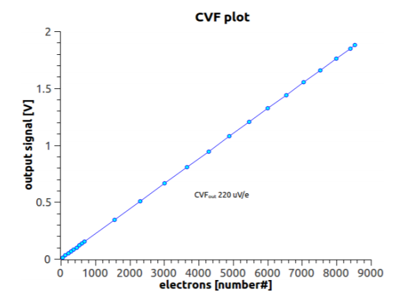{width="5.75in" height="4.28125in"}

在曝光、增益相同的条件下，灵敏度高的sensor信噪比更高，这意味着至少在两个方面可以获得比较优势，
在图像噪声水平接近的情况下，灵敏度高的sensor图像亮度更高、细节更丰富
在图像整体亮度接近的情况下，灵敏度高的sensor噪声水平更低，图像画质更细腻
EMVA 1288 定义了评价camera
灵敏度的标准，即多少个光子可以引起camera像素值变化1，即一个DN。根据量子力学的公式，

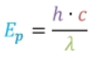{width="1.1458333333333333in"
height="0.6770833333333334in"}

1个波长为540 nm的绿光光子携带的能量是

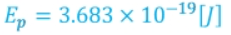{width="2.40625in"
height="0.3645833333333333in"}

Camera 技术手册中会给出像素灵敏度规格，

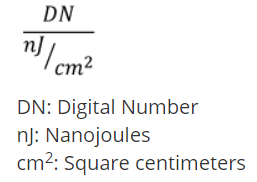{width="2.6770833333333335in"
height="1.8958333333333333in"}

根据此规格即可计算像素值变化1需要多少个光子。下面的链接给出了一个具体的例子。
\[[[像素值变化1需要多少个光子的具体实例]{.underline}](https://link.zhihu.com/?target=https%3A//www.lumenera.com/blog/understanding-camera-sensitivity-a-look-at-the-numbers)\]下图给出了普通灵敏度和高灵敏度sensor在噪声、亮度方面的效果对比。

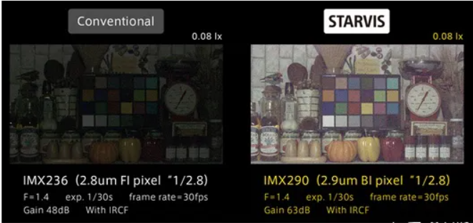{width="5.75in" height="2.7083333333333335in"}

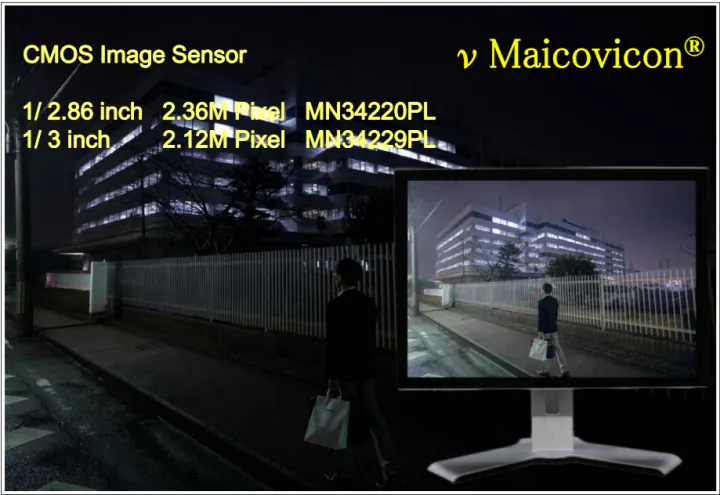{width="5.75in" height="3.9479166666666665in"}

松下高灵敏度传感器

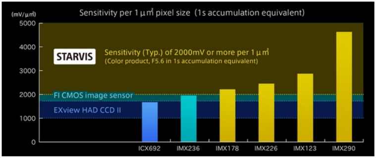{width="5.75in" height="2.4166666666666665in"}

**填充系数 （Fill factor）**

一个像素不管实际面积多少，用于控制和读出的三极管和电路连线所占的面积是必须首先保证的，余下的面积才能用于制造感光PN结。假设一个像素小到只能勉强容纳几个必须的三极管，则填充系数降为零，这个像素就失去了意义。反之，像素面积越大，三极管和电路所占面积的比例就越小，像素的填充系数就越高，像素的成像质量也会越好。
下图是一个像素版图的例子，这是一个采用PPD结构设计的像素，尽管面积很大，但实际也只取得了60%的填充系数。

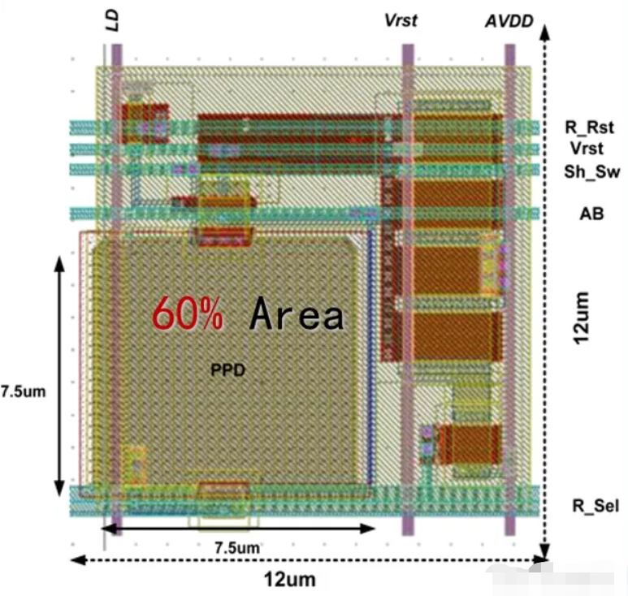{width="5.75in" height="5.458333333333333in"}

为了大幅度地提高填充系数，人们不得不费心费力地在每个像素上方制造一个微透镜，将较大范围内的入射光会聚到较小的感光面上，这样可以将光能利用率提高到90%以上，也就是通过微透镜提高了等效填充系数，如下图所示。

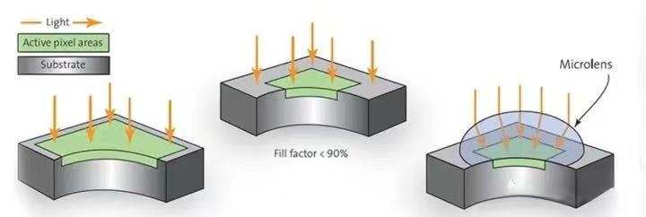{width="5.75in" height="1.9270833333333333in"}

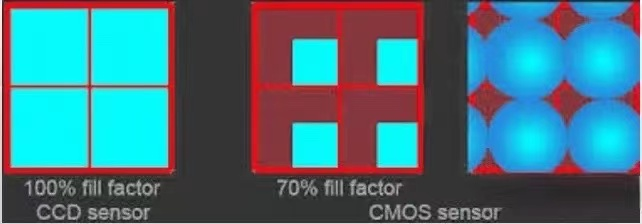{width="5.75in" height="2.0in"}

其中最右边的图片是带有microlens情况下的填充系数。

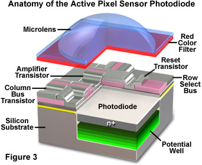{width="3.5625in"
height="2.9166666666666665in"}

**像素尺寸（pixel pitch）**

最小的像素通常是出现在手机sensor上，典型尺寸1.1um，这差不多已经到了实用的极限了，安防和机器视觉sensor常用2.2um\~4.2um大小的像素，而单反和广播级的sensor则倾向于用更大尺寸的像素。
关于像素尺寸有两个非常经典的问题，假设你有两个桶，一大一小，那么

{width="2.875in" height="2.0in"}

如果外边雨下的特别大，哪个桶先盛满水？ OK，很显然是小的桶先满。
如果外边的雨是一滴一滴地偶尔掉下来，哪个桶更容易接到水？
OK，很显然是大的那个。
其实像素也是一样的道理，大的像素通常可以容纳更多的电子，因此可以表示更大的信号变化范围，这个指标称为sensor的动态范围，是一个特别重要的参数。在极低照度下，大的像素更容易捕获到少量的光子，也就是低照度性能会更好。所以，如果不考虑面积和成本，在相同的工艺下，一般的原则是像素面积越大成像质量就越好。

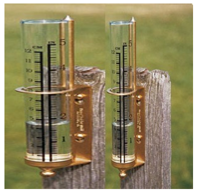{width="4.145833333333333in"
height="4.020833333333333in"}

在曝光时间很短的条件下，大像素的噪声水平会明显优于小像素。

下图对比了大小像素的实际噪声表现，可以看到在曝光时间很短的条件下，大像素的噪声水平会明显优于小像素。

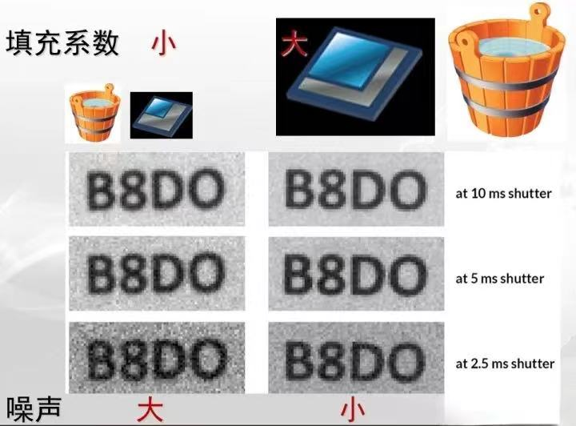{width="5.75in" height="4.239583333333333in"}

一个sensor
的尺寸大小主要取决于感光阵列和处理电路所占的面积，而感光阵列的面积等于像素尺寸和像素数量的乘积。sensor
的像素数量有专用的术语叫做分辨率（resolution），可以用总数量描述，如2MP，3MP等（MP=MegaPixel，百万像素），或者写成宽乘以高的形式，如1920x1080，2048x1536
等。sensor 的大小也有专用的术语叫做光学格式（optical format），用sensor
封装后的对角线长度衡量，注意并不是sensor
光敏阵列的对角线长度。光学格式在技术发展的过程中已经完全标准化，形成了一系列固定的尺寸，方便与任何厂家生产的标准规格镜头进行适配。

在进行像素密度计算时，设计人员需要准确地知道所选sensor
光敏阵列的尺寸，这个数据可以根据sensor
分辨率和像素尺寸计算得到，也可以快速地查表得到。下表给出了一些常见光学格式的光敏阵列尺寸。

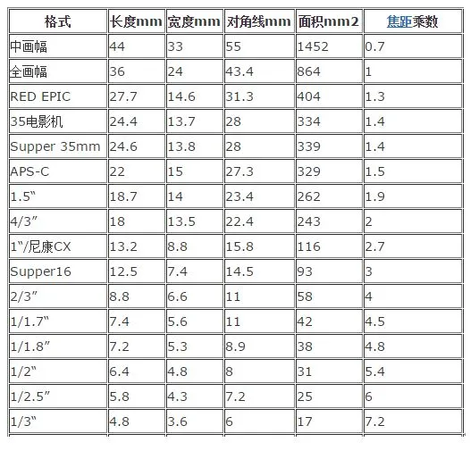{width="5.479166666666667in"
height="5.354166666666667in"}

注意用sensor 封装后的对角线长度一定大于sensor
光敏阵列的对角线长度。比如标称的1/2\" 格式，指的是sensor
封装后对角线长12.7mm，而实际的光敏阵列则为6.4mm\*4.8mm，对角线长8mm。这个定义方式源于最初的电视技术采用的阴极射线摄像管，如下图所示。考虑到元件替换是最为普遍的需求，普通用户只需要关注这种摄像管的外径尺寸，而并不关心其内部成像面的具体尺寸。

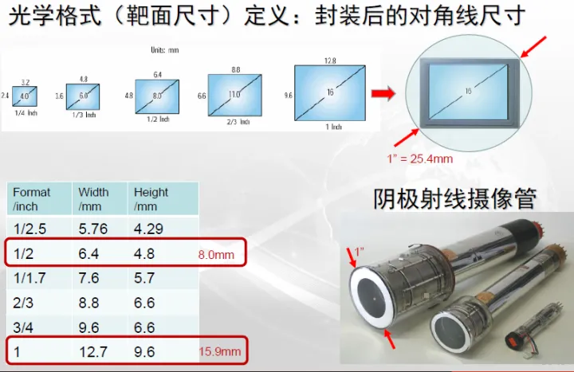{width="5.75in" height="3.7291666666666665in"}

**成品率（yield）**

单纯从信噪比的角度考虑，像素的尺寸显然是越大越好。但是为什么手机sensor都是越做越小呢？这主要有两方面的原因，最终都能归结到成本问题。一个很容易理解的原因是，在芯片总面积一定的情况下，单个像素面积越大，芯片的总像素数就会越少，即sensor的分辨率就越低，这与人类追求高像素、高清晰度的目标是不符的。因此手机sensor的发展思路一直是依靠技术进步不断提高像素灵敏度同时缩减像素面积，在保证成像效果基本不损失的前提下，通过提高成品率来降低单个sensor的成本，扩大总收益。

那么是否可以把芯片总面积扩大，既用大像素，也提供高像素数呢？在一定程度上是可以的，事实上单反、广播、武器、科研级的sensor就是这样做的，代价就是一片wafer（硅片）只能制造几十个sensor，单个sensor
的成本是相当感人的。

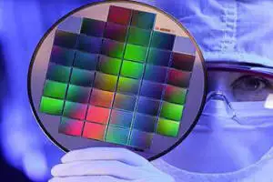{width="3.125in" height="2.0833333333333335in"}

当然了，如果是用在天文望远镜这种不计成本的场合上，也有人会用一整片wafer制造一个超大的sensor，比如下面这货，是佳能在一个12英寸（直径300mm）wafer
上制造的单个CMOS sensor，面积 202×205mm2, 1600万像素,
帧率100fps，采用0.25μm工艺。

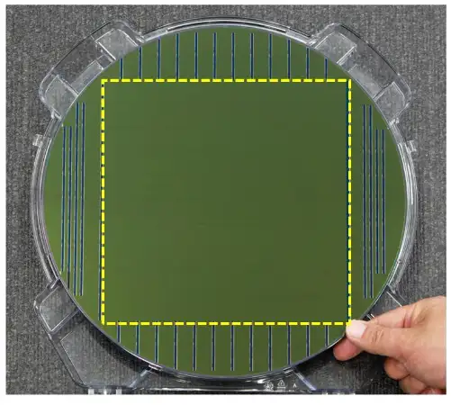{width="5.21875in" height="4.6875in"}

使用这个巨型sensor可以在10\~20ms内拍摄一幅高质量的天文图像，而普通的单反拍摄同样质量的图像通常需要使用慢快门拍摄几分钟甚至更久的时间。

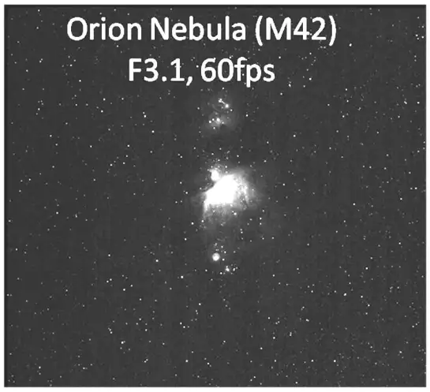{width="5.677083333333333in"
height="5.177083333333333in"}

但是对于手机sensor这种消费市场，拍摄夜景并不是频繁和主要的需求，相反成本是最重要的考虑，所以sensor厂家会希望一片wafer能够产出2000个以上sensor。

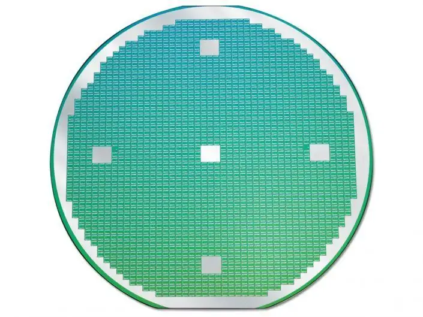{width="5.75in" height="4.3125in"}

一片wafer能制造出多少个sensor是在设计期就确定了的，但是实际有多少sensor
能正常工作则还有一些运气成分，因为每个wafer都或多或少有些瑕疵（defect），光刻过程也可能会引入瑕疵（如下图），导致电路无法工作。

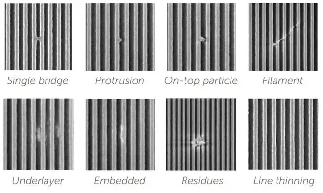{width="5.75in" height="3.4375in"}

一个sensor
如果刚好位于瑕疵位置就会变成废品，只有一切顺利没出任何意外才能变成成品。所以wafer的成品率是决定sensor成本的关键因素。对于上面提到的天文望远镜sensor，只要wafer上有一处关键瑕疵位于sensor
面积上，这个wafer的成品率就等于零。如果这片wafer制造的是2000个手机sensor，则损失一个sensor
问题也不很严重。下图说明了成品率和sensor尺寸的关系。

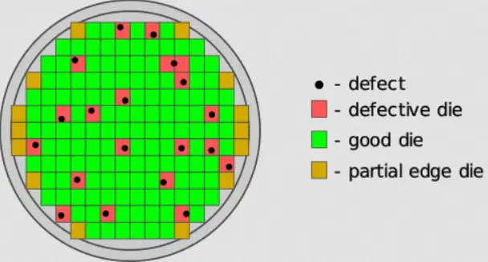{width="5.75in" height="3.0729166666666665in"}

显然sensor面积越大遇到瑕疵的概率也就越大，从数学上看，sensor遇到瑕疵（变成废品）概率与像素尺寸(pixel
pitch)是平方关系而不是线性关系。假设wafer上的瑕疵是均匀分布的，当sensor面积大到一定程度的时候，就会出现无论如何也无法避开瑕疵的尴尬境地。

**前照式工艺（FSI）**

传统CMOS sensor 工艺又称为FSI（Front Side
Illumination）工艺，与传统的半导体工艺一样，它首先装夹固定好一片wafer（硅片），从wafer的一侧开始制造光敏PN结以及控制和读出电荷所需的晶体管，然后制造连接晶体管所需的金属线路（铝或铜），接下来制造Bayer滤光膜和微透镜。在整个制造过程中wafer只装夹固定一次，直到制造完成，最后的wafer大概就是下图所示的样子。

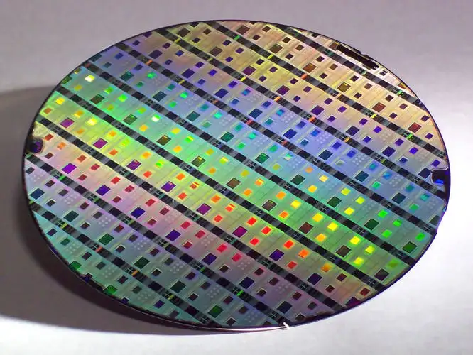{width="5.75in" height="4.3125in"}

接下来就是测试、切割、封装等步骤。wafer上的sensor
晶片叫做die，需要先用自动化测试机台进行探针测试（Probe），未能通过探针测试的die会被系统记住位置（如下图），切下后将直接丢弃，避免进入封装环节，因为封装成本可能会占sensor总成本的1/3。

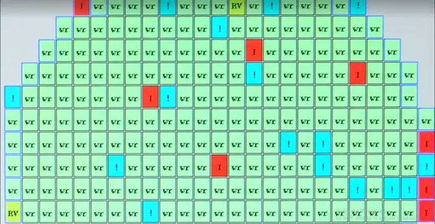{width="5.75in" height="2.9583333333333335in"}

封装就是将晶片固定在塑料或金属外壳内部，形成最终产品的过程，与其它半导体芯片的封装过程基本是一样的。

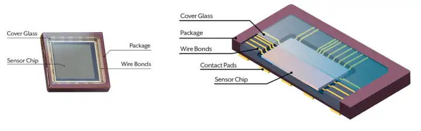{width="5.75in" height="1.78125in"}

如果一切顺利，封装好的sensor 大概就是下图所示的这个样子。

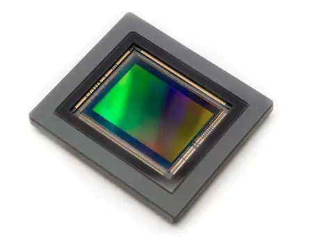{width="4.791666666666667in"
height="3.5416666666666665in"}

或者像这个样子。

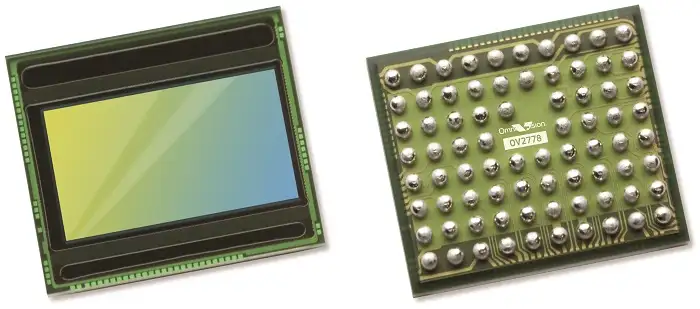{width="5.75in" height="2.53125in"}

根据sensor尺寸的不同，一个12英寸（直径300mm）的wafer粗略可以切出100\~2000个sensor，但是能否收回制造成本还取决于成品率（yield），正常情况下厂家会期望成品率大于90%，如果很不幸有一半sensor
是废品则厂家大概率会血本无归。

言归正传，在FSI工艺下，光线需要穿越多层电路结构才能抵达硅感光区，如下图所示。

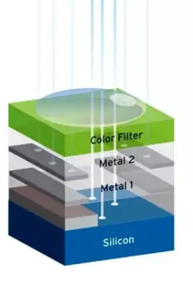{width="2.8333333333333335in"
height="4.1875in"}

传统FSI工艺的一个主要不足之处在于光敏PN结与滤光膜和微透镜之间需要制造若干层电路结构，由于电路高度问题会限制PN结可收集光线的面积和角度，同时光线在前进过程中会与电路结构发生吸收、散射，所以会增加光能的损耗，如下图所示。

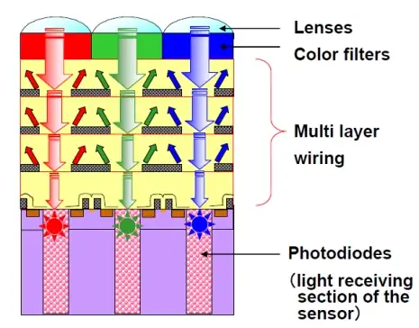{width="4.84375in"
height="3.7916666666666665in"}

下图是FSI像素在电子显微镜下的照片。

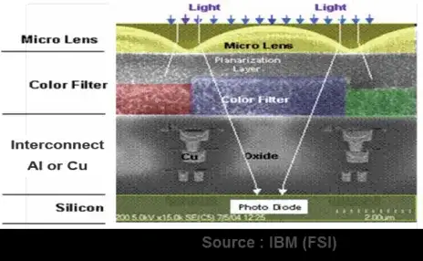{width="4.833333333333333in"
height="2.9791666666666665in"}

**主光线角（CRA）**

主光线角（Chief Ray Angle, CRA)是衡量sensor
收集入射光能量的一个主要参考指标。尤其是对于经典的FSI工艺，由于多个金属布线层的存在导致CRA
不太容易提高。如下图所示，使用铜线可以在一定程度上改善CRA
但也会提高sensor 成本。

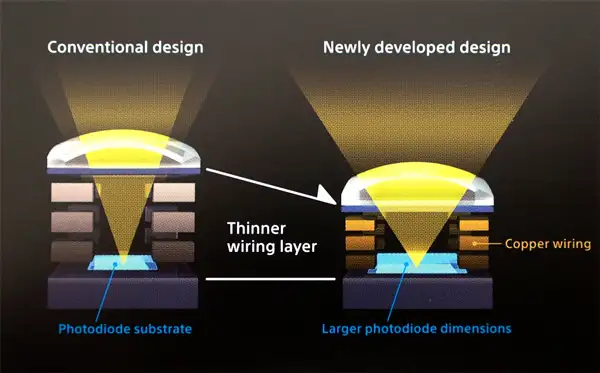{width="5.75in" height="3.5729166666666665in"}

CRA 经常是限制sensor 性能的一个重要因素，而下面将要介绍的BSI
工艺则可以显著改善CRA，使之不再成为一个主要问题。

**背照式工艺 （BSI）**

随着半导体工艺的进步，人们发现其实可以将wafer打磨得非常薄，让光线穿透wafer，从背面入射到感光PN结，这个想法无论在技术上还是成本上都已经变得可行，于是就产生了背照式工艺（Back
Side Illumination,
BSI）。BSI工艺的主要特点（也是难点）是生产过程中需要两次固定装夹，一次在wafer背面制造滤光膜和微透镜，一次在wafer正面制造感光PN结和电路结构。两次装夹定位的重复精度要求极高，才能保证光线能够通过背面的微透镜精准聚焦到PN结上。

下图是BSI工艺的典型流程，中间一个非常关键的步骤就是\"flip wafer\"。

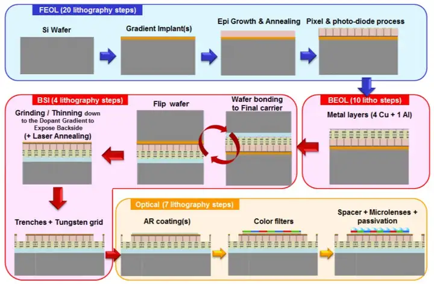{width="5.75in" height="3.7604166666666665in"}

下图是BSI像素的微观结构照片。

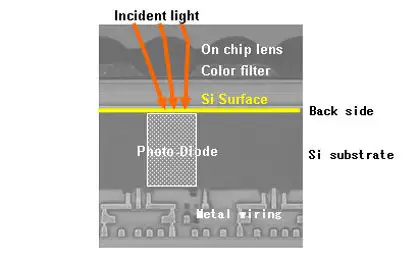{width="4.364583333333333in"
height="2.7083333333333335in"}

下图是FSI工艺和BSI工艺的原理对比。

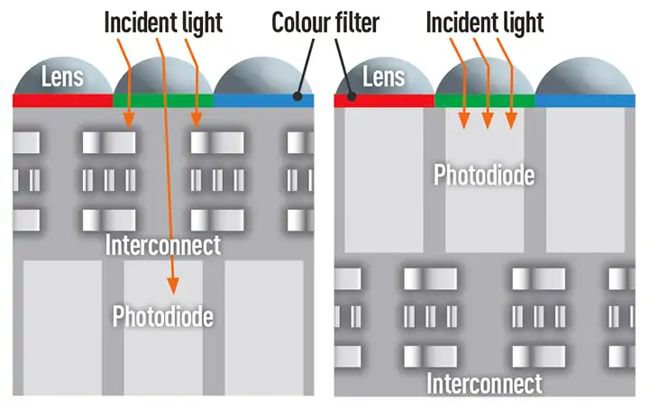{width="5.75in" height="3.6041666666666665in"}

下图是OmniVision BSI工艺流程和简介。

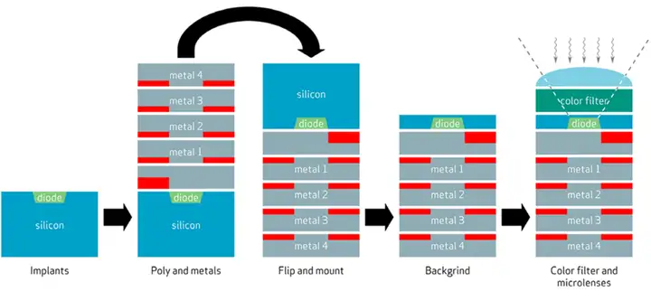{width="5.75in" height="2.65625in"}

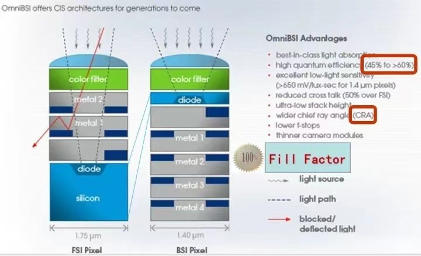{width="5.75in" height="3.4895833333333335in"}

OmniVision BSI (Back Side Illuminated) 工艺

FSI 与 BSI 工艺效果对比 @ ISO6400

左侧：Sony 20mp RX100 CMOS Sensor

右侧：Sony 20mp RX100 II BSI CMOS Sensor

{width="5.75in" height="2.125in"}

下图是另一个FSI工艺与BSI工艺效果对比的例子。

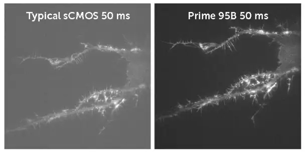{width="5.75in" height="2.8645833333333335in"}

**其它进展**

Sony 于2007年推出第一代Exmor系列CMOS
图像传感器。与传统CIS技术相比，Exmor
的主要特点是为每列像素配置了专用ADC和额外的CDS。由于ADC单元与像素的物理距离更近，并且由于大规模并行化可以降低单个器件的工作频率，所以极大地改善了sensor的噪声特性。而新增的CDS又进一步抑制数字噪声。

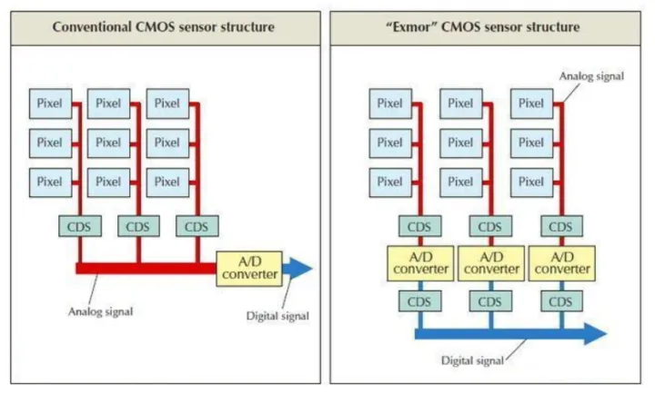{width="5.75in" height="3.4583333333333335in"}

随着制造技术的进一步演进，在背照式工艺的基础上又发展出了堆栈式（Stacked）工艺。顾名思义，堆栈式工艺把两片或者更多片硅片上下堆叠在一起，最上层硅片全部用于制造像素的感光区，而sensor
控制所需的模拟、数字逻辑全部移到下层硅片，所以感光区占sensor靶面尺寸的比例可以接近100%，终于达到了sensor
效率的巅峰。

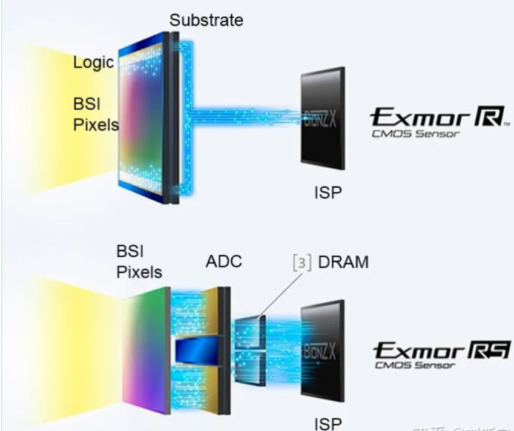{width="5.75in" height="4.8125in"}

Sony Exmor RS BSI 堆栈式工艺

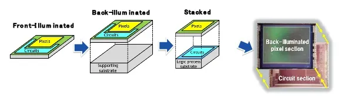{width="5.75in" height="1.71875in"}

实际上，CMOS sensor 也可以设计称支持global shutter曝光方式。与CCD
类似，global shutter
的实现原理是每个曝光像素都伴随一个存储电容，感光阵列上所有像素同时曝光，然后光电子立即被转移到存储电容上并锁定，等待读出电路读出。下图是一种较新的global
shutter 像素设计，该设计支持两种不同的增益系数，因此支持HDR功能。

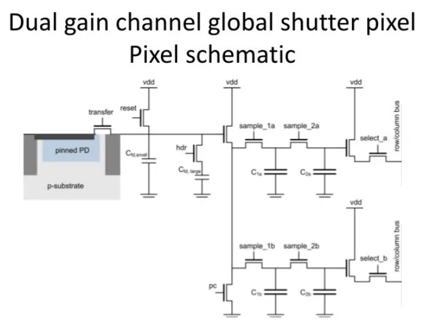{width="5.75in" height="4.4375in"}

下图展示了SONY 最新BSI stacked 工艺制造的global shutter CMOS sensor
像素原理。

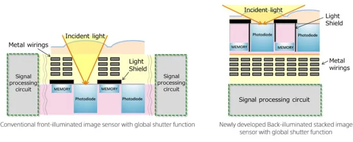{width="5.75in" height="2.3229166666666665in"}

该sensor使用上下两层硅片，通过一定的机制绑定成3D结构。下图是SONY发布的实物照片。

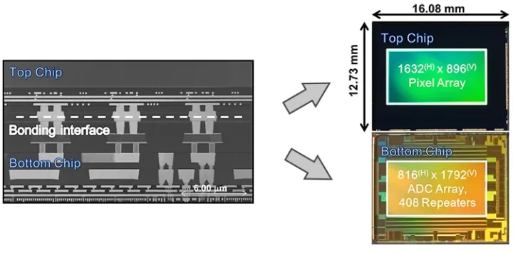{width="5.75in" height="2.8333333333333335in"}

**Sensor for AI**

另外，近些年的发展趋势是在sensor 上集成内存和AI 运算单元，使sensor
本身就能够完成一些高级图像处理算法，实现sensor 的智能化。

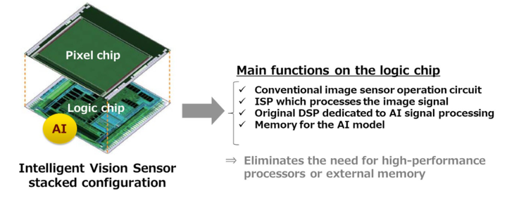{width="5.75in" height="2.3020833333333335in"}

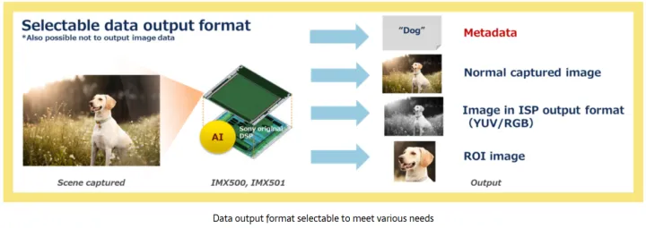{width="5.75in" height="2.03125in"}

智能化的sensor可以用于制造端侧AI
Camera，通过计算前移减轻云端的计算压力，减轻网络传输的带宽压力，减少系统延迟，有利于智能系统的大规模部署。这个市场称为端侧AI市场或Edge
AI。

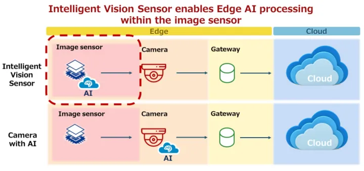{width="5.75in" height="2.6979166666666665in"}

**ToF sensor ToF**

即 Time-of-flight，ToF sensor
主动向视场前方打出一组激光，然后追踪反射光被sensor捕获的时间，通过时间差计算前方障碍物的距离，从而形成深度图（depth
image）。深度图的每个像素值代表目标距离camera的距离。为了形象地呈现深度信息，人们一般用红色代表近的距离，蓝色代表远的距离。

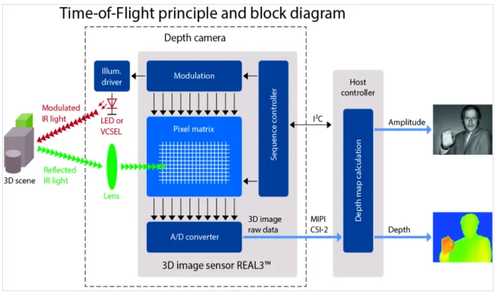{width="5.75in" height="3.40625in"}

ToF 相机原理

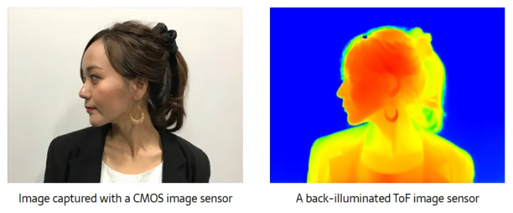{width="5.75in" height="2.3958333333333335in"}

可见光sensor图像与To
Fsensor的深度图可以用一定的算法融合成3D图像，实现3D建模功能。

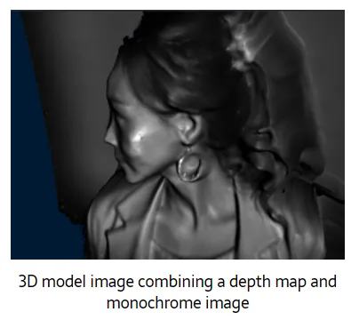{width="4.114583333333333in" height="3.75in"}

**Sensor fusion**

车载是仅次于手机、安防的第三大sensor应用市场。车载应用的主要挑战是包括强光、高动态、雨雪雾等环境因素会对
sensor 成像造成严重干扰，目前单靠CMOS
sensor本身的性能提升还不能很好地解决这些问题，所以人们在探索将可见光sensor、毫米波雷达、激光雷达等成像技术结合在一起，形成更为可靠的车载解决方案，保证在各种气象条件下都能稳定地检测出画面中的目标。索尼将此技术称为sensor
fusion。

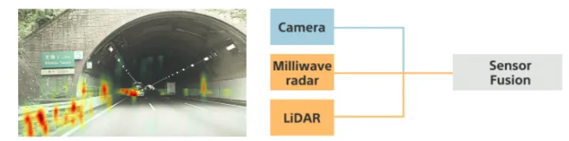{width="5.75in" height="1.4270833333333333in"}

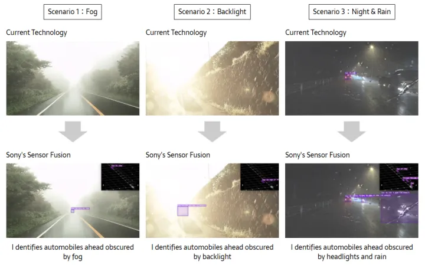{width="5.75in" height="3.5833333333333335in"}

**Foveon sensor**

研究发现，不同波长的光在硅材料中能够穿透的深度是不同的，下表是关于穿深的统计。

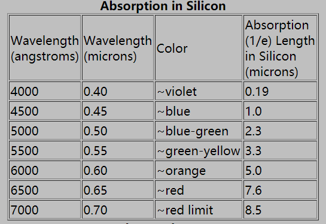{width="5.677083333333333in"
height="3.8958333333333335in"}

Foveon
公司开发了一款可以在一个像素上捕捉全部色彩的图像传感器，型号为Foveon
X3。与传统的Bayer阵列原理不同，Foveon
利用了蓝光穿透距离小，红光穿透距离大的原理，采用三层感光元件堆叠布局，每层记录一个颜色通道。

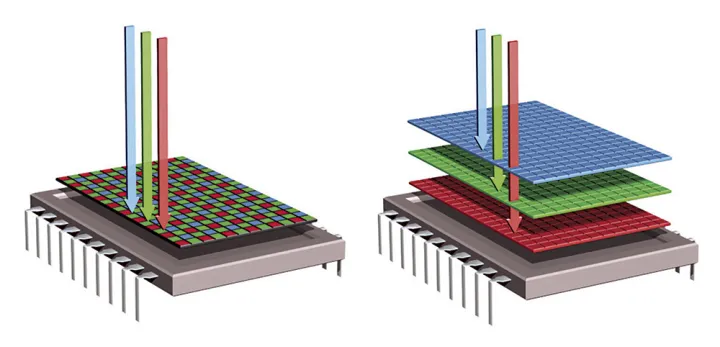{width="5.75in" height="2.7708333333333335in"}

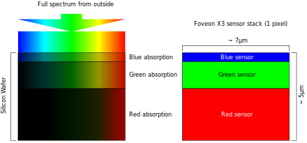{width="4.583333333333333in"
height="2.1354166666666665in"}

**宽动态（WDR）**

宽动态即Wide Dynamic Range，与之等价的一个术语是高动态即High Dynamic
Range
(HDR)。单从语法的角度看，WDR比HDR在语法上更严谨一些，因为形容一个范围可以说"宽窄"但很少说\"高矮\"，除此之外其实并无技术层面的区别。
从另一个角度看，当用水平的图表比较动态范围时，用WDR术语是最恰当的，如下图。

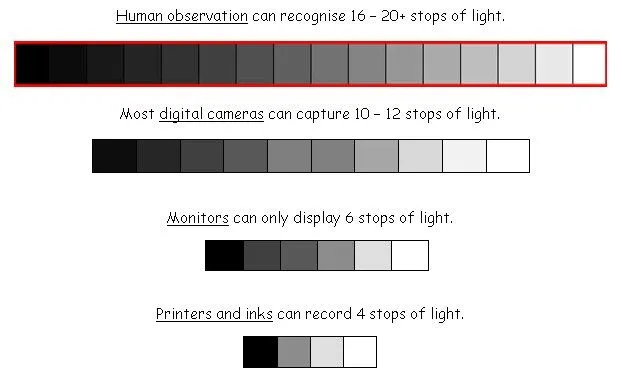{width="5.75in" height="3.5208333333333335in"}

然而，如果需要使用下面的图表对比动态范围，则用HDR术语似乎也显得合适了。

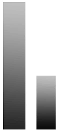{width="1.2291666666666667in"
height="2.7083333333333335in"}

现在一个流行的趋势似乎是用WDR描述与视频相关的应用，用HDR描述与静态图片相关的应用，其实在笔者看来这个界定也并无理论依据，只是一种约定俗成的习惯。
在前面第3.5节中已提到，目前较好的工艺水平（SONY）可以让sensor
提供80\~90dB的极限动态范围，但是更多就不合理也不经济了，因此超过80dB的动态范围一般需要通过其它技术实现。目前大致有九种技术路线可以实现WDR技术，即
Staggered
长短曝光帧融合，非同时曝光，存在运动伪影问题，短帧存在flicker问题
Interleaved
行交替曝光，将像素以两行为单位分组，长、短交替曝光，存在分辨率损失
Chopped 斩波曝光，主要解决flicker问题 Lin-Log
函数响应，依赖特别的像素设计，LDR区间为线性响应，HDR区间变为log规律响应，缺点是FPN较大
Dual-diode
pixel，两种不同敏感度的像素呈棋盘格排列，长、短帧同时曝光，存在分辨率损失和运动伪影
LOFIC 像素，用大电容收集像素溢出的电荷，原理与Split-diode pixel 有些类似
Complementary carrier
pixel，在LOF基础上使用电子-空穴两种互补载流子，显著提高阱容 DCG 像素
（Dual Conversion
Gain），每个像素可独立控制增益，等效于实现两种敏感度像素 Split-diode
pixel,
将每个像素的光敏区切成两块，分别负责短曝光和长曝光，没有分辨率损失和运动伪影

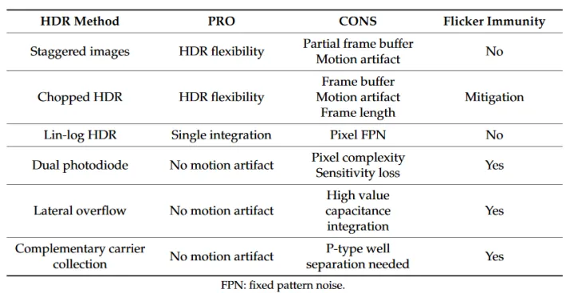{width="5.75in" height="2.9375in"}

**Staggered**

第一种模式应用最为普遍，sensor输出两帧图像用于宽动态融合，一帧短曝光图像重点采集亮部信息，一帧长曝光图像重点采集暗部信息，两帧图像同时输入ISP，经过一定的算法处理后生成一帧输出图像，能够同时还原亮部和暗部信息。算法对图像进行融合的过程称为frame
stitching，或者称为WDR fusion，意思是将多个图像融合拼合为一体。
两帧融合是最常见的方案，也有一些sensor支持三帧甚至四帧融合成一帧。下图是三帧融合的例子，右侧是合成的WDR图像。

{width="5.75in" height="1.3958333333333333in"}

多帧融合WDR技术由于参与融合的像素并非同时曝光所以会存在运动伪影问题，如下图所示，由于小孩快速移动位置造成了虚影。

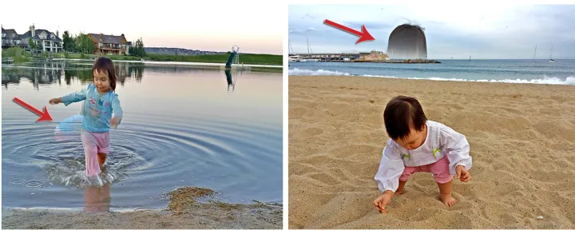{width="5.75in" height="2.2916666666666665in"}

以及下图（右）中的风扇叶片，在多帧合成时会出现错误。

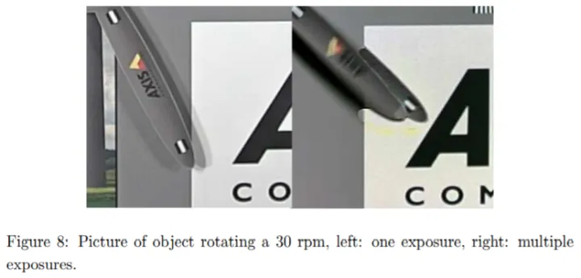{width="5.75in" height="2.75in"}

如果sensor
不再以帧为单位输出，而是以行位单位输出，则可以缓解运动伪影问题。如下图所示，sensor
先输出一行长曝光像素，再输出一行短曝光像素，然后开始输出下一行。当最后一个像素扫描完毕时，sensor已经完成了两帧图像的输出。三/四帧合成WDR也是同理。

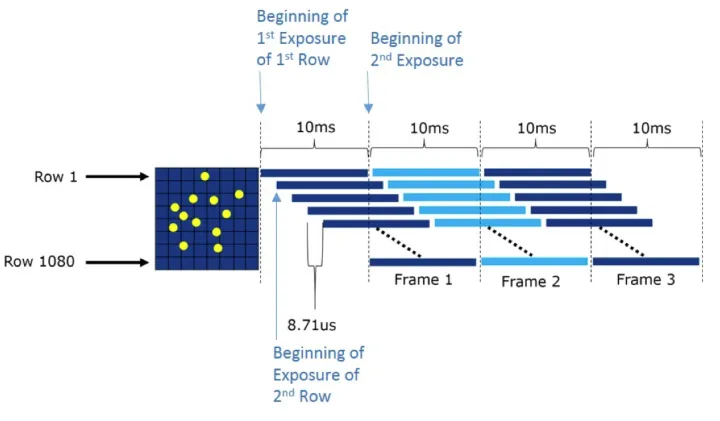{width="5.75in" height="3.3541666666666665in"}

这种输出方式被OmniVision 称为Staggered WDR技术，下面是OV Staggered WDR
sensor 的帧结构示意图，

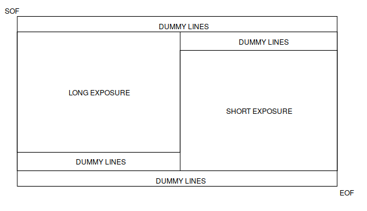{width="5.75in" height="3.3020833333333335in"}

SONY支持WDR的方式称为DOL(Digital
OverLap)技术，它支持两种像素输出方式，方式1是在同一个码流中替输出，方式2是使用两个码流并行输出，如下图所示。

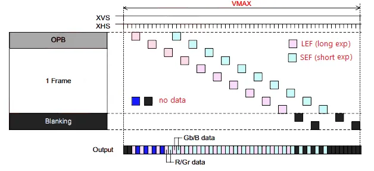{width="5.75in" height="2.6354166666666665in"}

SONY DOL - single stream 交替输出方式 在单码流输出方式中，
第4n组数据是sensor第2n行像素的长曝光数据（LEF:R/Gr/R/Gr/\...）；
第4n+1组数据是sensor第2n-4行像素的短曝光数据（SEF:Gb/B/Gb/B/\....）；
第4n+2组数据是sensor第2n+1行像素的长曝光数据（LEF:Gb/B/Gb/B/\...）；
第4n+3组数据是sensor第2n-3行像素的短曝光数据（SEF:Gb/B/Gb/B/\....）；
以此类推。。。
需要注意的是，短曝光像素相比长曝光像素有固定的4行延迟，所以最先输出的四组短曝光数据是无效的。
SONY DOL - main/sub stream 并行输出方式

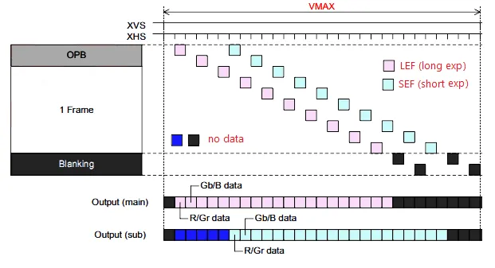{width="5.75in" height="3.1145833333333335in"}

**Interleaved**

第二种模式又称BME（Binned Multiplexed
Exposure）。这种sensor每隔两行的曝光时间分别设为短曝光和长曝光。然后融合长短曝光的两帧图像，成为行数减半的一帧WDR图像。空间分辨率损失了一半，就好像是做了1x2binning，所以叫做BME。SONY
IMX135 和IMX258使用了这一技术。

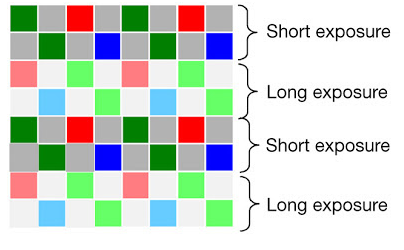{width="4.208333333333333in"
height="2.6041666666666665in"}

{width="5.3125in" height="2.0625in"}

**Chopped**

第三种模式主要用于解决WDR的短曝光容易遇到flicker的问题，需要针对短曝光做特别的斩波支持，具体可参考本文1.10小节。

**Lin-log**

第四种模式是使像素具备log响应曲线，自动压缩输入信号的动态范围。当输入信号小于一定阈值时，像素表现为线性响应（linear），当输入大于该阈值后，输出的阻尼正比于信号强度，输出表现为log特性。

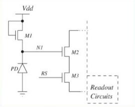{width="2.8229166666666665in"
height="2.2291666666666665in"}

当PD表现为log特性时，电压特性用以下公式描述。

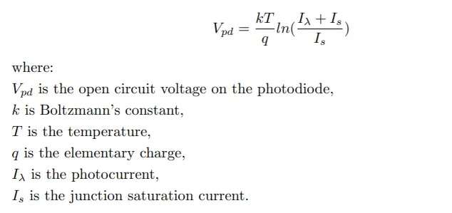{width="5.75in" height="2.7083333333333335in"}

这种像素设计的主要缺点是小信号时响应较慢，信噪比低。另外，需要后端ISP
配合解码才能使像素值恢复线性。 一家叫做New Imaging Technologies (NIT)
的法国公司有生产log像素的sensor，2014年公开的像素响应特性如下图所示。

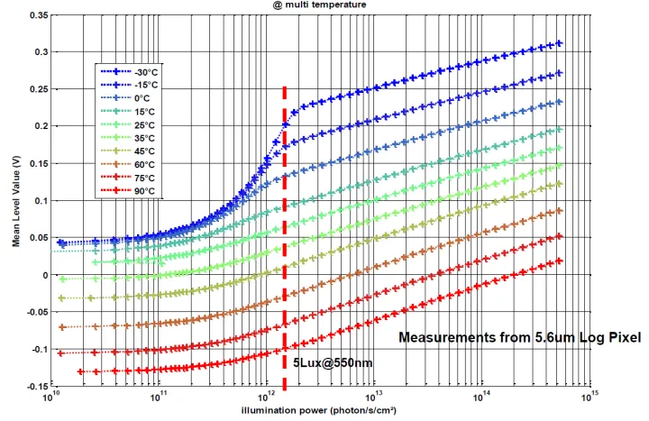{width="5.75in" height="3.7291666666666665in"}

**Dual-diode**

第五种模式又称SME（ Spatially Multiplexed
Exposure）。这种sensor在空间上以棋盘格的形式排列高感度和低感度两种像素，通过算法处理融合一帧WDR图像。

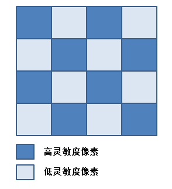{width="3.0625in"
height="3.3541666666666665in"}

这种方式的主要缺陷是sensor的有效分辨率下降，合成后的图像容易出现伪影。

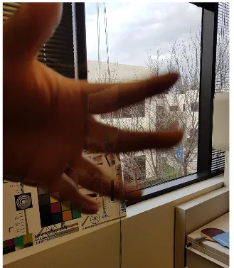{width="3.4270833333333335in"
height="3.9270833333333335in"}

**LOFIC**

第六种模式全称是Lateral OverFlow Integration
Capacitor，原理是每个像素都配置一个较大的电容用于收集因饱和而溢出的电荷，如下图所示。

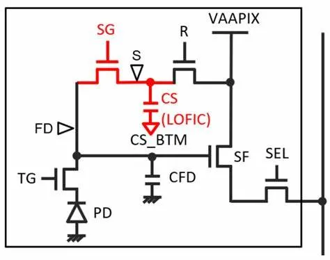{width="4.9375in"
height="3.8958333333333335in"}

曝光时只要PD达到饱和阱容的一半（Skim
level）就会触发相关电路动作把电荷转移到CS电容上。读出时，首先读取PD信号，随即再读取PD和CS电容和总信号。英文skim
常用语描述在水上撇油脂的动作，所以LOFIC 又称为 Skimming pixel。

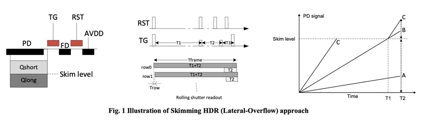{width="5.75in" height="1.6354166666666667in"}

LOFIC
像素的主要挑战是高效地制造大电容CS。2017年的报道是用6um像素实现了37.5万电子的最大阱容。
添加图片注释，不超过 140 字（可选）

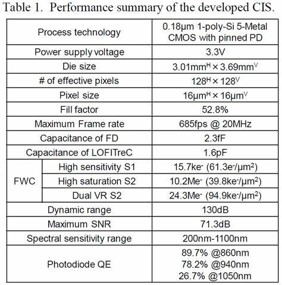{width="4.9375in" height="4.979166666666667in"}

2019年的报道是用2.8um像素实现了12万电子的最大阱容。
另据报导，此种技术可以实现高达200dB的动态范围。

**Complementary carrier**

第七种模式的原理是引入空穴载流子，由于CDTI工艺可以容易实现较大的电容，所以可以实现跨越式的阱容提升，2018年的报道是用3.2um的像素实现了75万载流子的阱容。

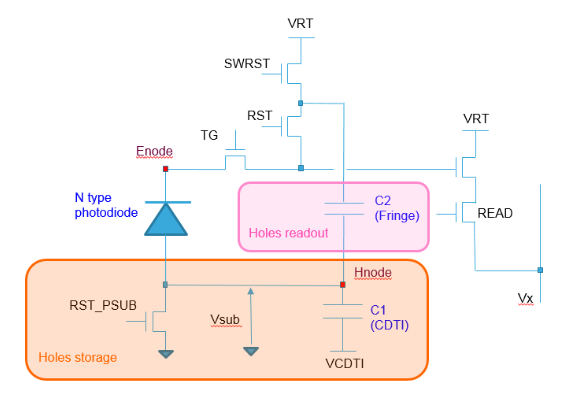{width="5.75in" height="3.9791666666666665in"}

{width="5.197916666666667in"
height="4.322916666666667in"}

参考文献：

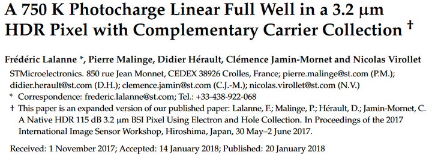{width="5.75in" height="2.0520833333333335in"}

**DCG**

第八种模式由OmniVision提出，原理是每个像素可单独控制增益（使用下图中的CG信号），当工作在HDR模式时，只进行一次曝光，但分两次读出，一次使用HCG
（high conversion gain）捕捉暗部信息，一次使用LCG（low conversion
gain）捕捉亮部信息。

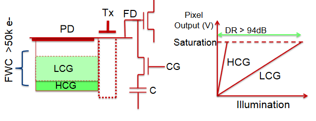{width="5.75in" height="2.1979166666666665in"}

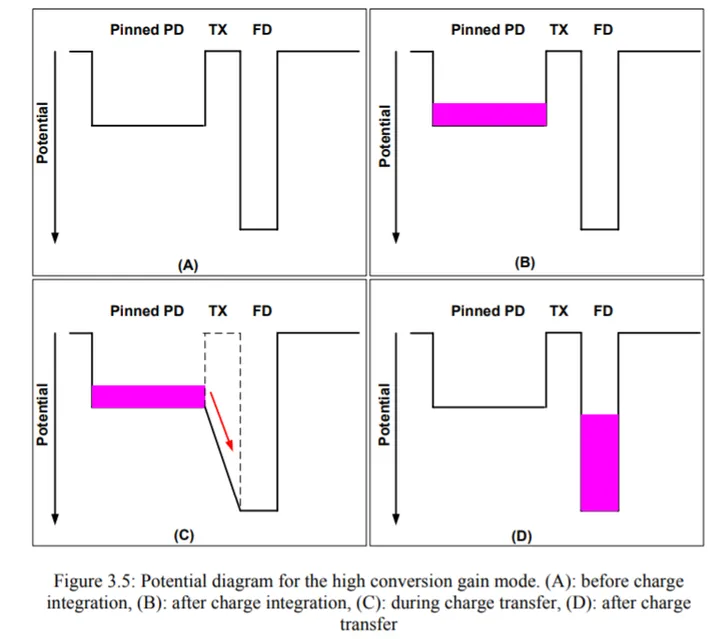{width="5.75in" height="5.09375in"}

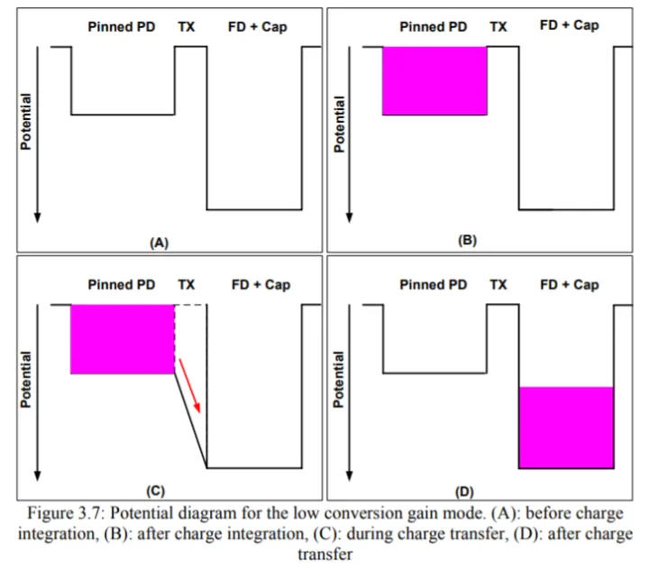{width="5.75in" height="5.052083333333333in"}

实验表明这种新的像素结构可以获得很好的WDR性能和明显的图像质量提升，如下图所示。

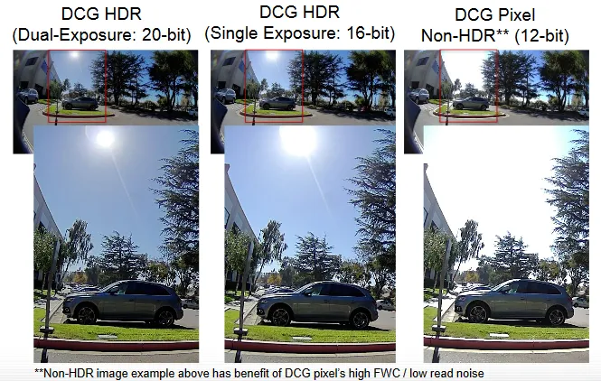{width="5.75in" height="3.6458333333333335in"}

DCG
像素的性能主要取决于像素的阱容。当最大阱容为60K个电子时，最大动态范围限制在96dB，与理想的\>120dB
尚有一定距离，因此最好结合其他的HDR技术（如多次曝光HDR）以取得更好的效果。

**Split-diode**

第九种模式由OmnVision提出，原文如下。 Split-diode
将像素的光敏区（PhotoDiode, PD）分割成SPD 和LPD
两个部分，分别负责短曝光（Short exposure）和长曝光（Long exposure）。

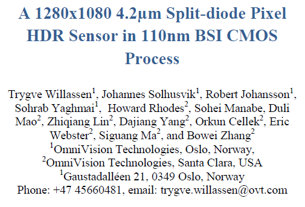{width="5.260416666666667in" height="3.5625in"}

SPD 主要用于捕捉强光信号，所以分配的面积很小，敏感度也很低；而LPD
主要用于捕捉弱光信号，所以面积大，且敏感度高，两者的敏感度比值为6.5:1（约16.5dB）。
使用下图中的DFD信号可以控制LPD 像素的增益（Conversion Gain, CG）。DFD
有效时，放大器SF 的输入端电容变大，LPD 的CG 变低；DFD无效时LPD 的CG
恢复正常。SPD 读出时DFD 必须有效，所以SPD 只有一种CG 选项。

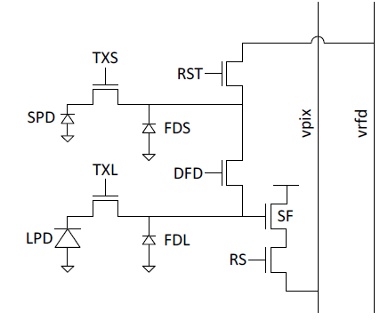{width="4.541666666666667in" height="3.75in"}

**Retinex 算法**

人眼会针对局部的图像特点进行自适应，既能够增加局部的对比度，同时保留大动态范围。1963年E.
Land 提出了Retinex
理论作为人类视觉的亮度和颜色感知模型，后人在此基础上发展了Retinex
系列算法，在彩色图像增强、图像去雾、彩色图像恢复方面具有很好的效果，也可以用于WDR融合。由于这种算法计算比较复杂，目前在sensor
端还暂未见产品应用，但是在图像后处理领域已经得到了非常好的应用。随着技术的发展可以预见Retinex
算法有一天将应用在camera ISP上甚至是直接集成到sensor上。

**CMOS Sensor接口**

一个CMOS sensor
至少会有两个接口，一个控制接口用于与MCU通信接受配置参数，一个数据接口用于输出像素数据。下图是一个实际sensor的框图。

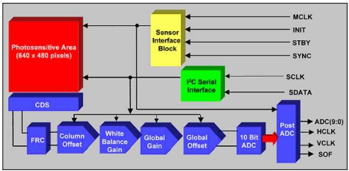{width="5.75in" height="2.8125in"}

The block diagram of the KODAK KAC-0310 image sensor illustrates the
features available on chip. These include a correlated double sampler
(CDS), and frame rate clamp (FRC), and A/D converter (ADC), and post A/D
conversion digital logic (Post ADC).

下面时一款OVsensor的框图，它的特点是自带AWB和AEC算法，可以省去后端ISP的成本。

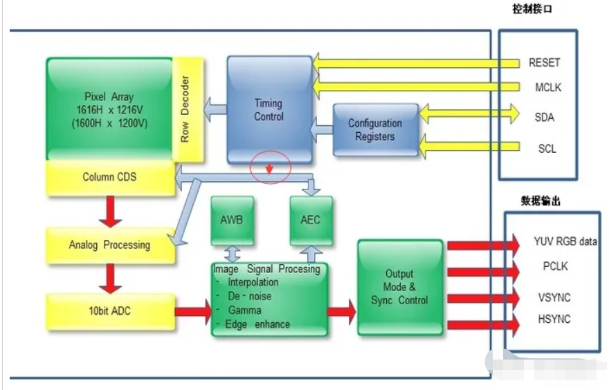{width="5.75in" height="3.6770833333333335in"}

下面时一款19MP CMOS sensor的框图，使用SPI控制接口和16-lane
LVDS数据端口。

{width="5.75in" height="5.6875in"}

**控制接口**

目前主流的CMOS
sensor多使用I2C串行总线接收主控MCU发来的的寄存器读写命令，I2C总线的最大时钟频率是400kHz。
I2C总线是在SCLK为高电平的中间点对数据信号SDAT进行采样，因此数据信号需要在SCLK为低电平期间完成变化。

**数据接口**

早期的sensor常采用DVP等并口方式传输图像数据。随着sensor分辨率不断增加，体积不断缩小，并口的局限性越来越明显，难以满足带宽、体积、功耗等指标要求，所以目前主流的CMOS
sensor已转为使用基于高速串行总线的MIPI接口，尤其是500万像素以上的sensor几乎全部采用MIPI接口。

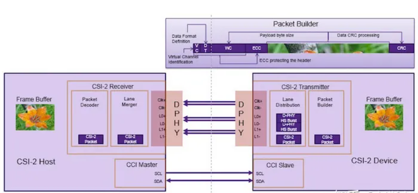{width="5.75in" height="2.65625in"}

在camera领域人们所说的MIPI接口一般是指MIPI
CSI-2规范，该规范使用长、短两种封包格式，其中长包用来传输图像数据，短包用来传输HSYNC,VSYNC等控制信号。
MIPI 的物理层协议主要采用DPHY，目前有1.0,1.2,2.1等几个版本。DPHY
v1.2版本支持1.5Gbps传输速率，在采取deskew校准的条件下最大支持2.5Gbps传输速率。
MIPI采用DDR (Double Data Rate)
的采样方法，即一个始终周期内对数据信号进行两次采样，上升沿和下降沿各一次，如下图所示。
这样的好处是相同时钟频率下数据带宽翻倍，或者说数据带宽相同的条件下时钟频率降至一半，有利于减少电磁辐射。

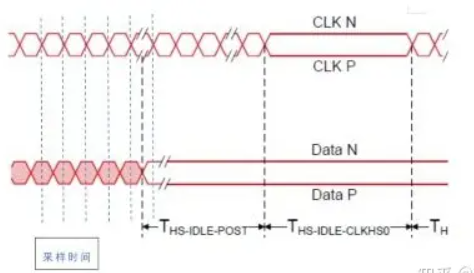{width="4.9375in" height="2.84375in"}

MIPI DPHY的数据带宽需要略大于sensor的数据带宽才能保证正常工作，而 DPHY
的数据带宽取决与DPHY的时钟频率，所以需要根据sensor数据带宽计算DPHY的时钟频率。
以1080P@25fps的应用场景为例，sensor
实际输出16bit的RAW数据，则数据带宽的最低需求是
1920x1080\*25\*16=829.44Mbps
当DPHY数据带宽大于850Mbps时可以满足sensor接入要求。 DPHY v1.2
版本支持1.5Gbps/lane，所以至少有两种接入方法可以满足要求
接入1个lane，时钟频率425MHz，数据速率850Mbps；
接入2个lane，共享同一时钟，时钟频率225MHz，数据速率900Mbps。[[MIPI接口细节文章]{.underline}](https://zhuanlan.zhihu.com/p/100476927)

**帧结构**

Sensor的实际像点数量通常比标准的图像分辨率（如2048x1536，1920x1080等）要大一些，多出来的像点主要有两种作用，
黑像素，即dark
pixel，像点上方覆盖的是不透光的金属，相当于零输入的情况，用于检测像素的暗电流水平
滤波像素，即filter
pixel，很多ISP算法会使用3x3或5x5大小的滤波窗口，因此需要在输出分辨率的基础上增加若干行、列使滤波窗口内全是有效像素。
Sensor
的输出信号中除了像素数据之外，还需要一些控制信号用于时间同步。每一帧开始时会有一个FrameStart
同步信号，在一帧内会用HSYNC信号指示哪些时钟周期携带了有效像素，以及会用VSYNC信号指示哪些行中携带了有效像素。

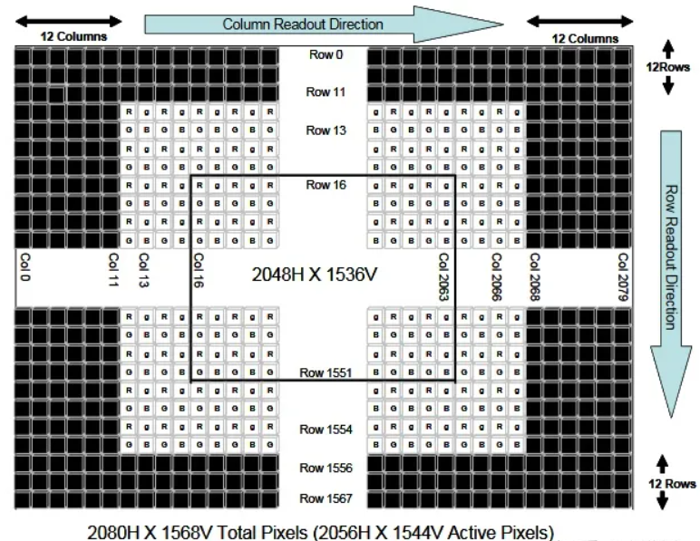{width="5.75in" height="4.4375in"}

未携带有效像素的时钟周期称为消隐周期，又分为水平消隐（horizontal
blanking）和垂直消隐（vertical blanking），如下图所示。

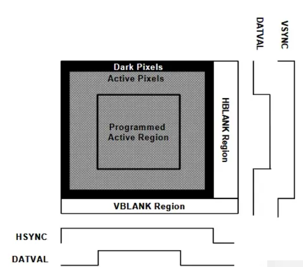{width="5.75in" height="5.052083333333333in"}

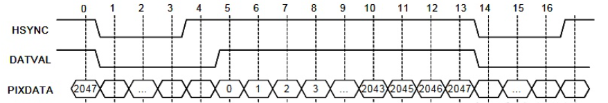{width="5.75in" height="0.9791666666666666in"}

以上图为例，sensor输出的每一行由以下单元组成

{width="5.75in" height="0.7708333333333334in"}

而sensor输出的每一帧图像由以下行组成

{width="5.739583333333333in"
height="0.8333333333333334in"}

Sensor
处理每一行都需要若干个水平消隐周期用于处理一些内部逻辑，在此基础上用户也可以增加消隐周期用于调节每行的曝光时间，起到间接调整帧率的作用。同理，sensor
每帧都需要若干个垂直消隐周期用于为下一帧做准备，在此基础上用户也可以增加一些消隐周期用于调整帧率。
因此，当sensor 主频确定后，垂直消隐的行数是用户控制sensor
输出帧率的主要手段，而水平消隐的周期数是调整帧率的辅助手段。尽管有两个参数都可以起到调整帧率的作用，但为了简单起见，人们往往以SONY
厂家推荐的水平消隐参数作为参考标准，使sensor
每一行的行长（时钟周期数）与SONY
同类型号保持一致，在此基础上继续调节垂直消隐，达到用户需要的帧率。
需要注意的是，当用户配置的积分时间（行数）参数大于一帧的有效行数时，sensor
会把超出的行数自动视作额外的垂直消隐，因此会在两帧之间插入额外的延时，导致sensor
输出帧率下降。 再举一个OV7725的例子，下图是OV7725的VGA时序，其特点是
每一帧开始时同步信号VSYNC有效并持续4行时间（4 tline），
每一行开始时同步信号HSYNC有效并持续64个tp （1tp=2PCLK），
在HREF为高电平时每一行有效时间为640tp，无效时间为144tp，每一行时间为tline=784tp；
每一帧总行数是510，其中有效行数是480 采集一帧数据的时间是784\*510tp。

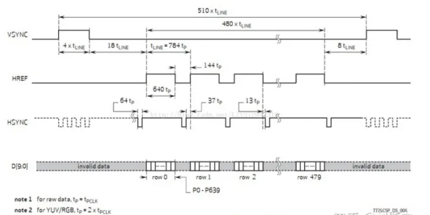{width="5.75in" height="2.875in"}

**曝光控制时序**

一般而言，用户向sensor
寄存器中写入的控制参数并不时立即生效的，而且不同参数生效的具体时间也不尽相同。举例来说，假设此时此刻sensor
正在采集第N帧之中，即第N帧的Frame Start 信号已经过去而Frame End
信号尚未到来，如果此时向sensor
寄存器写入新的积分时间，则对于某型号的Panasonic
sensor，新的积分时间将在第N+2帧开始生效；如果此时向sensor
写入新的增益，则新的增益将在第N+1帧即开始生效。这个问题会导致第N+1帧采用不正确的增益进行曝光，画面会出现瞬间闪烁，这是不可接受的。为了使积分时间和增益能够同时生效，必须通过软件把两个参数分开配置，第N帧写入积分时间，第N+1帧写入增益，两个参数在第N+2帧同时生效，如下图所示。

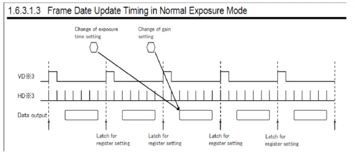{width="5.75in" height="2.59375in"}

在有一些sensor 中，如SONY IMX 477/377/277
等，模拟增益参数是立即生效的，而积分时间则是在第N+1帧生效，针对这种sensor，软件只能在sensor的垂直消隐区配置积分时间和增益，两者会同时在第N+1帧生效。在其它任何时间刷新模拟增益都会导致画面从中间随机位置发生割裂，上面部分采用旧的增益，下面部分采用新的增益，导致同一幅画面亮度
为了减少软件的负担，很多sensor
都已经支持一种影子寄存器，需要同步生效的参数都写到同一组影子寄存器中，sensor
会在下一帧开始前将影子寄存器中的内容刷新到工作寄存器中，并且保证所有参数都按照正确的时序生效，不需要软件针对每一款sensor
设计不同的配置逻辑。

**多sensor同步**

有一类camera需要同时捕捉多路sensor的图像，通过一定的算法将多路图像拼接成一个整体，以获得更大的视野。

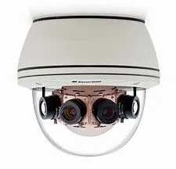{width="2.34375in" height="2.25in"}

此类camera对sensor捕捉图像的时间同步性提出了很高的要求，否则运动的物体在位于两个sensor接合部的时候容易出现各种诡异的现象，比如目标突然从画面上消失，或者同时出现在两个画面里。
sensor能够同步出图的一个必要条件是所有sensor共用同一个时钟源。在此基础上，不同的sensor会选择不同的同步机制。
某些sensor（如AR0431）支持sensor在外部信号的触发下工作，称为Trigger模式，此模式需要使用一个GPI引脚，主控设备通过GPI引脚控制所有sensor同步启动帧读出时序。

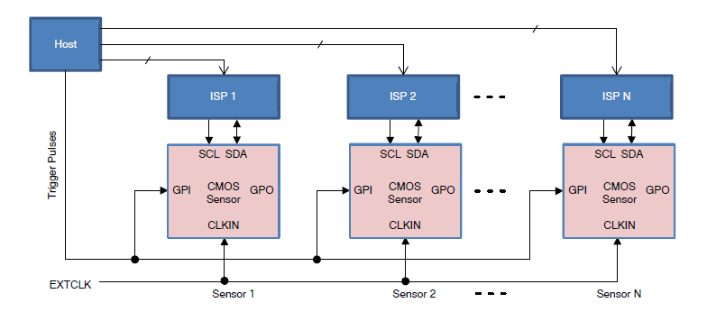{width="5.75in" height="2.53125in"}

AR0431 还支持一种名为Global Start
的同步模式，此模式需要将GPI引脚配置成菊花链形式，如下图所示。主控设备（Host）通过I2C总线向所有sensor广播start-streaming命令。由于各sensor是同时收到启动命令，所以只要各sensor配置的帧周期严格一致，它们输出数据的时序也会严格同步，并一致保持到永远。

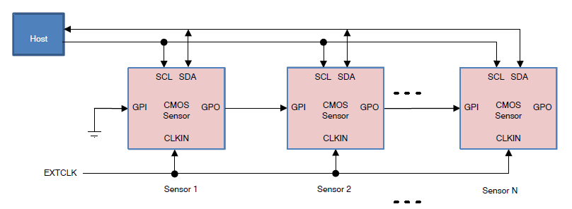{width="5.75in" height="2.1041666666666665in"}

**Companding 模式**

目前主流的CMOS sensor几乎都是输出Bayer
mosaic格式的数据，数据的位宽一般有8位、10位、12位、14位等级别。Bayer格式和数据位宽一般是sensor的固定参数，sensor型号一旦确定后，后续的MIPI和ISP必须能够支持或兼容该sensor的参数，否则系统将无法正常工作。
多数sensor支持线性输出模式，即输出的像素值与像素采集的光信号成正比。也有一些sensor支持companding输出模式，对线性数据进行压缩编码，使编码数据可以用更少的带宽传输，降低器件成本。下图使一种典型的companding模式，将12位线性数据（0\~4095）压缩编码成10位数据（0\~1023）。

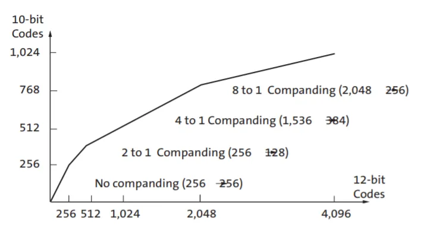{width="5.75in" height="3.2083333333333335in"}

这种输出方式要求后续的ISP必须支持decompanding，将10位数据恢复成12位数据才能获得正确的图像。
下图说明了companding压缩和decompanding解压缩的原理。

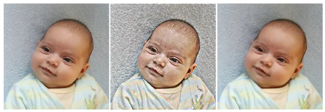{width="5.75in" height="1.9895833333333333in"}

\(a\) 8bit原图 (b) 3bit companding (c) 8bit decompanding
